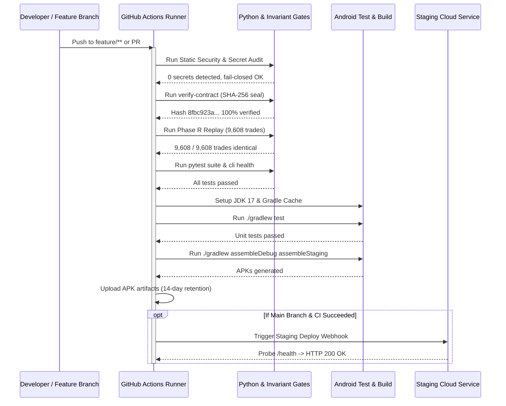

# Crypto Platform — CI/CD Runbook

## 1. CI/CD Architecture Overview

The continuous integration and deployment pipeline operates 100% autonomously on GitHub Actions runners without requiring local workstation dependencies, local Android Studio, or manual SDK configuration.

---

## 2. Invariant & Quality Gates

Every CI build enforces non-negotiable quantitative and security gates. A failure in ANY step strictly blocks the pipeline and prevents deployment:

1. **Static Security & Secret Audit (`python scripts/security_audit.py`):**
   - 0 API secrets, 0 private keys, 0 passwords, 0 withdrawal credentials.
   - Asserts `REAL_CAPITAL_AUTHORIZED_USD = 0.00` and `IS_LIVE_TRADING_LOCKED = true`.
2. **Contract Hash Gate (`python cli.py verify-contract`):**
   - Asserts Phase Q.2 frozen contract hash matches:
     `8fbc923a104e7688c3a9f0e4b8592c30dfb0b9a67a84511d5e49f8721c432098`
3. **Phase R Historical Replay Regression Gate (`python -m research.experiments.run_phase_r_replay_regression`):**
   - Total Candidate Count: `9,608 / 9,608`
   - Production Candidates $\ge 0.50$: `3,306 / 3,306`
   - High Confidence $\ge 0.60$: `2,942 / 2,942`
   - Strict Confidence $\ge 0.75$: `1,547 / 1,547`
   - Strict OOS: `1,665 / 1,665`
4. **Preflight Startup Invariant Validator (`python cli.py validate-preflight`):**
   - Validates withdrawal permissions disabled, capital safety locked, universe integrity, and directory paths.
5. **State Reconciliation Audit (`python cli.py reconcile`):**
   - Ensures zero internal discrepancy between state generator, simulated ledger, and active blotter.
6. **Android Build & Artifact Generation:**
   - Compiles and assembles debug and staging APKs.

---

## 3. GitHub Actions Workflows

| Workflow | File | Triggers | Artifacts Generated |
| :--- | :--- | :--- | :--- |
| **Main CI** | `.github/workflows/crypto-platform-ci.yml` | `push` (all branches), `pull_request` | `crypto-platform-debug-apk`, `crypto-platform-staging-apk` |
| **Android Release** | `.github/workflows/android-build.yml` | `workflow_dispatch`, tag `v*.*.*` | `crypto-platform-staging`, `crypto-platform-release-unsigned` |
| **Staging Deploy** | `.github/workflows/staging-deploy.yml` | After CI on `main`, `workflow_dispatch` | Staging Health Probe Logs |

---

## 4. GitHub Secrets Reference

The pipeline is designed to execute fully without any mandatory secrets for builds. For automated staging webhooks:

| Secret Name | Required? | Purpose | Default Behavior if Missing |
| :--- | :--- | :--- | :--- |
| `RENDER_STAGING_DEPLOY_HOOK` | Optional | Webhook URL to trigger Render deployment | Skips webhook; relies on Render auto-deploy on git push |
| `STAGING_API_URL` | Optional | Custom staging URL for probe validation | Defaults to `https://crypto-platform-staging.onrender.com` |

---

## 5. Troubleshooting CI Failures

### Issue: Contract Hash Mismatch
- **Cause:** Unintended edit to research files under `research/contracts/` or mathematical core.
- **Remedy:** Revert modifications. The Phase Q.2 research contract is frozen and must never be altered.

### Issue: Phase R Replay Count Drift
- **Cause:** Change in timeframe calculations, candle aggregation logic, or confidence scoring.
- **Remedy:** Restore causal candle logic. Verify 7-timeframe ladder configuration.

### Issue: Gradle Out Of Memory / Daemon Failure
- **Cause:** Heavy heap usage during Android compilation on free runners.
- **Remedy:** The repository includes `org.gradle.jvmargs=-Xmx2048m -Dfile.encoding=UTF-8` in `gradle.properties` which is tuned for standard GitHub Actions Ubuntu runners.
