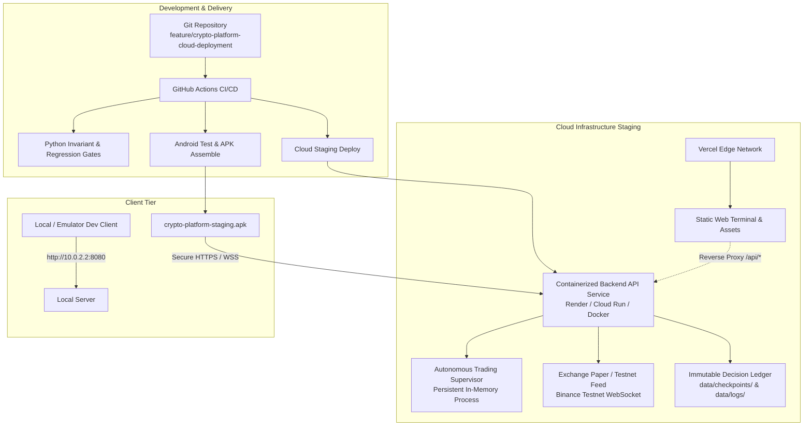

# Crypto Platform — Cloud Deployment Architecture

## 1. System Topology & Architecture Overview

The **Crypto Platform** is architected as an autonomous quantitative research and paper-trading system with an Android-first client and cloud-connected backend.

---

## 2. Component Classification & Hosting Model

Based on the forensic audit of the repository, platform components are classified into 7 operational tiers:

| Tier | Component | Technology | Target Environment | Hosting Model |
| :--- | :--- | :--- | :--- | :--- |
| **A** | Static Web Terminal & Assets | HTML5 / Vanilla CSS / JS | Vercel CDN / Edge | Static CDN Hosting (`vercel.json`) |
| **B** | Core REST API & Load Balancer | Python 3.12 / aiohttp | Staging Cloud (`render.com` / Cloud Run) | Containerized Service (`Dockerfile`, `render.yaml`) |
| **C** | Persistent Background Engine | Python / asyncio / 7-TF Engine | Staging Worker (Same container as API) | Long-running supervisor with live WebSocket feed |
| **D** | State Storage & Ledgers | SQLite / JSONL / Checkpoints | Persistent Volume (`/app/data`) | File-based append-only state checkpointing |
| **E** | Research Labs & Experiments | Python / NumPy / SciPy | CI & Local Dev Workstation | Headless batch execution |
| **F** | Mobile Client Application | Kotlin / Jetpack Compose / Material3 | Android 8.0+ (API 26..34) | Native Android APK |
| **G** | Verification & Test Gates | Pytest / JUnit / Gradle Wrapper | GitHub Actions Ubuntu Runner | Automated CI Pipeline |

---

## 3. Strict Safety & Research Boundaries

The quantitative core and research invariants are strictly preserved:

1. **Frozen Contract Hash:**
   `8fbc923a104e7688c3a9f0e4b8592c30dfb0b9a67a84511d5e49f8721c432098`
2. **Deterministic Replay Invariant:**
   `9,608 / 9,608` historical trades replicated with identical R-multiples and zero drift.
3. **Real Capital Authorized:**
   `$0.00` (Hardware and software fail-closed safety gate).
4. **Live Trading Gate:**
   `HARD_DISABLED_FAIL_CLOSED` — any attempt by the Android application or web terminal to submit live orders is rejected at the protocol layer.
5. **Geometry Floor:**
   Target destination $\ge 4.0\text{R}$ floor, risk per trade $\le 1.0\%$, portfolio heat $\le 3.0\%$.

---

## 4. Network Ingress, CORS, and Protocols

- **Base Ports:** Default container listens on port `8080` (or dynamic cloud `$PORT`).
- **TLS/HTTPS:** Terminated at the cloud edge proxy (Render / Cloud Run / Vercel SSL certificates).
- **CORS Headers:** Explicit preflight `OPTIONS` (HTTP 204) and `Access-Control-Allow-Origin: *` configured in `web/security_middleware.py`.
- **Health Probes:**
  - Liveness probe: `/health` (HTTP 200 `{"status": "HEALTHY", "real_capital_authorized": 0.00}`)
  - Readiness probe: `/ready` (HTTP 200 `{"status": "READY", "supervisor_running": true}`)
  - Version probe: `/version` (HTTP 200 `{"platform": "Crypto Platform", "king_contract_hash": "8fbc923..."}`)

---

## 5. Storage and State Persistence Model

| Type | Path | Retention Strategy | Disaster Recovery |
| :--- | :--- | :--- | :--- |
| **Canonical Checkpoints** | `/app/data/checkpoints/` | Persistent Volume / Cloud Snapshot | Recoverable via replay engine |
| **Immutable Decision Log** | `/app/data/logs/` | Append-only SHA-256 ledger | Cryptographically verifiable |
| **Local Cache** | `/app/market_data/cache/` | Ephemeral warm-start cache | Auto-reseeded on boot if missing |
| **Research Datasets** | `/app/data/` | Read-only frozen research data | Baked into container image |

---

## 6. Environment Separation Matrix

| Metric / Dimension | `LOCAL` | `STAGING` | `FORWARD TESTING` | `PRODUCTION` |
| :--- | :--- | :--- | :--- | :--- |
| **Host** | `127.0.0.1:8080` | `crypto-platform-staging.onrender.com` | `staging.cryptoplatform.internal` | `api.cryptoplatform.io` |
| **Execution Engine** | Simulated Paper | Testnet / Simulated Paper | Paper / Broker Demo Testnet | Live Exchange (HARD LOCKED) |
| **Real Capital ($)** | `$0.00` | `$0.00` | `$0.00` | `$0.00` (LOCKED) |
| **Order Gateway** | `SimulatedBroker` | `BinanceTestnetBroker` / Paper | `BinanceTestnetBroker` | Disabled (`FAIL_CLOSED`) |
| **Android Flavor** | `debug` | `staging` | `staging` | `release` (Unsigned) |
| **Secrets Exposed** | None | None | None | None |
