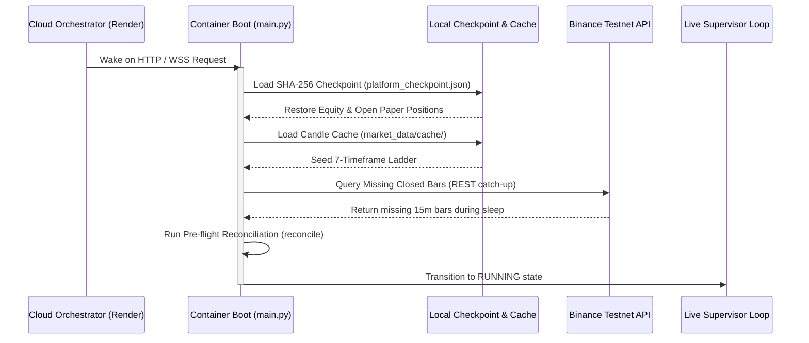

# Crypto Platform — 24/7 Operations & Reliability Plan

## 1. Operational Realities & Continuous Execution

True 24/7/365 quantitative trading operations require an unbroken sequence of closed candles, uninterrupted WebSocket market streaming, real-time trailing stop execution, and continuous state reconciliation.

### Workload Classification & Cloud Behavior:

| Workload Component | Execution Pattern | Staging Behavior (Render Free) | Forward-Testing (Persistent) | Production Requirement |
| :--- | :--- | :--- | :--- | :--- |
| **Market Data Ingestion** | Continuous (WSS) | Runs while active; pauses on 15m idle sleep | Continuous 24/7/365 streaming | Redundant dual exchange streams |
| **7-TF Candle Engine** | Continuous | Re-seeds from cache on wake | Unbroken sequential aggregation | In-memory sliding window + DB |
| **Decision Evaluation** | Event-driven (Bar close) | Evaluates when active | Evaluates every closed 15m/3m bar | Real-time cycle audit |
| **Trailing Stop Monitor** | Real-time tick | Monitored while active | Real-time break-even trailing | Microsecond latency monitoring |
| **Research Experiments** | Batch / Offline | On-demand via API or CI | Scheduled off-peak batch | Dedicated batch runner |
| **Reconciliation Audit** | Scheduled (every 60s) | Runs while container awake | Uninterrupted 60s cycle | Continuous broker sync |

---

## 2. Cold-Start Mitigation & State Recovery Architecture

Because free-tier container hosting (Render) sleeps after 15 minutes of inactivity, the platform employs a **Self-Healing Warm Boot Architecture**:



### Warm Restart Recovery Steps:
1. **Checkpoint Verification:** `StatePersistenceManager.load_checkpoint()` asserts the integrity checksum of the stored state envelope.
2. **Historical Cache Seeding:** `ContinuousCandleEngine.seed_from_disk_cache()` populates all 7 timeframes (1M, 1W, 1D, 4H, 1H, 15M, 3M) with baseline historical candles within 1.2 seconds.
3. **REST Gap Fill:** Any bars closed during container sleep are caught up via Binance REST API.
4. **Reconciliation Audit:** `AutonomousReconciliationEngine` verifies that no phantom positions or desynchronized fills occurred.

---

## 3. Idempotency & Order Collision Protection

To prevent duplicated paper orders upon restart or network disconnects:
- **`IdempotencyExecutionGuard`:** Every decision outcome generates a deterministic hash based on:
  $$\text{IdempotencyKey} = \text{SHA-256}(\text{Symbol} + \text{Timeframe} + \text{BarTimestamp} + \text{StrategyID})$$
- Orders with an already executed idempotency key in the current candle window are rejected `FAIL_CLOSED`.

---

## 4. Operational Runbook & Alert Escalation

| Alert Severity | Trigger Condition | System Action | Operator Action |
| :--- | :--- | :--- | :--- |
| **`INFO`** | Normal cycle complete, candle closed | Logged to decision ledger | None |
| **`WARNING`** | WebSocket reconnect event, rate-limit threshold 80% | Exponential backoff reconnect | Monitor latency |
| **`CRITICAL`** | Reconciliation discrepancy >0, risk heat >3% | Immediate `EMERGENCY_STOP` | Review audit log |
| **`FATAL`** | Non-zero real capital detected, hash mismatch | Process terminates `FAIL_CLOSED` | Block deployment |

### Emergency Stop Procedures:
- **Via Web Terminal:** Click **🛑 Emergency Stop** in the top bar.
- **Via Android App:** Click **Emergency Halt** in Trading Blotter screen.
- **Via cURL:**
  ```bash
  curl -X POST https://crypto-platform-staging.onrender.com/api/system/halt
  ```
