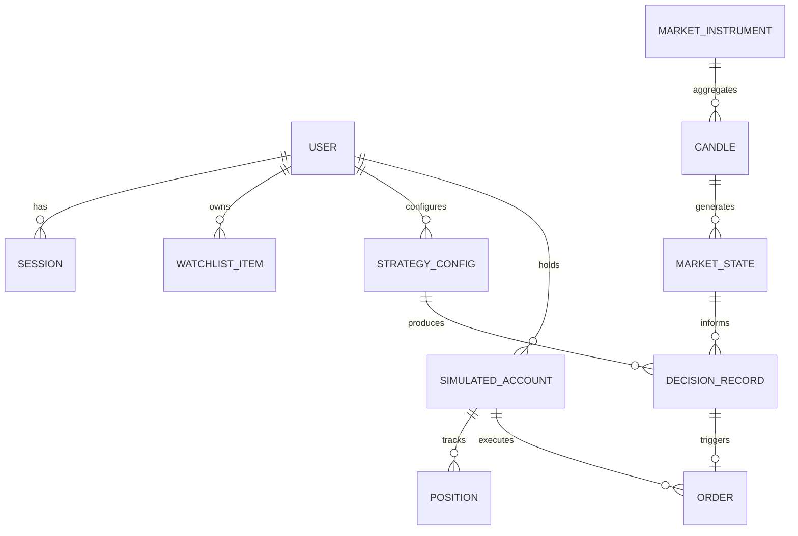

# Crypto Platform — Canonical Data Architecture & Persistence Plan

## 1. Data Ownership & Storage Classification

Data across the Crypto Platform is categorized into five distinct tiers based on durability, mutability, and recovery requirements:

| Tier | Category | Storage Technology | Path / Location | Mutability | Durability Requirement |
| :--- | :--- | :--- | :--- | :--- | :--- |
| **1** | **User, Auth & Accounts** | SQLite (WAL mode) | `data/crypto_platform.db` | Mutable | Durable across all reboots |
| **2** | **State Checkpoints** | Atomic JSON + SHA-256 | `data/checkpoints/` | Overwritten | Disaster recovery / Warm restart |
| **3** | **Decision Ledgers** | Append-only JSONL | `data/logs/` | Immutable append | Permanent audit trail |
| **4** | **Historical Market Cache** | Parquet / JSON Cache | `market_data/cache/` | Ephemeral cache | Auto-reseeding from Binance |
| **5** | **Frozen Research Datasets** | JSON / Artifacts | `data/`, `research/` | **FROZEN / READ-ONLY** | Permanent invariant baseline |

---

## 2. Canonical Domain Entities & Ownership Matrix



### Entity Specifications

1. **User & Auth Session:**
   - *Owner:* `core/auth/`
   - *Fields:* `user_id` (PK), `email` (Unique), `password_hash`, `salt`, `tenant_id`, `role`, `created_at`.
   - *Target Persistence:* SQLite table `users` and `sessions`.
2. **Market Instrument & Candles:**
   - *Owner:* `market_data/`
   - *Fields:* `symbol` (e.g. `BTCUSDT`), `timeframe` (1M..3M), `open`, `high`, `low`, `close`, `volume`, `timestamp_ms`, `is_closed`.
   - *Persistence:* In-memory sliding window (latest 1,000 candles) + disk cache in `market_data/cache/`.
3. **Multi-Timeframe Market State:**
   - *Owner:* `market_model/`
   - *Fields:* `timestamp_ms`, `symbol`, `7_timeframe_snapshots` (Structure, Bias, Phase, Zone, MSS, CHoCH).
   - *Persistence:* Transient in-memory state; checkpointed on shutdown.
4. **Simulated Position & Order Blotter:**
   - *Owner:* `execution/`
   - *Fields:* `position_id`, `symbol`, `direction`, `entry_price`, `stop_loss`, `take_profit` ($\ge 4\text{R}$), `r_multiple`, `status` (OPEN/CLOSED).
   - *Persistence:* Checkpoint JSON + SQLite table `positions`.
5. **Decision Record:**
   - *Owner:* `execution/decision/`
   - *Fields:* `decision_id`, `cycle_id`, `timestamp_utc`, `decision` (TRADE/NO_TRADE), `attribution_code`, `confidence_score`, `target_geometry`.
   - *Persistence:* Cryptographic append-only JSONL ledger in `data/logs/decision_ledger.jsonl`.
6. **Strategy Configuration:**
   - *Owner:* `strategy/`
   - *Fields:* `strategy_id`, `name`, `target_floor_r` ($\ge 4.0$), `max_risk_pct` ($\le 1.0$), `universe`, `is_active`.
   - *Persistence:* Registry code + SQLite table `strategy_configs`.

---

## 3. Migration Plan from In-Memory to Persistent SQLite

### Problem Identified in Audit:
Currently, `AuthService` stores users and tokens in memory, and `AutonomousTradingSupervisor` stores checkpoints only in local container directories.

### Target Relational Schema (`data/crypto_platform.db`):

```sql
-- 1. Users Table
CREATE TABLE IF NOT EXISTS users (
    user_id TEXT PRIMARY KEY,
    email TEXT UNIQUE NOT NULL,
    name TEXT NOT NULL,
    password_hash TEXT NOT NULL,
    salt TEXT NOT NULL,
    tenant_id TEXT NOT NULL,
    role TEXT NOT NULL DEFAULT 'TRADER',
    created_at TIMESTAMP DEFAULT CURRENT_TIMESTAMP
);

-- 2. Sessions Table
CREATE TABLE IF NOT EXISTS sessions (
    token TEXT PRIMARY KEY,
    user_id TEXT NOT NULL REFERENCES users(user_id) ON DELETE CASCADE,
    tenant_id TEXT NOT NULL,
    role TEXT NOT NULL,
    created_at_ts REAL NOT NULL,
    expires_at_ts REAL NOT NULL
);

-- 3. User Watchlists
CREATE TABLE IF NOT EXISTS user_watchlists (
    user_id TEXT NOT NULL REFERENCES users(user_id) ON DELETE CASCADE,
    symbol TEXT NOT NULL,
    added_at TIMESTAMP DEFAULT CURRENT_TIMESTAMP,
    PRIMARY KEY (user_id, symbol)
);

-- 4. Simulated Account Balances
CREATE TABLE IF NOT EXISTS accounts (
    account_id TEXT PRIMARY KEY,
    user_id TEXT NOT NULL REFERENCES users(user_id) ON DELETE CASCADE,
    equity_usd REAL NOT NULL DEFAULT 100000.0,
    peak_equity_usd REAL NOT NULL DEFAULT 100000.0,
    mode TEXT NOT NULL DEFAULT 'PAPER',
    updated_at TIMESTAMP DEFAULT CURRENT_TIMESTAMP
);
```

### Zero-Disruption SQLite Migration Strategy:
1. Provide a lightweight database manager in `core/persistence/db_manager.py` using Python's standard library `sqlite3`.
2. Enable WAL (Write-Ahead Logging) mode via `PRAGMA journal_mode=WAL;` and `PRAGMA synchronous=NORMAL;` for high-concurrency async read/write performance.
3. Automatically execute schema bootstrap on startup if `crypto_platform.db` is missing.
4. Keep the database in a mountable `/app/data/` volume so cloud deployments can attach durable block storage.

---

## 4. Preservation of Frozen Research Datasets

> [!IMPORTANT]
> The historical research data in `data/` and `research/results/` (specifically the 9,608 Phase Q.2 trade candidate universe and reference baselines) are **IMMUTABLE CANONICAL FIXTURES**. They are never migrated, altered, or overwritten. The SQLite migration applies solely to application state, user accounts, and forward paper-trading records.
