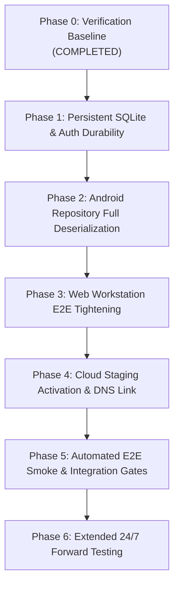

# Crypto Platform — Implementation Roadmap & Execution Plan

**Author:** Principal Software & Quantitative Systems Architect  
**Scope:** One Shared Backend, One Canonical API, One Protected Quantitative Core, Two Client Interfaces (Web Workstation + Native Android), Zero Capital Exposure.

---

## Roadmap Overview & Dependency Graph

---

## Detailed Phase Breakdown

### PHASE 0 — Repository, Research & Deployment Verification (COMPLETED)
- **Objective:** Establish verified baseline for frozen research contract, replay regression, unit tests, and local builds.
- **Evidence:**
  - Contract Hash: `8fbc923a104e7688c3a9f0e4b8592c30dfb0b9a67a84511d5e49f8721c432098` (100% verified).
  - Replay Regression: `9,608 / 9,608` trades identical.
  - Pytest Suite: `260/260 passed`.
  - Android Builds: `assembleDebug` and `assembleStaging` successful; unit tests passed.
  - Cloud Staging Probe: External URL `https://crypto-platform-staging.onrender.com/health` returns 404 (identified pending manual Render link).
- **Complexity:** Low. Paid Infrastructure Required: **No ($0.00)**.

---

### PHASE 1 — Persistent SQLite Database & Auth Durability (HIGHEST PRIORITY FOUNDATIONAL TASK)
- **Objective:** Eliminate the in-memory persistence vulnerability by migrating `AuthService` and state checkpoints to durable SQLite (`data/crypto_platform.db`) in WAL mode.
- **Existing Code to Reuse:**
  - `core/auth/auth_service.py` (password hashing PBKDF2 logic).
  - `core/auth/user_model.py` (`User`, `SessionToken`, `UserRole`).
  - `execution/state/state_persistence.py` (checksum serialization).
- **Required Changes:**
  - Implement `core/persistence/db_manager.py` (SQLite schema auto-bootstrap, WAL mode).
  - Update `AuthService` to query and persist to `users` and `sessions` SQLite tables.
  - Persist user watchlists to SQLite `user_watchlists`.
- **Dependencies:** Phase 0.
- **Tests:** Add unit tests `tests/unit/core/test_db_persistence.py` asserting user survival across service process restarts.
- **Acceptance Criteria:** A user registered via `POST /api/auth/register` can immediately authenticate via `POST /api/auth/login` after the backend process has restarted.
- **Risks:** Concurrency file locks; mitigated by enabling SQLite WAL mode (`PRAGMA journal_mode=WAL`).
- **Complexity:** Medium. Paid Infrastructure Required: **No ($0.00)**.

---

### PHASE 2 — Native Android Full API Deserialization
- **Objective:** Replace static fallback returns in `AppRepositories.kt` with live JSON parsing of the canonical API payloads.
- **Existing Code to Reuse:**
  - `mobile/android/.../data/repository/AppRepositories.kt`
  - `mobile/android/.../core/network/CryptoApiClient.kt`
  - `web/server.py` (`/api/strategies`, `/api/positions`, `/api/alerts`).
- **Required Changes:**
  - Wire `StrategyRepository.getStrategies()` to parse array returned by `GET /api/strategies`.
  - Wire `TradingRepository.getPositions()` to parse `active_positions` and `closed_positions` from `GET /api/positions`.
  - Wire `MonitoringRepository.getAlerts()` to fetch live items from `GET /api/alerts`.
- **Dependencies:** Phase 1.
- **Tests:** Gradle unit tests in `AppRepositoriesTest.kt` with mock HTTP responses.
- **Acceptance Criteria:** Android app displays real server strategies, positions, and operational alerts fetched dynamically over HTTP.
- **Risks:** Schema mismatch; mitigated by strictly conforming to `docs/api/openapi.yaml`.
- **Complexity:** Low. Paid Infrastructure Required: **No ($0.00)**.

---

### PHASE 3 — Desktop Web Workstation E2E Hardening
- **Objective:** Verify and polish all 18 tabs in `web/static/app_terminal.html` against the running server.
- **Existing Code to Reuse:**
  - `web/static/app_terminal.html`
  - `web/server.py`
- **Required Changes:**
  - Audit JavaScript fetch calls in `app_terminal.html` to guarantee identical parameter and auth token handling.
  - Add visual offline/reconnecting indicator when WebSocket or HTTP polling encounters network interruptions.
- **Dependencies:** Phase 1, Phase 2.
- **Tests:** Integration smoke test `tests/integration/test_cloud_staging_smoke.py`.
- **Acceptance Criteria:** Full 18-tab desktop interface renders live metrics, positions, and charts with zero browser console errors.
- **Complexity:** Low. Paid Infrastructure Required: **No ($0.00)**.

---

### PHASE 4 — Cloud Staging Activation & DNS Linking
- **Objective:** Transition cloud staging from "Configured" to "Deployed & Externally Verified".
- **Existing Code to Reuse:**
  - `render.yaml`
  - `Dockerfile`
  - `vercel.json`
- **Required Changes:**
  - Link the repository in the user's Render dashboard using the existing `render.yaml` blueprint.
  - Point Vercel project to repository root using `vercel.json`.
- **Dependencies:** Phase 3.
- **Tests:** `curl -fsS https://crypto-platform-staging.onrender.com/health` returns HTTP 200.
- **Acceptance Criteria:** External health probe resolves with status `HEALTHY` and real capital `$0.00`.
- **Risks:** Render cold-start latency (~30-50s on initial wake); mitigated by client timeout handling and retry loops.
- **Complexity:** Low (purely operational/DNS). Paid Infrastructure Required: **No ($0.00)**.

---

### PHASE 5 — Automated End-to-End Acceptance Testing & CI Gate
- **Objective:** Enforce continuous verification across the shared backend, web workstation, and native Android builds in GitHub Actions.
- **Existing Code to Reuse:**
  - `.github/workflows/crypto-platform-ci.yml`
  - `tests/integration/test_cloud_staging_smoke.py`
  - `scripts/security_audit.py`
- **Required Changes:**
  - Ensure CI pipeline triggers on all PRs to `main` and `develop`.
  - Validate that failure in contract hash or replay regression strictly blocks deployment.
- **Dependencies:** Phase 4.
- **Tests:** Complete CI run on GitHub Actions.
- **Acceptance Criteria:** All CI steps pass green in under 4 minutes.
- **Complexity:** Low. Paid Infrastructure Required: **No ($0.00)**.

---

### PHASE 6 — Extended Forward Testing & Operational Run
- **Objective:** Execute uninterrupted paper-trading across the admitted universe (`BTCUSDT`, `ETHUSDT`, `SOLUSDT`, `BNBUSDT`) with append-only decision logging.
- **Existing Code to Reuse:**
  - `execution/autonomous_supervisor.py`
  - `execution/decision/decision_ledger.py`
- **Required Changes:**
  - Monitor strategy performance, trailing stop activations (+2R breakeven), and target destinations ($\ge 4\text{R}$).
- **Dependencies:** Phase 5.
- **Tests:** Weekly state reconciliation audits and statistical drift tests.
- **Acceptance Criteria:** 0 trade execution discrepancies, 0 capital risk violations, 100% adherence to research boundaries.
- **Complexity:** Medium. Paid Infrastructure Required: Optional ($7/mo only if zero-sleep always-on forward testing is desired).
