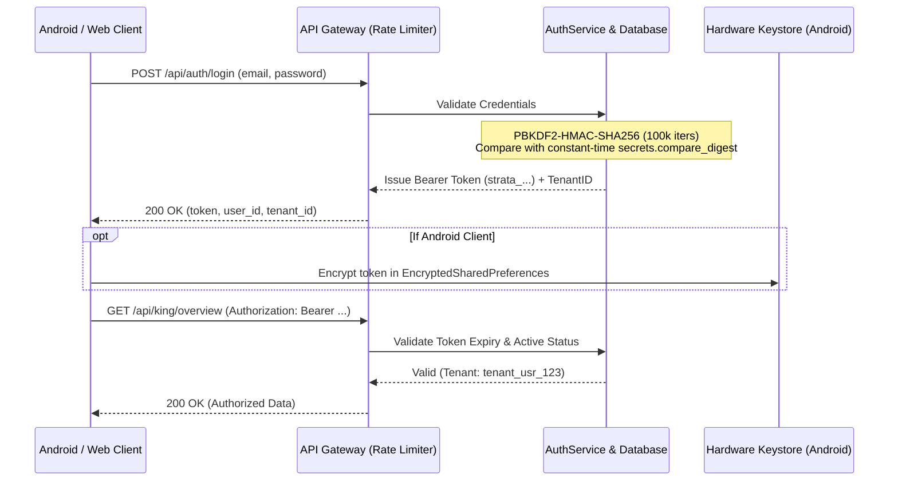

# Crypto Platform — Security & Authorization Architecture

## 1. Security Architecture Principles

1. **Backend as Sole Authority:** Identity, permission evaluation, risk limits, and paper order placement are strictly evaluated server-side. Client-side UI gates exist only for user feedback; they are never treated as security boundaries.
2. **Zero Capital Boundary:** Hardware and software safety gates enforce `REAL_CAPITAL_AUTHORIZED_USD = 0.00` and `LIVE_TRADING_LOCKED = true`. Any attempt to trigger live order placement fails closed.
3. **Zero Secrets in Clients:** No exchange API keys, private keys, HMAC secrets, or database credentials are embedded in the Android APK or Web client bundle.
4. **Tenant Isolation:** Multi-tenancy is cryptographically segregated by `tenant_id` at the repository and database layer.

---

## 2. Authentication & Credential Management

### Password Hashing Standards:
- Algorithm: `PBKDF2-HMAC-SHA256`
- Iterations: `100,000`
- Salt: 16-byte cryptographically secure random token (`secrets.token_bytes(16)`).
- Comparison: Constant-time comparison using `secrets.compare_digest` to prevent timing attacks.

### Session Token Lifecycle:
- Format: High-entropy string (`strata_` prefix + 32 bytes base64 urlsafe, 256 bits of entropy).
- TTL: 24 hours (`86,400` seconds).
- Invalidation: Handled via `POST /api/auth/logout`.

---

## 3. Network Defense & Gateway Hardening

### Security Middleware (`web/security_middleware.py`):
- **Clickjacking Prevention:** `X-Frame-Options: DENY`
- **MIME Sniffing Prevention:** `X-Content-Type-Options: nosniff`
- **XSS Protection:** `X-XSS-Protection: 1; mode=block`
- **Referrer Policy:** `Referrer-Policy: strict-origin-when-cross-origin`
- **CORS Protection:** Configurable via `CORS_ALLOWED_ORIGINS` environment variable. Preflight `OPTIONS` requests return 204 with strict headers.
- **Rate Limiting:** Sliding-window rate limiter enforcing a maximum of 240 requests/minute per client IP to prevent brute-force attacks and DoS.

---

## 4. Mobile Client Security (Android)

- **Storage Security:** Tokens and API endpoint overrides are stored in `EncryptedSharedPreferences` backed by the Android hardware Keystore (`MasterKeys.AES256_GCM_SPEC`).
- **Static Security Verification:** Automated CI scanner (`scripts/security_audit.py`) analyzes all source and asset files to guarantee:
  - 0 exchange API secrets
  - 0 private keys
  - 0 plaintext passwords
  - 0 withdrawal credentials
- **Network Security Configuration:** Android manifest enforces TLS/HTTPS for all external connections, permitting unencrypted traffic only to `10.0.2.2` (local emulator dev loopback).

---

## 5. Deployment Secrets Governance

- **Source Control Cleanliness:** `.env*`, `.key`, `.keystore`, `*.pem`, `credentials*.json`, and `*.db` are strictly `.gitignore`d.
- **Provider Managed Secrets:**
  - Render: Configured via Render Environment Secrets dashboard.
  - Vercel: Configured via Vercel Project Environment Variables.
  - GitHub Actions: Configured via Repository Actions Secrets (e.g., `RENDER_STAGING_DEPLOY_HOOK`).
