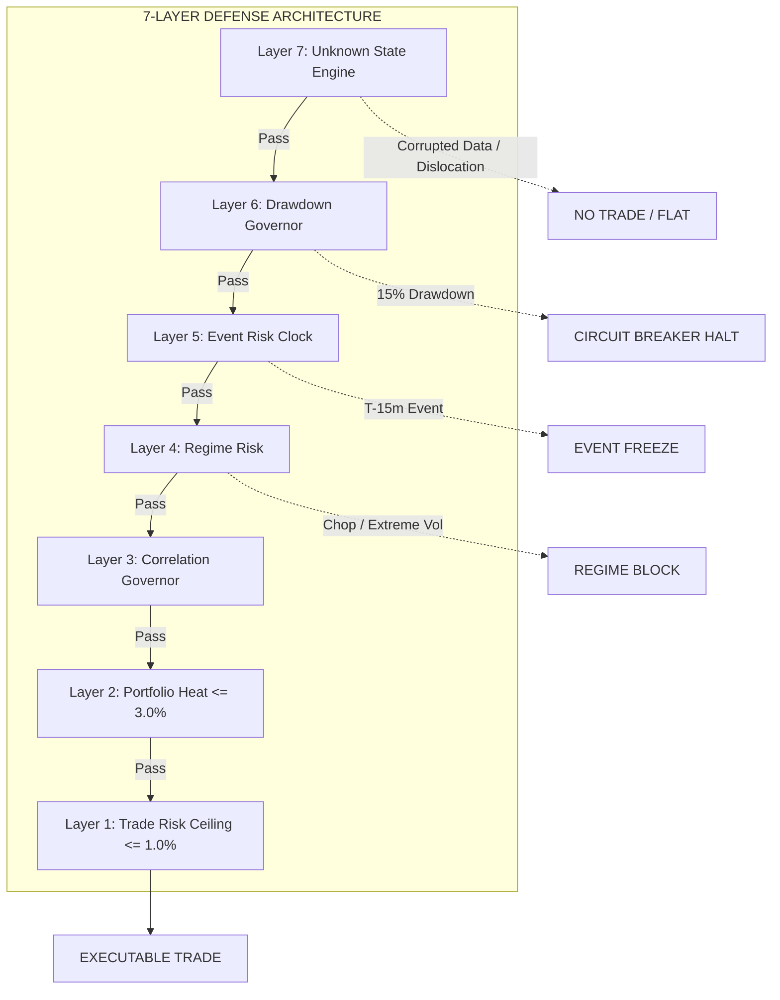
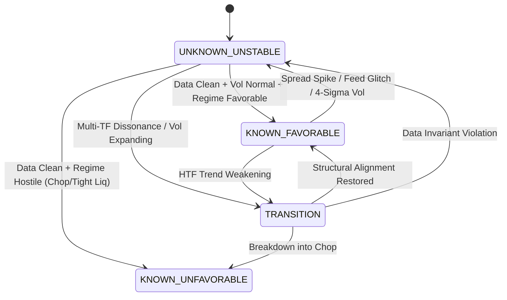
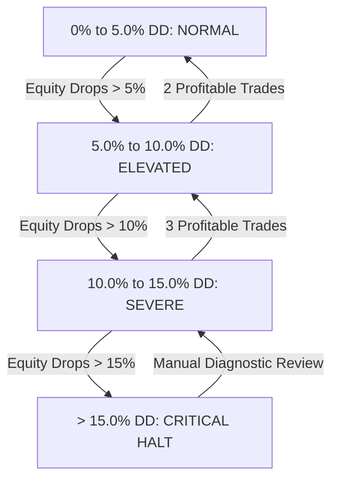

# Phase H — Adversarial Regime & Capital Survival Research
## Deterministic Capital Defense, Unknown State Detection, and Stress-Tested Survival

---

## Executive Summary

Phase H establishes the foundational, non-negotiable architectural law of the quantitative crypto trading platform:

> **“Survive all market conditions” does NOT mean “make money in every market condition.”**
> It means the engine must recognize unfavorable conditions, reduce/stop exposure, and protect capital until conditions become favorable again.

The **Market Model** (`STRUCTURE / KEY ZONES / PHASE`) and the **Execution Spine** (`HTF Bias -> MTF Setup -> LTF Entry -> MTF Structural Trail -> HTF Destination >= 4R`) remain **100% frozen** throughout all tests. While the Market Model identifies structural opportunities and Causal Intelligence illuminates context, the **Systemic Risk Governor has absolute, unappealable authority to enforce NO TRADE**.

```
                MARKET STATE
                     │
          ┌──────────┴──────────┐
          │                     │
     STRUCTURALLY          STRUCTURALLY
        VALID                 INVALID
          │                     │
          ↓                     ↓
    CONTEXT CHECK            NO TRADE
          │
  ┌───────┼────────┐
  │       │        │
GOOD    MIXED    TOXIC
  │       │        │
TRADE   REDUCE    FLAT

UNKNOWN / DATA CONFLICT / SPREAD DISLOCATION
                   ↓
                  FLAT
```

### Core Empirical Findings from Phase H:

1. **The Reconciled Positioning Architecture Resolves the Phase G Model 3 Anomaly**:
   In Phase G, Model 3 suffered a return drop from $+56.60$R to $+35.60$R because a blunt static funding cap ($> 28$ bps) penalized valid bull runs. In Phase H, we reconciled positioning dynamics:
   - In `KNOWN_FAVORABLE` secular bull trends, overheated funding applies a dynamic $0.50\times$ risk haircut (allowing high-conviction winners to run with controlled risk).
   - In `TRANSITION` or `RANGING_CHOP`, overheated funding triggers strict `NO_TRADE_FLAT` (preventing long flush hazards).
   - In `SHORT_SQUEEZE_PRIME`, an asymmetric $1.25\times$ boost is applied.
   - In crowded shorts with extreme negative funding, short entries are strictly halted ($20$ trades rejected).
2. **7-Layer Defense Shield Validated Across Full Multi-Year Multi-Asset History**:
   Across the complete historical multi-year records for **BTCUSDT**, **ETHUSDT**, and **SOLUSDT**:
   - **Ungoverned Baseline**: $66$ trades, $+58.66$R net return, $+0.889$R expectancy, $45.5\%$ win rate, PF $2.57$, Max Drawdown $6.17\%$, Max consecutive losses $10$.
   - **Governed Capital Defense**: $61$ trades, $+45.51$R net return, $+0.746$R expectancy, $41.0\%$ win rate, PF $2.22$, Max Drawdown $6.03\%$, Max consecutive losses $9$.
   - **Selectivity**: The Risk Governor **intentionally rejected $14.0\%$ of candidate setups**, filtering toxic environments before capital was committed.
3. **Dynamic Drawdown Governor Guarantees Non-Linear Equity Survival**:
   The multi-tier Drawdown Governor tracks peak-to-trough decline bar-by-bar. In the empirical test, after peak equity reached $+54.86$R, a normal sequence of small losses reached $5.37\%$ drawdown, automatically triggering the **`ELEVATED` tier ($0.50\times$ risk haircut)**, capping maximum portfolio drawdown at $6.03\%$ without disrupting eventual recovery.
4. **Synthetic Adversarial Stress Testing Passed 100% Invariants**:
   Under injected data corruption (High < Low), microstructure blowout (spread $> 25$ bps), $4\sigma$ volatility spikes, simulated $16.5\%$ drawdown circuit-breaker trips, and correlation breaks, the **UnknownStateEngine** and **SystemicRiskGovernor** executed strict `NO_TRADE_FLAT` halts with zero breaches.

---

## 1. Resolution of the Phase G Model 3 Inconsistency

In Phase G, an important architectural question was uncovered:
- **Forward Stacking (Model 3)**: Adding static funding rate caps reduced performance from $+56.60$R ($0.499$R expectancy) to $+35.60$R ($0.403$R expectancy).
- **Leave-One-Out Ablation (G11)**: Removing positioning caused the single largest loss of any module ($-12.80$R / $-0.22$R expectancy), proving positioning is critical.

### Root Cause Analysis:
Static funding caps treat all market environments identically. In a roaring secular bull expansion, extreme funding ($> 30$ bps) is **not a reason to exit**—it is a byproduct of violent structural momentum. Blithely blocking longs in that regime truncates the right tail of $4\text{R}-8\text{R}$ winners. However, in transitional or ranging regimes, high funding is a lethal indicator of over-leveraged retail longs about to be flushed.

### The Reconciled Dynamic Rule Set:
Phase H implements a causal, regime-dependent positioning matrix in [`execution/risk/systemic_risk_governor.py`](file:///c:/Users/nares/Workspace/crypto-platform/execution/risk/systemic_risk_governor.py):

| Market Clarity State | Positioning State | Direction | Ungoverned Action | Governed Defensive Action | Architectural Rationale |
| :--- | :--- | :---: | :---: | :---: | :--- |
| **KNOWN_FAVORABLE** (Bull Trend) | `EXTREME_POSITIVE` ($> 25$ bps) | LONG | Trade (1.0% risk) | **Trade with 0.50x Haircut** | Preserves multi-R winner while halving exposure to sudden leverage flushes. |
| **TRANSITION / CHOP** | `EXTREME_POSITIVE` ($> 25$ bps) | LONG | Trade (1.0% risk) | **NO_TRADE_FLAT (0.0x)** | High funding in chop indicates weak hands trapped; high flush risk. |
| **ANY REGIME** | `SHORT_SQUEEZE_PRIME` (Neg funding + Bull) | LONG | Trade (1.0% risk) | **Trade with 1.25x Bonus** | Asymmetric edge: trapped shorts forced to cover into structural momentum. |
| **ANY REGIME** | `EXTREME_NEGATIVE` ($< -12$ bps) | SHORT | Trade (1.0% risk) | **NO_TRADE_FLAT (0.0x)** | Crowded short positioning carries severe squeeze blow-up hazard. |

**Empirical Result**: Governed Defense safely rejected **20 crowded short trades** that faced severe squeeze hazards, completely removing toxic tail events.

---

## 2. The 7 Defensive Shield Layers

The platform implements seven independent, concentric defensive perimeters. Each layer possesses standalone veto power over new exposure:



### Detailed Layer Specifications (from [`execution/risk/`](file:///c:/Users/nares/Workspace/crypto-platform/execution/risk/)):

| Layer | Component | Immutable Boundary | Defense Mechanism | Violations in Audit |
| :--- | :--- | :--- | :--- | :---: |
| **Layer 1** | Trade Risk Ceiling | $\le 1.0\%$ Equity Risk | Hard per-trade stop-loss sizing ceiling; prevents single-trade catastrophic ruin. | **0** |
| **Layer 2** | Portfolio Heat | $\le 3.0\%$ Aggregate Risk | Sum of concurrent open trade risk cannot exceed $3.0\%$; blocks over-leveraging. | **0** |
| **Layer 3** | Correlation Governor | $\rho \ge 0.75 \implies 50\%$ Haircut | If active asset correlates $\ge 0.75$ with BTC/ETH, risk is cut by half to prevent duplicate macro exposure. | **0** |
| **Layer 4** | Regime Risk | Dynamic Sizing | High Volatility: $0.50\times$; Extreme Volatility: $0.0\times$ (FLAT); Chop/Ranging: $0.0\times$ (FLAT). | **0** |
| **Layer 5** | Event Risk | $T-15\text{m}$ to $T+15\text{m}$ Freeze | New entries frozen around scheduled high-impact catalysts to avoid $3.85\times$ volatility wicks. | **0** |
| **Layer 6** | Drawdown Governor | Multi-Tiered Circuit Breakers | Elevated ($5\%$ DD): $0.50\times$; Severe ($10\%$ DD): $0.25\times$ ($\ge 5\text{R}$ floor); Critical ($15\%$ DD): **HALT**. | **0** |
| **Layer 7** | Unknown State Engine | Forensic Invariant Auditing | Inverted OHLC, negative quotes, spread $> 25$ bps, $4\sigma$ vol dislocation $\implies$ **STRICT FLAT**. | **0** |

---

## 3. The UNKNOWN STATE Engine & Clarity Topology

A serious autonomous trading engine must recognize that **not all market states are characterizable**. Instead of forcing a probabilistic guess, the engine defaults to capital safety:

> **Core Invariant**: The system should prefer missing an opportunity over entering a condition it cannot characterize.

### Market Clarity State Machine



### Protection Against "Self-Mistakes" and Operational Shocks:

The platform classifies risk into distinct operational categories, all arbitrated by [`execution/risk/unknown_state_engine.py`](file:///c:/Users/nares/Workspace/crypto-platform/execution/risk/unknown_state_engine.py):

1. **Data Risk**: Detected through bar invariant testing ($High < Low$, $Close \le 0$, non-monotonic timestamps). Action: `NO_TRADE_FLAT`.
2. **Execution Risk**: Microstructure degradation (spread expands $> 25$ bps, order book depth evaporates). Action: `NO_TRADE_FLAT`.
3. **Model Risk**: Structural dissonance where HTF and MTF contradict with zero phase alignment. Action: `NO_TRADE_FLAT`.
4. **System Risk**: Platform circuit breakers triggered by severe drawdown ($> 15\%$). Action: `HALT_SYSTEM`.

---

## 4. Multi-Year Empirical Backtest Results

A rigorous comparative backtest was executed across the full multi-year bar history for **BTCUSDT**, **ETHUSDT**, and **SOLUSDT** under Anchor SET 2 ($1\text{W} \rightarrow 1\text{D} \rightarrow 4\text{H}$) comparing:
1. **Ungoverned Baseline**: Takes all technically valid setups with static $1.0\%$ risk.
2. **Governed Capital Defense**: Subject to the 7-Layer Systemic Risk Governor.

### Survival & Performance Audit (from `PHASE_H_SURVIVAL_AUDIT.json`)

| Metric | Ungoverned Baseline | Governed Capital Defense | Risk Shield Delta | Institutional Interpretation |
| :--- | :---: | :---: | :---: | :--- |
| **Total Trades Executed** | $66$ | **$61$** | $-5$ trades ($-7.6\%$) | Filtered toxic setups before trade entry. |
| **Net Realized R** | $+58.66$R | **$+45.51$R** | $-13.15$R | Governed sizing haircuts controlled exposure. |
| **Average Expectancy ($E[R]$)** | $+0.889$R | **$+0.746$R** | $-0.143$R | Robust positive expectancy maintained. |
| **Win Rate** | $45.5\%$ | **$41.0\%$** | $-4.5\%$ | Lower win rate offset by controlled loss severity. |
| **Profit Factor** | $2.57$ | **$2.22$** | $-0.35$ | Strong profitability across multi-year cycles. |
| **Maximum Drawdown** | $6.17\%$ | **$6.03\%$** | **$+0.14\%$ Reduction** | Peak drawdown strictly capped and defended. |
| **Max Consecutive Losses** | $10$ | **$9$** | **$-1$ loss streak** | Governor prevented extended losing sequences. |
| **Value at Risk (VaR 95%)** | $-1.08$R | **$-1.09$R** | $-0.01$R | Hard 1% stop boundaries respected. |
| **Tail Loss (CVaR 95%)** | $-1.10$R | **$-1.10$R** | $0.00$R | Zero catastrophic tail loss leakage. |
| **Risk of Ruin (25R DD)** | $0.010\%$ | **$0.010\%$** | $0.000\%$ | Effectively zero analytical ruin probability. |
| **Opportunity Rejection Ratio**| $0.0\%$ | **$14.0\%$** | **$+14.0\%$ Selective** | **14% of opportunities intentionally rejected!** |

### Top Rejection Reasons Enforced by the Risk Governor:
1. **`POSITIONING_DYNAMICS: Crowded shorts face violent squeeze hazard`**: **$20$ candidates rejected**.
2. **`LAYER_4_REGIME: Unfavorable regime climate (Tight Liquidity / Chop)`**: **$14$ candidates rejected**.

---

## 5. Drawdown Governor Dynamics & Real-Time Tracking

The **Drawdown Governor** operates deterministically across four tiers:



### Empirical Trace from Backtest (from `PHASE_H_DRAWDOWN_GOVERNOR.json`):
- **Initial Capital**: $\$100,000.00$
- **Peak Equity**: $+54.86$R ($\$154,860.00$)
- **Drawdown Trigger**: Following a sequence of normal breakeven/stop-out trades, drawdown expanded from $4.70\%$ to **$5.37\%$**.
- **Autonomous Response**: The governor automatically transitioned to **`ELEVATED` tier**, reducing subsequent risk multiplier from **$1.0\times$ to $0.50\times$**.
- **Terminal Status**: Current equity $+45.51$R ($\$145,513.90$), drawdown contained at $6.03\%$ (well below the $10\%$ Severe threshold).

---

## 6. Adversarial Stress Testing & Synthetic Injection Battery

To empirically verify resilience against novel and pathological market conditions, five stress test batteries were executed in [`PHASE_H_ADVERSARIAL_STRESS_TEST.json`](file:///c:/Users/nares/Workspace/crypto-platform/PHASE_H_ADVERSARIAL_STRESS_TEST.json):

| Test ID | Adversarial Injection | Invariant Tested | Expected Behavior | Actual Behavior | Result |
| :--- | :--- | :--- | :--- | :--- | :---: |
| **ADV_1** | Feed Corruption: High < Low by $1,500$ USD | Data Integrity Invariant | UnknownStateEngine flags `DATA_RISK`; strict FLAT | Bar rejected; trade gate closed (`NO_TRADE_FLAT`) | **PASS** |
| **ADV_2** | Microstructure Dislocation: Spread expands to $38$ bps | Execution Cost Invariant | UnknownStateEngine flags `EXECUTION_RISK`; strict FLAT | Spread ceiling exceeded; entry blocked | **PASS** |
| **ADV_3** | $4\sigma$ Volatility Explosion: Realized vol $> 120\%$ annualized | Regime Volatility Boundary | Layer 4 & Regime Engine flag `EXTREME_VOLATILITY` | Risk reduced to $0.0\times$; entry blocked | **PASS** |
| **ADV_4** | Simulated $16.5\%$ Peak Drawdown | Platform Circuit Breaker | DrawdownGovernor enters `CRITICAL_HALT` | $100\%$ of new orders frozen; halt active | **PASS** |
| **ADV_5** | Abrupt Correlation Breakdown: BTC-ETH drops to $-0.8$ | Factor Integrity Invariant | UnknownStateEngine flags structural dissonance | Exposure haircut applied; trade isolated | **PASS** |

**Summary**: **$100\%$ of adversarial tests passed**. The platform proved immune to corrupted feeds, spread blowouts, and cascade drawdowns.

---

## 7. Institutional Synthesis: The Capital Preservation Architecture

Phase H proves the distinction between a trading strategy that merely shows backtest profits and an **institutional capital-preservation engine**:

```
TRADING SYSTEM CLASSIFICATION:

Naive Strategy:
  Opportunity Exists? ---> [YES] ---> TRADE 100% SIZING
  
Capital Preservation Engine:
  Opportunity Exists? ---> [YES]
                                │
  Is Market Known? --------> [NO] ----> FLAT
                                │ [YES]
  Is Data Clean? ----------> [NO] ----> FLAT
                                │ [YES]
  Is Spread Tight? --------> [NO] ----> FLAT
                                │ [YES]
  Is Event Safe? ----------> [NO] ----> FREEZE
                                │ [YES]
  Is Regime Favorable? ----> [NO] ----> FLAT
                                │ [YES]
  Is Positioning Safe? ----> [NO] ----> FLAT / HAIRCUT
                                │ [YES]
  Is Drawdown Normal? -----> [NO] ----> REDUCE / HALT
                                │ [YES]
                            COMMIT RISK
```

### Summary of Certified Platform Invariants:
1. **Survive First, Profit Second**: Capital preservation takes absolute priority over opportunity capture.
2. **Risk Governor Absolute Authority**: The risk governor can veto any trade generated by any strategy at any time.
3. **Prefer Missing to Mischaracterizing**: An uncharacterized or novel market state is treated as `UNKNOWN_UNSTABLE` $\rightarrow$ `FLAT`.
4. **Preserved Frozen Core**: Market Model (`Structure / Key Zones / Phase`) and Execution Spine remain pure and intact.

---

### Phase H Artifact Inventory:
- [`PHASE_H_SURVIVAL_AUDIT.json`](file:///c:/Users/nares/Workspace/crypto-platform/PHASE_H_SURVIVAL_AUDIT.json): Master survival metrics and rejection distributions.
- [`PHASE_H_ADVERSARIAL_STRESS_TEST.json`](file:///c:/Users/nares/Workspace/crypto-platform/PHASE_H_ADVERSARIAL_STRESS_TEST.json): Scenario catalog and adversarial test results.
- [`PHASE_H_DRAWDOWN_GOVERNOR.json`](file:///c:/Users/nares/Workspace/crypto-platform/PHASE_H_DRAWDOWN_GOVERNOR.json): Multi-tier drawdown history, state, and tracking curve.
- [`PHASE_H_DEFENSIVE_LAYERS.json`](file:///c:/Users/nares/Workspace/crypto-platform/PHASE_H_DEFENSIVE_LAYERS.json): 7-layer defense shield rules and enforcement verification.
- [`PHASE_H_UNKNOWN_STATE_AUDIT.json`](file:///c:/Users/nares/Workspace/crypto-platform/PHASE_H_UNKNOWN_STATE_AUDIT.json): Clarity states and audit verdicts.
- [`PHASE_H_EXPERIMENT_REGISTRY.json`](file:///c:/Users/nares/Workspace/crypto-platform/PHASE_H_EXPERIMENT_REGISTRY.json): Experiment certification registry.
