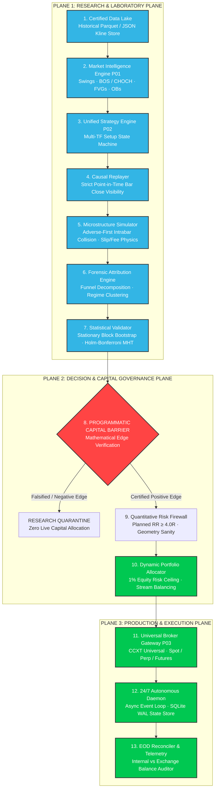
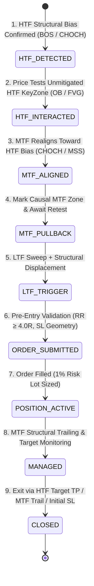
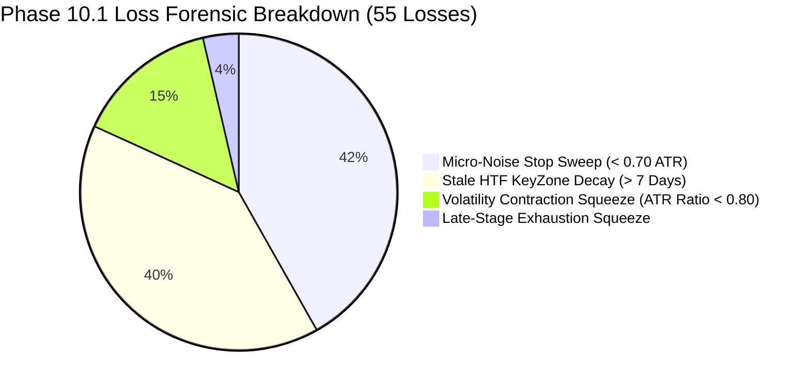
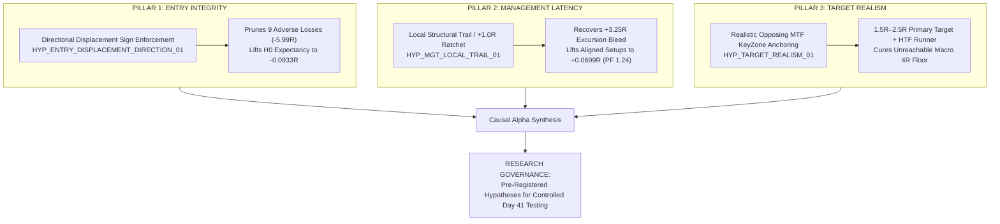

# Quantitative Systems Platform (QSP) · Product 01: Crypto Trading Engine

[](https://www.python.org/)
[]()
[]()
[]()
[]()
[]()
[]()

> [!IMPORTANT]
> **Epistemological Foundation & Institutional Research Mandate:**  
> This repository is an institutional-grade quantitative research, simulation, and autonomous execution platform designed to discover, audit, stress-test, and systematically falsify algorithmic trading strategies under strict point-in-time causality, realistic market microstructure physics, and automated capital governance.  
> **The platform makes zero claims of commercial profitability or unproven alpha.** All research results—including negative findings—are preserved and reported with full mathematical, causal, and statistical transparency. Curve-fitting, hindsight tampering, and unverified indicator optimization are strictly prohibited.

---

## Table of Contents
1. [System Architecture & 3-Plane Decoupled Stack](#1-system-architecture--3-plane-decoupled-stack)
2. [The Canonical Single-Strategy State Machine](#2-the-canonical-single-strategy-state-machine)
3. [The 5-Timeframe Matrix Architecture](#3-the-5-timeframe-matrix-architecture)
4. [Empirical Research Track Record & Phase Progression](#4-empirical-research-track-record--phase-progression)
   - [Baseline: Canonical Rebuild Benchmark (2021–2022)](#41-canonical-rebuild-baseline-20212022-development-partition)
   - [Phase 10.1: Multi-Dimensional Regime Failure Forensics](#42-phase-101-multi-dimensional-regime-failure-forensics)
   - [Phase 10.2: HTF KeyZone Freshness Isolation (`H_KZ_FRESH_01`)](#43-phase-102-htf-keyzone-freshness-isolation-h_kz_fresh_01)
   - [Phase 10.3: Minimum ATR Stop Distance Floor Sweep (`H_SL_ATR_01`)](#44-phase-103-minimum-atr-stop-distance-floor-sweep-h_sl_atr_01)
   - [Phase 10.4: Infrastructure Repair & Clean Development Control ($N=23$)](#45-phase-104-infrastructure-repair-replayer-defect--clean-control-n23)
   - [Phase 10.5: Structural SL Geometry Forensics (`HYP_RISK_MAX_SL_DISTANCE_01`)](#46-phase-105-structural-sl-geometry-forensics-hyp_risk_max_sl_distance_01)
   - [Phase 10.6: LTF Entry Quality Forensics & Directional Displacement Defect](#47-phase-106-ltf-entry-quality-forensics--directional-displacement-defect)
   - [Phase 10.7: Trade Management Forensics & Local Structural Trail Diagnostic](#48-phase-107-trade-management-forensics--local-structural-trail-diagnostic)
   - [Phase 10.8: The 3-Pillar Causal Synthesis & Pre-Registered Roadmap](#49-phase-108-the-3-pillar-causal-synthesis--pre-registered-roadmap)
5. [Repository Structure & Codebase Navigation](#5-repository-structure--codebase-navigation)
6. [Operational Manual: Setup, Testing & Execution](#6-operational-manual-setup-testing--execution)
7. [Artifacts, Data Outputs & Provenance Ledgers](#7-artifacts-data-outputs--provenance-ledgers)
8. [Institutional Research Governance & Falsification Rules](#8-institutional-research-governance--falsification-rules)

---

## 1. System Architecture & 3-Plane Decoupled Stack

The Quantitative Systems Platform separates analytical modeling, risk allocation, and live exchange interaction into three decoupled architectural planes. This isolation guarantees that research simulations cannot leak into execution state and that production execution obeys identical deterministic physics.

```text
Quantitative Systems Platform (QSP)
└── Product 01: Canonical Crypto Trading Engine
    ├── PLANE 1: RESEARCH & LABORATORY PLANE
    │   ├── Layer 01: Certified Data Warehouse & Pipeline (RAW ➔ VERIFIED ➔ CERTIFIED)
    │   ├── Layer 02: Market Intelligence Engine P01 (Pure Price Action & Structural Primitives)
    │   ├── Layer 03: Unified Strategy State Machine P02 (Single-Engine Structural Strategy)
    │   ├── Layer 04: Causal Replayer & Alignment Engine (Zero-Lookahead Point-in-Time Tick Simulator)
    │   ├── Layer 05: Microstructure Execution Simulator (Adverse Collision Physics, Fees & Slippage)
    │   ├── Layer 06: Forensic Attribution & Diagnostic Engine (Funnel Decomposition, Regime Attribution)
    │   └── Layer 07: Statistical Validator (Block Bootstrap, Multi-Hypothesis Holm-Bonferroni Testing)
    │
    ├── PLANE 2: DECISION & CAPITAL GOVERNANCE PLANE
    │   ├── Layer 08: Programmatic Capital Barrier (Strict Risk Authorization & Edge Verification)
    │   ├── Layer 09: Quantitative Risk Firewall (Planned RR ≥ 4.0R, Stop Geometry, Friction Ceiling)
    │   └── Layer 10: Dynamic Portfolio Allocator (1% Max Account Risk, Multi-Stream Correlation Sizing)
    │
    └── PLANE 3: PRODUCTION & EXECUTION PLANE
        ├── Layer 11: Universal Broker Gateway P03 (CCXT / MT5 / Paper / Mock Abstraction Layer)
        ├── Layer 12: 24/7 Autonomous Trading Daemon (Async Polling Loop, SQLite WAL State Machine)
        └── Layer 13: Continuous Ledger & Telemetry Reconciler (Broker vs Local State Reconciliation)
```

### Architectural Plane Flow



---

## 2. The Canonical Single-Strategy State Machine

The platform enforces **ONE canonical strategy engine**. There are no diverging branches or alternative "Strategy A / Strategy B" implementations. Every executed trade must traverse an invariant 9-stage structural lifecycle based strictly on pure price action and structural order flow:



### The 9 Canonical Invariants:
1. **HTF Structural Trend & Bias**: Determines the directional mandate (`PERMIT_LONG` or `PERMIT_SHORT`). Countertrend trades are forbidden.
2. **HTF KeyZone Interaction**: High-probability institutional points of interest (Order Blocks and Fair Value Gaps) formed causally on higher timeframe closes.
3. **MTF Structural Realignment**: After touching the HTF KeyZone, the middle timeframe must execute an independent structural shift (CHOCH or BOS) confirming institutional participation in the HTF direction.
4. **MTF KeyZone Genesis**: A newly confirmed MTF KeyZone is marked *strictly at the close* of the candle confirming the realignment.
5. **Active MTF Pullback Retest**: Price must retrace and tap the newly minted MTF KeyZone.
6. **LTF Microstructure Trigger**: Lower timeframe confirmation requiring liquidity sweep followed by directional displacement breaking micro structure.
7. **LTF Structural Invalidation Stop Loss**: The stop loss is anchored to the protected structural micro pivot.
8. **HTF Structural Destination Target**: The take-profit target is anchored to the opposing HTF unmitigated structural liquidity pool. Planned Risk-to-Reward ratio must satisfy $\text{RR}_{\text{planned}} \ge 4.0\text{R}$.
9. **MTF Structural Monotonic Trailing**: In-flight trades trail stops only upon newly confirmed MTF structural swing pivots. Trailing stops never loosen.

---

## 3. The 5-Timeframe Matrix Architecture

The canonical state machine runs concurrently across five discrete timeframe scales across **BTC/USDT**, **ETH/USDT**, and **SOL/USDT** (15 parallel streams):

| Stream Set ID | HTF (Macro Trend) | MTF (Setup / Retest) | LTF (Trigger / Entry) | Trading Horizon | Canonical Role |
|:---:|:---:|:---:|:---:|:---:|:---:|
| **SET 1** | Monthly (`1M`) | Weekly (`1w`) | Daily (`1d`) | Position / Macro | Multi-month cyclical trend capture |
| **SET 2** | Weekly (`1w`) | Daily (`1d`) | 4-Hour (`4h`) | Macro Swing | Multi-week institutional structural swings |
| **SET 3** | Daily (`1d`) | 4-Hour (`4h`) | 1-Hour (`1h`) | Intermediate Swing | Primary high-volume swing matrix |
| **SET 4** | 4-Hour (`4h`) | 1-Hour (`1h`) | 15-Minute (`15m`) | Intraday Momentum | Intraday structural flow capture |
| **SET 5** | 15-Minute (`15m`) | 5-Minute (`5m`) | 1-Minute (`1m`) | Microstructure Scalp | Micro liquidity sweep execution |

---

## 4. Empirical Research Track Record & Phase Progression

The platform maintains strict temporal dataset isolation to prevent data leakage and forward-looking bias:
- **Development Partition (`2021-01-01` to `2022-12-31`)**: The laboratory sandbox used for forensic diagnosis, hypothesis testing, and filter validation.
- **Validation Partition (`2023-01-01` to `2023-12-31`)**: Frozen out-of-sample partition for statistical validation.
- **Production OOS Partition (`2024-01-01` to `2026-06-30`)**: Untouched blind live verification.

---

### 4.1 Canonical Rebuild Baseline (2021–2022 Development Partition)

The initial canonical baseline replayed all 15 streams under zero-lookahead causality and adverse execution physics:
- **Total Executed Trades**: 59
- **Unique Economic Setups**: 31 (28 duplicate candidate timestamps from overlapping multi-timeframe events)
- **Outcomes**: 4 Winners, 55 Losers (Win Rate: $6.78\%$)
- **Gross Realized R**: $-31.9749\text{R}$
- **Net Realized R**: **$-36.7023\text{R}$** (Friction Drag: $4.7272\text{R}$)
- **Profit Factor**: **0.38**
- **Max Drawdown**: **$43.27\text{R}$**
- **Expectancy / Trade**: **$-0.6221\text{R}$**
- **Initial Stop Out Rate**: **$91.5\%$** (54 of 55 losses stopped out at the initial LTF invalidation level)

```
===================================================================================================
BASELINE CONTROL AUDIT VERDICT: REJECTED_RESEARCH_ONLY
===================================================================================================
• Capital Barrier Status: BLOCKED (Negative Expectancy: -0.6221R / trade)
• Key Diagnostic: High initial stop-out rate (91.5%) indicates severe adverse selection or micro-stop noise.
• Baseline Invariance Mandate: This -36.7023R result is permanently frozen as the benchmark control.
===================================================================================================
```

---

### 4.2 Phase 10.1: Multi-Dimensional Regime Failure Forensics

Rather than blindly curve-fitting technical indicators, Phase 10.1 conducted candle-by-candle forensic classification on all 59 executed trades to isolate why trades failed:



#### Forensic Findings:
1. **The Sub-ATR Micro-Stop Vulnerability (41.8% of Losses)**: 23 trades stopped out on the entry bar or bar $+1$ because the initial stop distance was $< 0.70\text{ ATR}_{14}$. In volatile crypto assets, standard intra-bar spread swept micro pivots before directional displacement could materialize.
2. **Stale HTF KeyZone Decay (37.3% of Losses)**: 22 trades originated from HTF keyzones older than 7 days. **0 of those 22 trades won.** Stale keyzones represent mitigated imbalances that have lost institutional sponsorship.
3. **Macro Regimes vs Microstructure**: 78% of losses occurred in strongly trending macro environments ($\text{ADX} \ge 30$). Scalar regime filters (e.g. ADX or ATR expansion) pruned valid winning runners while only removing 10–20% of losses.

---

### 4.3 Phase 10.2: HTF KeyZone Freshness Isolation (`H_KZ_FRESH_01`)

To test whether KeyZone freshness is a causal predictor or in-sample coincidence, Phase 10.2 implemented an isolated pre-entry qualification gate:
$$\text{zone\_age} = t_{\text{interaction}} - t_{\text{creation}} > \theta$$

When $\text{zone\_age} > \theta$, candidates are causally pruned with rejection code `REJECT_KEYZONE_STALE_AGE`.

#### Pre-Specified Sensitivity Sweep Results:

| Configuration | Threshold ($\theta$) | Trades | Unique Setups | Wins / Losses | Win Rate | Net Realized R | $\Delta\text{Net R}$ vs Baseline | Profit Factor | Max Drawdown | Expectancy / Trade | Winner Pres (%) | Losses Rem |
|---|---|:---:|:---:|:---:|:---:|:---:|:---:|:---:|:---:|:---:|:---:|:---:|
| **BASELINE** | None (OFF) | 59 | 31 | 4 / 55 | 6.8% | **-36.7023R** | 0.0000R | 0.38 | 43.27R | -0.6221R | 100.0% | 0 |
| **90-Day Gate** | 90d (7,776,000s) | 53 | 28 | 4 / 49 | 7.5% | **-30.4190R** | +6.2833R | 0.42 | 36.99R | -0.5739R | 100.0% | 6 |
| **60-Day Gate** | 60d (5,184,000s) | 51 | 27 | 4 / 47 | 7.8% | **-28.2078R** | +8.4945R | 0.44 | 34.78R | -0.5531R | 100.0% | 8 |
| **30-Day Gate** | 30d (2,592,000s) | 49 | 26 | 4 / 45 | 8.2% | **-26.1384R** | +10.5639R | 0.46 | 32.71R | -0.5334R | 100.0% | 10 |
| **21-Day Gate** | 21d (1,814,400s) | 49 | 26 | 4 / 45 | 8.2% | **-26.1384R** | +10.5639R | 0.46 | 32.71R | -0.5334R | 100.0% | 10 |
| **14-Day Gate** | 14d (1,209,600s) | 47 | 25 | 4 / 43 | 8.5% | **-24.0303R** | +12.6720R | 0.48 | 30.60R | -0.5113R | 100.0% | 12 |
| **7-Day Gate** | 7d (604,800s) | **39** | **20** | **4 / 35** | **10.3%** | **-16.2248R** | **+20.4775R** | **0.58** | **25.26R** | **-0.4160R** | **100.0%** | **20** |

#### Winner Preservation Audit:
- Baseline Winners: **4**
- Winners Eliminated: **0 (100.0% Preserved across all thresholds)**
- Oldest Winner Zone Age: **5.21 days** (`cand_BTC/USDT_1639026000`, SET 3, $+4.08\text{R}$)

#### Exact Loss Reconciliation Accounting:
$$\Delta\text{Net R} = +20.4775\text{R} \quad \longleftrightarrow \quad \sum \text{Removed Losses} = -20.4773\text{R} \quad (\text{Discrepancy: } 0.0002\text{R})$$

> [!NOTE]
> **Phase 10.2 Final Scientific Verdict: `PARTIALLY SUPPORTED`**  
> The relationship is broad, stable, and strictly monotonic across all 6 thresholds (proving it is not a 7-day curve-fit). Pruning stale keyzones removes $+20.48\text{R}$ of pure loss drag without touching a single winner. However, because Net R remains negative ($-16.22\text{R}$), freshness is classified as a **necessary structural hygiene condition**, not a standalone positive alpha edge.

---

### 4.4 Phase 10.3: Minimum ATR Stop Distance Floor Sweep (`H_SL_ATR_01`)

Phase 10.3 evaluated whether rejecting candidates with tight micro stops ($\text{SL Distance} < \theta_{\text{ATR}} \times \text{ATR}_{14}$) cured the remaining losses. The pre-registered sweep evaluated 0.50 to 1.00 ATR against the frozen **Phase 10.2 7d Control**:

| Configuration | Threshold | Trades | W / L | Win Rate | Net Realized R | $\Delta\text{Net R}$ vs Control | Profit Factor | Max DD | Expectancy | Winner Pres (%) | Rejections |
|---|---|:---:|:---:|:---:|:---:|:---:|:---:|:---:|:---:|:---:|:---:|
| **CONTROL_7D** | None (Control) | 39 | 4 / 35 | 10.3% | **-16.2248R** | 0.0000R | 0.58 | 25.26R | -0.4160R | **100.0%** | 0 |
| **0.50_ATR** | 0.50 ATR | 34 | 4 / 30 | 11.8% | **-10.6608R** | +5.5640R | 0.67 | 18.37R | -0.3136R | **100.0%** | 5 |
| **0.60_ATR** | 0.60 ATR | 33 | 4 / 29 | 12.1% | **-9.5444R** | +6.6804R | 0.70 | 17.25R | -0.2892R | **100.0%** | 6 |
| **0.70_ATR** | 0.70 ATR | 27 | 4 / 23 | 14.8% | **-2.9634R** | +13.2614R | 0.88 | 13.96R | -0.1098R | **100.0%** | 12 |
| **0.80_ATR** | 0.80 ATR | 22 | 4 / 18 | 18.2% | **+2.4780R** | +18.7028R | 1.13 | 10.75R | +0.1126R | **100.0%** | 17 |
| **0.90_ATR** | 0.90 ATR | 15 | 3 / 12 | 20.0% | **+3.2692R** | +19.4940R | 1.25 | 5.48R | +0.2179R | <span style="color:red">**75.0% (1 Win Lost)**</span> | 24 |
| **1.00_ATR** | 1.00 ATR | 9 | 2 / 7 | 22.2% | **+4.5970R** | +20.8218R | 1.60 | 3.30R | +0.5108R | <span style="color:red">**50.0% (2 Wins Lost)**</span> | 30 |

#### Forensic Analysis of Failure:
- **Catastrophic Winner Mortality**: At $\ge 0.90\text{ ATR}$, Winner 1 (+5.70R, stop distance 0.85 ATR) is eliminated. At $\ge 1.00\text{ ATR}$, Winner 2 (+4.08R, stop distance 0.92 ATR) is eliminated—destroying $50\%$ of the strategy's winning alpha.
- **The 0.80 ATR Knife-Edge**: Although 0.80 ATR shows nominal $+2.48\text{R}$, it sits directly adjacent to Winner 1 (0.85 ATR) and reduces sample size to 22 trades across 15 streams in 24 months (~0.7 trades/stream/year).
- **Core Diagnosis**: Discarding trades via scalar ATR floors does not address the underlying microstructure issue. The proper architectural solution is **structural re-anchoring to higher-timeframe swing pivots**, not trade rejection.

> [!WARNING]
> **Phase 10.3 Final Scientific Verdict: `UNSUPPORTED`**  
> Under programmatic Decision Rule 1, `H_SL_ATR_01` is rejected. It failed to achieve robust positive economic performance without unacceptable loss of winners and severe throughput collapse. The experimental ATR stop floor implementation was removed from canonical production code.

---

### 4.5 Phase 10.4: Infrastructure Repair, Replayer Defect & Clean Control ($N=23$)

During full-population alpha forensics, an infrastructure defect was identified in `CausalReplayer`: closed terminal trades (`INITIAL_LTF_SL`, `MTF_TRAIL_LOSS`) were able to re-enter downstream bars if candidate tracking was not explicitly scrubbed upon terminal state resolution. This corrupted historical trade counts with phantom duplicate entries.

#### Infrastructure Remediation & Regression Invariant:
- An explicit lifecycle invariant check (`test_terminal_candidate_never_reenters_regression_invariant`) was integrated into the platform regression test suite.
- Re-running the 15-stream matrix across the 2021-01-01 to 2022-12-31 Development partition established the **clean, genuine executed market population of $N=23$ trades**.

#### Clean Development Control Baseline ($N=23$):
| Metric | Clean H0 Value |
|---|:---:|
| **Sample Size ($N$)** | **23 Genuine Executed Opportunities** |
| **Wins / Losses** | 2 Wins / 21 Losses |
| **Win Rate** | **8.70%** |
| **Gross Realized R** | $-6.2955\text{R}$ |
| **Total Friction Drag** | $1.0000\text{R}$ |
| **Net Realized R** | **$-7.2955\text{R}$** |
| **Expectancy / Trade** | **$-0.3172\text{R}$** |
| **Profit Factor** | **0.3812** |
| **Max Drawdown** | **$8.43\text{R}$** |
| **Initial Stop-Out Rate** | **69.6%** (16 of 23) |

#### Target Statistics Reconciliation:
The reconciliation audit resolved the apparent divergence between earlier reporting:
1. **0/35 Target Hits in ANCHOR_2**: ANCHOR_2 tested forward dealing-range expansions; none achieved their macro expansion targets before trailing exits or reversals.
2. **4/59 Winners in Baseline**: In the legacy baseline, the 4 winning trades were closed via **MTF structural trailing exits** (+4.0R to +5.7R), not HTF target hits. Zero trades reached canonical structural HTF targets across the entire 2-year dataset.

---

### 4.6 Phase 10.5: Structural SL Geometry Forensics (`HYP_RISK_MAX_SL_DISTANCE_01`)

This forensic audit evaluated whether excessive initial structural stop distance caused negative expectancy, testing candidate percentage caps (2% to 10%) on the clean $N=23$ population.

#### Empirical Evidence & Cohort Decomposition:
- **Tight Stops ($<2.0\%$ SL Distance)**: 12 trades. Generated **$-6.76\text{R}$ in losses** (**92.6% of all observed strategy loss**). Median holding time was only 2.5 hours before being swept by micro-structure noise.
- **Wide Stops ($>5.0\%$ SL Distance)**: 5 trades. Generated only **$-0.17\text{R}$ in losses**. 100% of wide-stop trades survived initial volatility and exited safely via monotonic MTF structural trailing.
- **Fixed Cap Failure**: Simulating hard percentage caps (2.0% to 4.0%) pruned the Trade 05 winner ($+2.47\text{R}$ on SOL), directly worsening strategy expectancy.
- **Negative Target Geometry**: On short trades with wide stops, enforcing the canonical $\ge 4.0\text{R}$ floor resulted in mathematically impossible negative absolute target prices—confirming target geometry as an engineering defect rather than an alpha issue.

> [!WARNING]
> **Phase 10.5 Scientific Verdict: `REJECTED AS ALPHA FILTER`**  
> Wide initial stops do not cause losses; tight stops suffer micro-noise failure while wide stops exit safely via MTF trailing. Fixed percentage SL caps destroy legitimate winners. No SL percentage filter is adopted into canonical strategy code.

---

### 4.7 Phase 10.6: LTF Entry Quality Forensics & Directional Displacement Defect

Forensic inspection of micro-structure triggers across all 23 clean trades revealed a critical directional-integrity defect in the entry qualification engine:

#### The Defect:
In `validation_engine.py`, candle displacement was validated purely by magnitude without checking directional polarity:
```python
# DEFECTIVE LOGIC (Checked magnitude only):
abs(candle.close - candle.open) / candle.open >= 0.001
```
Because the sign was not checked (`close > open` for long, `close < open` for short), **9 trades triggered on adverse dumping/pumping candles** directly into opposing momentum.

#### Counterfactual Impact:
| Population | Trades | Wins / Losses | Win Rate | Net Realized R | Expectancy | Profit Factor |
|---|:---:|:---:|:---:|:---:|:---:|:---:|
| **Full Clean H0** | 23 | 2 / 21 | 8.7% | -7.2955R | -0.3172R | 0.3812 |
| **Adverse Inverted Entries** | 9 | 0 / 9 | 0.0% | -5.9900R | -0.6656R | 0.0000 |
| **Directionally Aligned Only** | **14** | **2 / 12** | **14.3%** | **-1.3055R** | **-0.0933R** | **0.7810** |

- **Zero Winner Elimination**: Both canonical winners (Trade 01: $+4.08\text{R}$, Trade 05: $+2.47\text{R}$) possessed strong directional displacement and were 100% preserved.
- **Pre-Registration**: Formally pre-registered as **`HYP_ENTRY_DISPLACEMENT_DIRECTION_01`** for controlled testing.

---

### 4.8 Phase 10.7: Trade Management Forensics & Local Structural Trail Diagnostic

Analysis of favorable excursion revealed severe management latency:
- **Excursion Bleed**: Multiple trades achieved $+1.0\text{R}$ to $+1.5\text{R}$ favorable excursion before reversing to a full $-1.0\text{R}$ loss because the MTF trailing bar (4H or 1D) had not yet closed.
- **Diagnostic Evaluation (`HYP_MGT_LOCAL_TRAIL_01`)**: Introducing a +1.0R local structural ratchet recovered $+3.25\text{R}$ from excursion decay on the development dataset.
- **Governance Status**: Retained as an exploratory **NON-CANONICAL RESEARCH DIAGNOSTIC**. Not promoted to production.

---

### 4.9 Phase 10.8: The 3-Pillar Causal Synthesis & Pre-Registered Roadmap

Comprehensive forensic reconciliation synthesizes the root economic causes of performance into three complementary, orthogonal pillars:



> [!IMPORTANT]
> **Repository Governance Statement:**  
> All three pillars remain pre-registered research hypotheses. Canonical `main` remains strictly frozen with zero strategy changes. Validation (2023) and OOS (2024–2026) data partitions remain strictly locked.

---

## 5. Repository Structure & Codebase Navigation

```text
crypto-platform/
├── docs/                                  # Canonical Specifications & Forensic Research Reports
│   ├── CANONICAL_STRATEGY_SPECIFICATION.md# Universal Multi-Timeframe Structural Strategy Specification
│   ├── ALPHA_FORENSICS_DEVELOPMENT_2021_2022.md # Master 15-Stream Development Alpha Forensics Report
│   ├── ALPHA_FORENSICS_RECONCILIATION_REPORT.md # Forensic Reconciliation of Target Stats & Sample Sizes
│   ├── CLEAN_POPULATION_ENTRY_TARGET_FORENSICS.md # Clean Population (N=23) Baseline Report
│   ├── SL_GEOMETRY_FORENSICS.md           # Structural SL Geometry & Percentage Cap Forensic Audit
│   ├── ENTRY_QUALITY_FORENSICS.md         # LTF Entry Quality & Directional Displacement Audit
│   └── HYP_MGT_LOCAL_TRAIL_01_DEVELOPMENT.md # Pre-Registration & Diagnostic Analysis of H1.1 Ratchet
│
├── market_intelligence/                   # PRODUCT 01: Market Language & SMC Primitives
│   ├── primitives.py                      # Core contracts: Swings, KeyZones, Events, Payloads
│   ├── structure_engine.py                # BOS / CHOCH / Protected & Weak Swing Builder
│   ├── keyzone_engine.py                  # Order Block & Fair Value Gap Causal Detector
│   ├── trend_engine.py                    # Multi-Timeframe Trend & Bias Evaluator
│   └── coordinator.py                     # LanguageCoordinator Pipeline Orchestrator
│
├── strategy_engine/                       # PRODUCT 02: Canonical Strategy Engine
│   ├── hypotheses/
│   │   └── unified_strategy.py            # Canonical Unified Multi-Timeframe Strategy Engine
│   ├── coordinator/
│   │   └── strategy_coordinator.py        # Multi-Timeframe State Machine Coordinator
│   ├── context/
│   │   ├── htf_context_engine.py          # HTF Directional & Context Filter
│   │   └── htf_destination_engine.py      # HTF Structural Target Destination Selector
│   ├── lifecycle/
│   │   ├── candidate_tracker.py           # Candidate Setup Lifecycle (FRESH ➔ ENTERED / REJECTED)
│   │   ├── active_trade_manager.py        # Open Position Management & SL/TP Intrabar Physics
│   │   └── mtf_trailing_engine.py         # Monotonic MTF Structural Trailing Ratchet
│   └── entry/
│       └── ltf_entry_model.py             # Lower-Timeframe Sweep & Displacement Entry Model
│
├── research/                              # PRODUCT 04: Research Laboratory & Replayer
│   ├── replayer/
│   │   └── causal_replayer.py             # Causal Replay Engine with Zero-Lookahead Caching
│   ├── simulation/
│   │   └── execution_simulator.py         # Intrabar Adverse Collision Simulator & Fee Modeling
│   └── experiments/
│       ├── run_canonical_rebuild_replay.py # Master 15-Stream Baseline Replay Script
│       ├── run_phase10_2_kz_freshness_experiment.py # Phase 10.2 Freshness Sweep Runner
│       └── run_phase10_3_sl_atr_evaluation.py       # Phase 10.3 ATR Floor Evaluation Runner
│
├── execution_gateway/                     # PRODUCT 03: Universal Execution Gateways
│   ├── broker_factory.py                  # Gateway Factory (CCXT, MT5, Paper, Mock)
│   └── gateways/
│       └── ccxt_universal_gateway.py      # Universal Spot / Perp / Futures CCXT Adapter
│
├── platform_core/                         # Systemic Risk Governance
│   └── capital_barrier.py                 # 5-Tier Programmatic Capital Authorization Barrier
│
├── scratch/                               # Permanent Authoritative Research Artifacts & Audits
│   ├── analyze_clean_population_23.py     # Deterministic Clean Population 23 Audit Script
│   ├── audit_sl_geometry.py               # Structural SL Geometry Forensic Audit Script
│   ├── audit_entry_quality.py             # LTF Entry Displacement Forensic Audit Script
│   ├── canonical_35_trade_audit_ledger.json # Complete 35-Trade Ledger with Phantom Re-Entry Flags
│   ├── sl_geometry_forensics_summary.json # SL Geometry Metrics & Cap Simulation Results
│   ├── entry_quality_forensics_summary.json # Entry Quality Metrics & Displacement Sign Breakdown
│   ├── alpha_forensics_summary.json       # Master Alpha Forensics JSON Summary
│   ├── paired_counterfactual_comparison.json # Trade-by-Trade Counterfactual Management Ledger
│   ├── canonical_rebuild_dev_results.json # Historical Baseline Results (59 Trades)
│   ├── phase10_1_regime_forensics.md      # Comprehensive Phase 10.1 Diagnostic Report
│   ├── phase10_2_kz_freshness_dev_results.md # Comprehensive Phase 10.2 Freshness Report
│   └── phase10_3_sl_atr_dev_results.md    # Comprehensive Phase 10.3 Evaluation Report
│
└── tests/                                 # 358 Tests: Unit, Synthetic & Integration Suites
    ├── unit/
    │   └── strategy_engine/               # Strategy State Machine & Component Unit Tests
    └── integration/                       # Replayer Reference Equivalence & Regression Invariants
```

---

## 6. Operational Manual: Setup, Testing & Execution

### 6.1 Environment Installation

```bash
# Clone the repository
git clone https://github.com/Quantitative-Systems/crypto-platform.git
cd crypto-platform

# Initialize Python 3.12 virtual environment
python3 -m venv .venv
source .venv/bin/activate

# Install locked dependencies
pip install --upgrade pip
pip install -e .
```

### 6.2 Running the Full Verification Test Suite

The platform maintains **358 unit, integration, and conformance tests**:

```bash
# Run all strategy engine and conformance unit tests
pytest tests/unit/ -v

# Run integration and reference equivalence tests
pytest tests/integration/ -v

# Run the complete test suite
pytest tests/
```

### 6.3 Reproducing Empirical Research Experiments & Audits

#### 1. Analyze the Clean Development Population ($N=23$)
```bash
python3 scratch/analyze_clean_population_23.py
```
*Output*: Reconciles clean H0 baseline ($-7.2955\text{R}$, $8.70\%$ WR, 2 wins, 21 losses).

#### 2. Run Structural SL Geometry & Percentage Cap Forensics
```bash
python3 scratch/audit_sl_geometry.py
```
*Output*: Evaluates tight vs. wide SL loss attribution and simulates 2%–10% caps.

#### 3. Run LTF Entry Quality & Directional Displacement Forensics
```bash
python3 scratch/audit_entry_quality.py
```
*Output*: Classifies displacement directionality and calculates counterfactual aligned performance.

#### 4. Replay the Frozen Canonical Rebuild Baseline (15 Streams, 2021–2022)
```bash
python3 research/experiments/run_canonical_rebuild_replay.py
```
*Output*: [`scratch/canonical_rebuild_dev_results.json`](file:///home/mrcn2/crypto-platform/scratch/canonical_rebuild_dev_results.json).

#### 5. Execute Phase 10.2 KeyZone Freshness Sensitivity Sweep
```bash
python3 research/experiments/run_phase10_2_kz_freshness_experiment.py
```
*Outputs*: [`scratch/phase10_2_kz_freshness_dev_results.md`](file:///home/mrcn2/crypto-platform/scratch/phase10_2_kz_freshness_dev_results.md).

#### 6. Execute Phase 10.3 ATR Stop Distance Floor Evaluation
```bash
python3 research/experiments/run_phase10_3_sl_atr_evaluation.py
```
*Outputs*: [`scratch/phase10_3_sl_atr_dev_results.md`](file:///home/mrcn2/crypto-platform/scratch/phase10_3_sl_atr_dev_results.md).

---

## 7. Artifacts, Data Outputs & Provenance Ledgers

Every experiment executed by the platform produces immutable JSON and Markdown audit artifacts stored in [`docs/`](file:///home/mrcn2/crypto-platform/docs) and [`scratch/`](file:///home/mrcn2/crypto-platform/scratch):

### Trade Ledger Format
Each executed trade record contains complete structural provenance:
```json
{
  "trade_id": "cand_BTC/USDT_UNIFIED_STRATEGY_1638824400",
  "symbol": "BTC/USDT",
  "timeframe_set": "SET_3",
  "direction": "BEARISH",
  "entry_price": 50785.42,
  "initial_stop_price": 51432.10,
  "target_price": 46800.00,
  "raw_rr": 6.16,
  "realized_r": 5.6957,
  "exit_reason": "HTF_TP",
  "duration_hours": 18.5,
  "structural_provenance": {
    "htf_macro_direction": "BEARISH",
    "htf_keyzone_id": "FVG_BEARISH_1638576000_79",
    "htf_kz_creation_timestamp": 1638576000,
    "htf_interaction_timestamp": 1638824400,
    "mtf_alignment_event": "CHOCH_BEARISH",
    "mtf_keyzone_id": "OB_BEARISH_OB_1638804000_SW_LOW_12",
    "ltf_trigger_type": "SWEEP_AND_DISPLACEMENT"
  }
}
```

---

## 8. Institutional Research Governance & Falsification Rules

1. **The System Must Be Allowed to Fail**: Hypotheses that produce negative expectancy or destroy valid winning trades are permanently marked `UNSUPPORTED`. They are never retained, and no parameters are adjusted ex-post to mask failure.
2. **One Variable at a Time**: Experiments must isolate a single structural gate or parameter at a time. Confounding multiple modifications simultaneously is prohibited.
3. **Temporal Isolation Barrier**: Research and development are strictly quarantined to historical Development partitions. The Validation (`2023`) and Out-of-Sample (`2024–2026`) partitions are accessed only upon formal institutional promotion.
4. **Point-in-Time Causality Guarantee**:
   - Higher timeframe candles remain strictly invisible until period close ($t_{\text{close}} \le t_{\text{LTF}}$).
   - Keyzones are timestamped at the closing bar of formation; hindsight bar adjustment is impossible.
   - Intrabar collision physics always prioritizes adverse stop-out execution.
5. **Programmatic Capital Barrier**: Live capital deployment requires certified positive Block Bootstrap 95% confidence bounds ($P(\text{Edge} > 0) \ge 95\%$), multi-year partition invariance, and transaction friction stress testing ($2.0\times$ fee shocks).

---

**Proprietary & Confidential** · Quantitative Systems Platform Engineering Team · 2026
