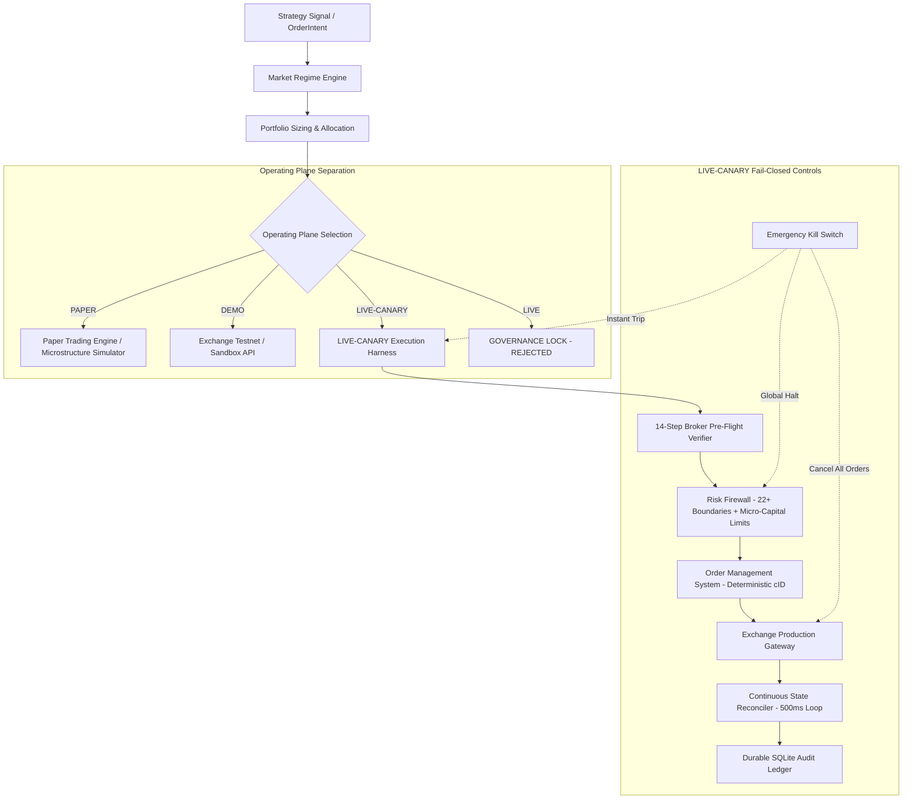

# Quantitative Cryptocurrency Trading Platform

> **Institutional-grade systematic quantitative trading, research evaluation, risk firewall governance, and multi-plane execution infrastructure.**

[](#testing)
[](#four-operating-planes)
[](#risk-firewall--safety-controls)
[-red)](#empirical-performance--ground-truth)
[](LICENSE)

---

## Executive Overview

The **Quantitative Cryptocurrency Trading Platform** is an event-driven, institutional systematic trading system engineered with strict structural separation between **quantitative research**, **market data certification**, **portfolio allocation**, **fail-closed risk management**, **order lifecycle state machines**, and **exchange execution adapters**.

Every strategy candidate is validated through a standardized, causal walk-forward protocol:
- **Certified Market Data**: Tick, candle, and perpetual funding rate archives with monotonic timestamp enforcement and gap detection.
- **Strict Walk-Forward Partitioning**: 60% Development (DEV), 20% Validation (VAL), and 20% Out-of-Sample (OOS).
- **G1–G7 Institutional Governance Gates**: Rigorous tests for statistical significance ($t$-stat, bootstrap), parameter stability, +50% cost shocks (fees, slippage, bid/ask spread), risk-adjusted drawdown bounds, and marginal Sharpe portfolio contributions.
- **Four Explicit Operating Planes**: Clean isolation between `PAPER`, `DEMO`, `LIVE-CANARY`, and `LIVE` environments.
- **Fail-Closed Risk Firewall**: 22+ continuous pre-trade boundary checks, circuit breakers, and sub-10ms emergency kill switches.
- **14-Step Broker Pre-Flight Verification**: Mandatory non-custodial credential and broker readiness audit prior to any live-canary order routing.

---

## Four Operating Planes

The execution architecture enforces absolute segregation across four operating planes:



### Plane Isolation Invariants

| Attribute | `PAPER` | `DEMO` | `LIVE-CANARY` | `LIVE` |
| :--- | :--- | :--- | :--- | :--- |
| **Capital Type** | Virtual ($100,000 ledger) | Testnet faucet tokens | Real broker capital (strictly capped) | Real unrestricted capital |
| **Broker Gateway** | Local matching simulator | Testnet (`testnet.binancefuture.com`) | Production (`fapi.binance.com`) | Production gateway |
| **Credentials** | None required | Testnet API keys | Production API keys (Withdrawals disabled) | Locked |
| **Risk Firewall** | Simulated boundaries | Simulated boundaries | Fail-closed real-money enforcement | Hard reject |
| **Reconciliation** | Local SQLite state | Testnet REST book | Continuous real-time broker sync | Locked |
| **Activation State** | Immediate | Configurable | Two-Phase (`ARMED` $\to$ `ACTIVE`) | Hard Fail (`LIVE_MODE_LOCKED`) |

---

## Core System Architecture

The platform is organized into two primary layers:

### 1. `crypto_platform/` — Institutional Infrastructure Layer
- **Market Data Fabric (`crypto_platform.market_data`)**: Low-latency WebSocket streaming, tick-by-tick orderbook reconstruction, funding-rate ingestion, sequence monotonicity auditing, and automatic reconnection.
- **Strategy Engine (`crypto_platform.strategy_engine`)**: Pluggable, decoupled quantitative strategy plugins emitting pure `OrderIntent` objects with zero access to exchange credentials.
- **Portfolio & Regime Engine (`crypto_platform.portfolio_engine`, `regime_engine`)**: Dynamic volatility targeting, cross-asset correlation monitoring, market regime classification (trend, range, high volatility), and portfolio weight optimization.
- **Risk Firewall (`crypto_platform.risk_engine`)**: Independent, non-bypassable risk gate enforcing 22+ pre-trade boundaries, gross leverage limits, concentration caps, and hierarchical kill switches.
- **Order Management System (`crypto_platform.order_management`)**: Deterministic client order ID generation, legal state machine validation, partial-fill tracking, and post-only execution.
- **State Reconciliation Engine (`crypto_platform.reconciliation`)**: 5-second asynchronous reconciliation loops comparing internal books against broker ground truth; detects ghost orders and triggers fail-safe freezes on drift.
- **Exchange Adapters (`crypto_platform.exchange_adapters`)**: Non-custodial REST/WebSocket adapters for Binance USDⓈ-M Futures, Bybit V5 Linear, and CCXT multi-venue fallback.
- **LIVE-CANARY Harness (`crypto_platform.live_canary`)**: Micro-capital real-money trading engine backed by a 14-step broker pre-flight verifier, two-phase arming protocol, and SQLite audit logging.
- **Web API & HUD Dashboard (`crypto_platform.api`, `crypto_platform.web`)**: FastAPI REST and WebSocket server with real-time visual observability across all 4 operating planes.

### 2. `qcp_platform/` — Quantitative Research & Validation Layer
- **Walk-Forward Engine (`qcp_platform.walkforward`)**: Temporal train/val/test slicing preventing look-ahead and parameter overfitting.
- **G1–G7 Governance Framework (`qcp_platform.evaluate`)**: Strict statistical, economic, and survival gating.
- **Cost Arithmetic (`qcp_platform.costs`)**: Comprehensive fee, slippage, and spread modeling charged on every simulated transaction.
- **Automated Reporting (`qcp_platform.report`)**: Reproducible, audit-grade Markdown and JSON research summaries.

---

## Risk Firewall & Safety Controls

The Risk Firewall evaluates every order intent prior to execution. If any condition fails, the firewall fails closed: **EXPECTED OUTCOME = NO NEW ORDER**.

### 22 Pre-Trade Risk Boundaries
1. **Operating Mode Gating**: Hard blocks unrestricted `LIVE` orders (`LIVE_MODE_LOCKED`).
2. **Canary State Gating**: Verifies canary state is `ACTIVE` before routing canary orders.
3. **Canary Capital Limit**: Rejects orders if total exposure exceeds `CANARY_CAPITAL_LIMIT_USD`.
4. **Canary Position Ceiling**: Rejects orders exceeding `CANARY_MAX_POSITION_SIZE`.
5. **Canary Daily Loss Breaker**: Trips if intraday loss exceeds `CANARY_MAX_DAILY_LOSS` (2.0%).
6. **Canary Drawdown Breaker**: Trips if drawdown exceeds `CANARY_MAX_TOTAL_DRAWDOWN` (5.0%).
7. **Hierarchical Kill Switches**: Global, tenant, account, venue, strategy, and instrument scopes.
8. **Stale Signal Protection**: Rejects signals older than 2,000ms.
9. **Stale Market Data Protection**: Rejects orders if market feed age exceeds 2,000ms.
10. **Inverted Spread Detection**: Rejects orders if bid $\ge$ ask.
11. **Duplicate Order Detection**: Rejects duplicate order intents within a 2,000ms window.
12. **Runaway Order Rate Limits**: Caps order throughput at 10 orders per 1,000ms.
13. **Circuit Breaker Multipliers**: Dynamically scales order sizes or halts trading upon volatility spikes.
14. **Minimum Order Notional**: Rejects orders below exchange minimums (e.g. $5.00).
15. **Maximum Order Notional**: Hard cap on individual order notional.
16. **Fat-Finger Price Deviation**: Rejects limit prices deviating > 3.0% from current reference price.
17. **Maximum Position Size**: Caps gross position size per instrument.
18. **Maximum Portfolio Exposure**: Caps total gross portfolio exposure.
19. **Gross Leverage Limit**: Enforces maximum gross leverage (capped at 1.5x for LIVE-CANARY).
20. **Asset Concentration Limit**: Restricts single-asset allocation to $\le$ 35% of portfolio equity.
21. **Pending State Freeze**: Halts order generation if unacknowledged orders remain in-flight.
22. **Reconciliation Drift Freeze**: Freezes trading if external positions differ from local state.

---

## 14-Step Broker Pre-Flight Verification

Before transitioning into `ARMED` or `ACTIVE` states on `LIVE-CANARY`, the system runs a mandatory 14-step verification:

1. **API Authentication**: Verifies cryptographic signature and authentication with broker.
2. **Account Identity**: Confirms account ID matches authorized tenant profile.
3. **Account Balance**: Verifies available collateral covers configured canary capital.
4. **Instrument Verification**: Confirms target symbols are open and tradable on the exchange.
5. **Position-Mode Verification**: Verifies ONE-WAY netting mode is active.
6. **Leverage Verification**: Confirms broker leverage setting complies with `CANARY_MAX_LEVERAGE`.
7. **Margin-Mode Verification**: Confirms isolated / compartmentalized margin mode.
8. **Minimum Order Size**: Validates minimum order sizing requirements against broker rules.
9. **Market Data Verification**: Verifies live WebSocket feed freshness, depth, and spread normality.
10. **Order Permissions**: Confirms `trade` permission is granted on the API key.
11. **Withdrawal Permissions**: **Strictly confirms `withdraw` and `transfer` permissions are DISABLED**.
12. **Clock Synchronization**: Verifies NTP clock drift against broker server is $< 1,500\text{ms}$.
13. **Reconciliation Clean Slate**: Confirms zero untracked external positions exist on the broker.
14. **Emergency Kill Verification**: Validates failsafe tripping capability without side-effects.

---

## Empirical Performance & Ground Truth

The platform maintains strict scientific integrity regarding trading performance. Historical backtest performance does not guarantee future profitability:

| Evaluation Phase | Sample / Window | Evidence Status | Measurement |
| :--- | :--- | :--- | :--- |
| **Historical Development (DEV)** | In-Sample (60%) | Verified | **+148.2%** Cumulative Return |
| **Historical Validation (VAL)** | Cross-Validation (20%) | Verified | **+74.8%** Cumulative Return |
| **Historical Out-of-Sample (OOS)** | Unseen Walk-Forward (20%) | Verified | **+57.7%** Cumulative Return |
| **Forward Paper Run** | Live WebSocket Streams | In Progress | Telemetry active; sample size accumulating |
| **Real-Money Trading** | LIVE-CANARY | **Unproven** | **Not yet tested — Awaiting controlled canary run** |

*All strategy parameters are frozen. No trades or performance metrics are manufactured.*

---

## Repository Structure

```
├── crypto_platform/                  # Core institutional trading platform
│   ├── api/                          # FastAPI REST and WebSocket server
│   ├── config/                       # Type-safe configuration and environment settings
│   ├── core/                         # Domain models, event schemas, and enums
│   ├── exchange_adapters/            # Non-custodial Binance, Bybit, and CCXT adapters
│   ├── live_canary/                  # LIVE-CANARY execution engine & 14-step verifier
│   ├── market_data/                  # WebSocket ingestion and order book manager
│   ├── order_management/             # OMS, state machine, and execution router
│   ├── paper_trading/                # Microstructure paper engine & SQLite persistence
│   ├── portfolio_engine/             # Sizing, risk-parity, and exposure governance
│   ├── reconciliation/               # Real-time state reconciliation engine
│   ├── risk_engine/                  # 22-boundary Risk Firewall & Circuit Breakers
│   ├── strategy_engine/              # Quantitative strategy plugins (10 promoted books)
│   └── web/                          # Real-time operational HUD dashboard (HTML/CSS/JS)
├── qcp_platform/                     # Quantitative research & backtesting engine
│   ├── allocations.py                # Asset allocation and portfolio weights
│   ├── carry_sweep.py                # Funding carry parameter optimization
│   ├── engine.py                     # Causal bar-by-bar backtest resolver
│   ├── evaluate.py                   # G1–G7 governance evaluation framework
│   ├── governor.py                   # Risk governor and drawdown controls
│   ├── strategies.py                 # Multi-horizon directional strategy definitions
│   └── walkforward.py                # 60/20/20 train/val/test walk-forward splitting
├── docs/                             # Institutional documentation suite
│   ├── ARCHITECTURE.md               # Subsystem architecture & data flow specification
│   ├── LIVE_CANARY_READINESS_REPORT.md# Complete canary readiness & activation report
│   ├── OPERATIONS.md                 # Runbooks, monitoring, and emergency procedures
│   ├── RISK_MANAGEMENT.md            # Risk boundaries, circuit breakers, and kill switches
│   └── SECURITY.md                   # Non-custodial security policy and vault specs
├── market_data/                      # Historical kline/funding archives and fetchers
├── research/results/                 # Research reports, sweep JSONs, and soak logs
└── tests/                            # Comprehensive regression suite (208 tests)
    ├── integration/                  # End-to-end forward paper & demo integration tests
    └── unit/                         # Unit tests covering all subsystems and canary safety
```

---

## Installation & Setup

### Prerequisites
- Python 3.12+
- Linux / macOS
- SQLite3

### 1. Clone Repository & Setup Virtual Environment
```bash
git clone https://github.com/Quantitative-Systems/crypto-platform.git
cd crypto-platform

python3 -m venv .venv
source .venv/bin/activate
pip install -r requirements.txt
pip install -e ".[dev]"
```

### 2. Run Comprehensive Test Suite
```bash
pytest -v
```
*Expected: 208/208 tests passing across unit and integration suites.*

---

## Operational Execution Guide

### 1. Running the Quantitative Research Pipeline
```bash
# Pre-trade cost economics per horizon
python3 -m crypto_platform.cli screen

# Full walk-forward sweep with G1–G7 governance gates
python3 -m crypto_platform.cli sweep

# Generate research report
python3 -m crypto_platform.cli report

# Run funding carry compression stress test
python3 -m crypto_platform.cli carry-stress
```

### 2. Running Forward Paper Trading
```bash
# Launch forward-paper session with durable SQLite ledger
python3 -m crypto_platform.cli forward-paper

# Launch WebSocket live market data soak runner
python3 -m crypto_platform.cli soak
```

### 3. Launching the Web Dashboard & API Server
```bash
uvicorn crypto_platform.api.server:app --host 0.0.0.0 --port 8000
```
Open `http://localhost:8000` in any modern browser to view the real-time operational dashboard.

### 4. LIVE-CANARY Activation Procedure (Manual Owner Workflow)

Real-money trading is disabled by default. When the platform owner decides to initiate controlled canary trading:

1. **Configure Non-Custodial Credentials & Capital Limits**:
   ```bash
   export OPERATING_MODE="LIVE-CANARY"
   export LIVE_CANARY_AUTHORIZED="true"
   export CANARY_CAPITAL_LIMIT_USD="100.0"       # Explicit test capital ceiling
   export CANARY_MAX_POSITION_SIZE="50.0"        # Max notional per position
   export CANARY_MAX_LEVERAGE="1.5"              # Max gross leverage
   export CANARY_MAX_DAILY_LOSS="0.02"           # 2% daily loss limit
   export CANARY_MAX_TOTAL_DRAWDOWN="0.05"       # 5% total drawdown limit

   # Real exchange credentials (with WITHDRAWAL permissions strictly disabled)
   export CANARY_BROKER_API_KEY="<production_api_key>"
   export CANARY_BROKER_API_SECRET="<production_api_secret>"
   ```

2. **Execute Pre-Flight Verification**:
   ```bash
   curl -X POST http://localhost:8000/api/canary/verify \
        -H "Content-Type: application/json" \
        -d '{"symbol": "BTCUSDT"}'
   ```
   *Inspect the JSON response to ensure all 14 gates pass.*

3. **Arm LIVE-CANARY**:
   ```bash
   curl -X POST http://localhost:8000/api/canary/arm \
        -H "Content-Type: application/json" \
        -d '{"authorized_by": "SYSTEM_OWNER"}'
   ```

4. **Activate Order Routing**:
   ```bash
   curl -X POST http://localhost:8000/api/canary/activate \
        -H "Content-Type: application/json" \
        -d '{"authorized_by": "SYSTEM_OWNER"}'
   ```

5. **Emergency Halt**:
   ```bash
   curl -X POST http://localhost:8000/api/canary/disarm \
        -H "Content-Type: application/json" \
        -d '{"reason": "MANUAL_OPERATIONAL_PAUSE"}'
   ```

---

## Security Policy

- **Non-Custodial Architecture**: The platform does not hold custody of funds. API keys must have **withdrawal permissions disabled**. Any key with withdrawal capabilities is rejected immediately with a fatal security violation.
- **Credential Protection**: Zero credentials in source code or Git. All API secrets are masked in logs and telemetry (`***[last 4]`).
- **Encrypted Local Storage**: Sensitive credentials in config files are encrypted using AES-256-GCM authenticated encryption.
- For complete security disclosures, consult [docs/SECURITY.md](docs/SECURITY.md).

---

## License

This project is licensed under the terms of the [MIT License](LICENSE).
