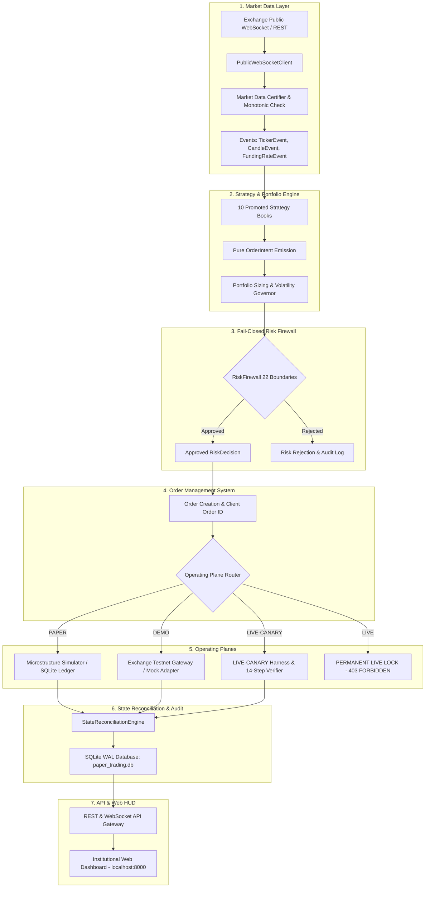
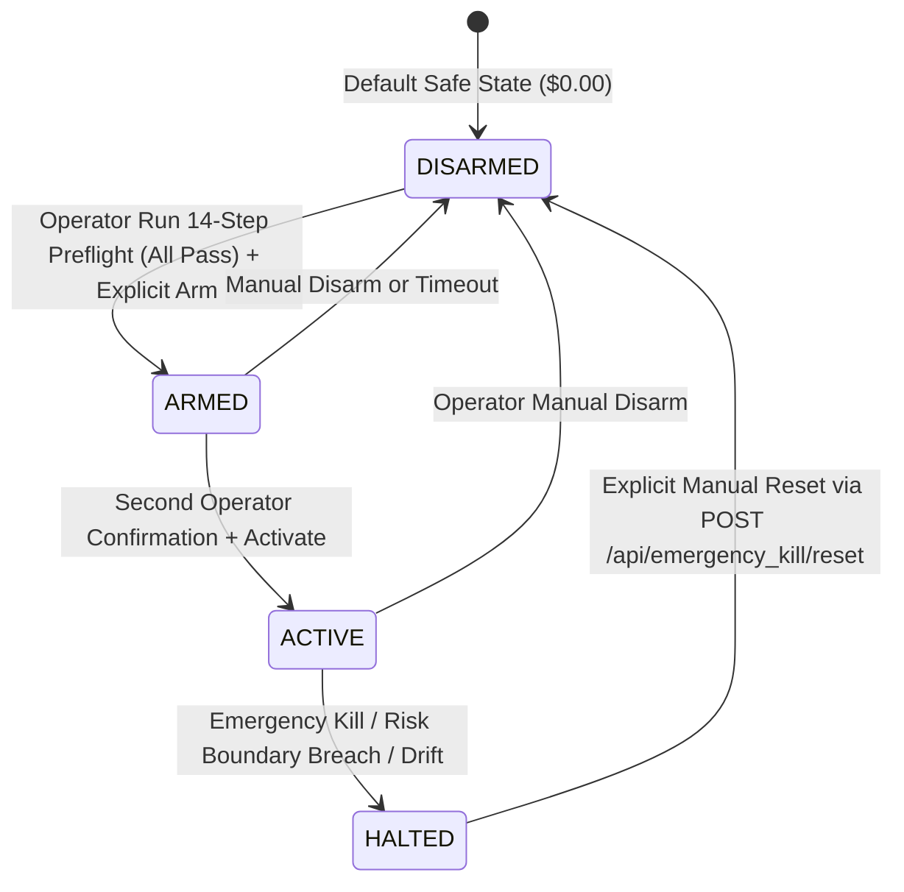

# Quantitative Crypto Trading Platform

> **An institutional-grade systematic quantitative trading, research evaluation, risk firewall governance, and multi-plane execution platform.**

[](#testing--verification)
[](#four-operating-planes)
[](#local-operations)
[](#risk-firewall--safety-controls)
[-red)](#current-verified-status)
[](LICENSE)

---

## Table of Contents
1. [Project Overview](#1-project-overview)
2. [Engineering Objectives](#2-engineering-objectives)
3. [System Architecture & Data Flow](#3-system-architecture--data-flow)
4. [Four Operating Planes](#4-four-operating-planes)
5. [Strategy Engine & Promoted Books](#5-strategy-engine--promoted-books)
6. [Quantitative Research System](#6-quantitative-research-system)
7. [Important Research Limitations](#7-important-research-limitations)
8. [LIVE-CANARY Safety Architecture](#8-live-canary-safety-architecture)
9. [REST & WebSocket API Gateway](#9-rest--websocket-api-gateway)
10. [Institutional Web Dashboard](#10-institutional-web-dashboard)
11. [Database & Persistence Model](#11-database--persistence-model)
12. [Exchange Adapters](#12-exchange-adapters)
13. [Security Architecture](#13-security-architecture)
14. [Local Installation](#14-local-installation)
15. [Local Operations](#15-local-operations)
16. [Testing & Verification](#16-testing--verification)
17. [Current Verified Status](#17-current-verified-status)
18. [Verified Capabilities ("What Works")](#18-verified-capabilities-what-works)
19. [Forensic Audit History ("What Failed & What Was Fixed")](#19-forensic-audit-history-what-failed--what-was-fixed)
20. [Known Limitations](#20-known-limitations)
21. [Development Roadmap](#21-development-roadmap)
22. [Repository Structure](#22-repository-structure)
23. [Engineering Principles](#23-engineering-principles)
24. [License & Disclaimer](#24-license--disclaimer)

---

## 1. Project Overview

The **Quantitative Crypto Trading Platform** is a research-driven, event-driven systematic trading platform engineered for controlled progression from offline quantitative research and forward paper trading to exchange-connected execution.

### What Problem It Solves
Most automated cryptocurrency trading scripts suffer from critical architectural deficiencies: lookahead bias in backtests, failure to charge realistic transaction fees and funding carry costs, lack of independent pre-trade risk controls, hardcoded exchange API secrets, absence of broker reconciliation, and lack of separation between paper and real capital. This platform provides an institutional foundation where research evaluation, risk firewall governance, order lifecycle management, and exchange adapters are strictly separated.

### System Type
- **Classification:** Event-driven asynchronous quantitative algorithmic trading system.
- **Asset Classes:** Cryptocurrency perpetual futures (USDⓈ-M linear contracts) and spot markets.
- **Target Instruments:** Major pairs (`BTCUSDT`, `ETHUSDT`, `SOLUSDT`, `ADAUSDT`, `BNBUSDT`, `DOGEUSDT`).
- **Exchange Integrations:** Non-custodial adapters for Binance (Spot & Futures), Bybit (V5 Linear), and CCXT sandbox.
- **Deployment State:** **Locally operational and production-ready on localhost (`127.0.0.1:8000`)**. Cloud deployment has **not yet started**.
- **Trading Maturity Level:** Research-validated through causal walk-forward analysis (DEV/VAL/OOS); forward-paper execution active; live real-money trading remains **permanently locked** at **$0.00 capital**.

---

## 2. Engineering Objectives

The platform was engineered to satisfy strict quantitative and operational requirements:
1. **Systematic Quantitative Research:** Reproducible, strictly causal bar-by-bar backtesting with zero lookahead bias.
2. **Temporal Partitioning:** Standardized 60% Development (DEV), 20% Validation (VAL), and 20% Out-of-Sample (OOS) walk-forward splits.
3. **Rigorous Governance Gates (G1–G7):** Automated statistical hypothesis tests, bootstrap parameter stability, +50% cost shocks, drawdown bounds, and marginal Sharpe portfolio evaluation.
4. **Forward Paper Validation:** Real-time forward paper trading engine driven by live public WebSocket feeds, recording every order, fill, and position into a persistent SQLite ledger.
5. **Fail-Closed Risk Firewall:** 22 continuous pre-trade boundary checks evaluated independently of strategy logic prior to order submission.
6. **Execution Abstraction:** Modular Order Management System (OMS) with deterministic client order IDs, state machines, and rate-limited token bucket dispatch.
7. **Broker State Reconciliation:** Continuous asynchronous reconciliation loops comparing internal state against broker ground truth to detect ghost orders or execution drift.
8. **Auditability & Persistence:** Complete, tamper-evident audit logging of all system state transitions, risk rejections, and execution telemetry.
9. **Controlled Progression Toward Live Execution:** Clean, isolated progression across four operating planes (`PAPER`, `DEMO`, `LIVE-CANARY`, `LIVE`) with hard fail-closed locks preventing accidental live trading.
10. **Non-Custodial Security:** Zero live credentials in source code or Git; fatal rejection of API keys possessing withdrawal permissions.

---

## 3. System Architecture & Data Flow

The platform enforces absolute separation of concerns across its data pipeline:



---

## 4. Four Operating Planes

The execution architecture enforces strict isolation across four distinct operating environments:

```
┌────────────────────────────────────────────────────────────────────────┐
│                        OPERATING PLANE ISOLATION                       │
├─────────────────┬─────────────────┬───────────────────┬────────────────┤
│     PAPER       │      DEMO       │    LIVE-CANARY    │      LIVE      │
│ (Virtual Paper) │(Exchange Testnet│(Real Micro-Capital│ (Real Full Cap │
│                 │ / Mock Gateway) │   Pre-Flight)     │  Hard Locked)  │
├─────────────────┼─────────────────┼───────────────────┼────────────────┤
│ Capital: $100k  │ Capital: Faucet │ Capital: $0.00    │ Capital: $0.00 │
│ Broker: Sim     │ Broker: Testnet │ Broker: Prod REST │ Broker: N/A    │
│ Status: ACTIVE  │ Status: VERIFIED│ Status: DISARMED  │ Status: LOCKED │
└─────────────────┴─────────────────┴───────────────────┴────────────────┘
```

| Operating Plane | Purpose | Capital Allocation | Broker Endpoint | Current Status |
| :--- | :--- | :--- | :--- | :--- |
| **`PAPER`** | Local event-driven forward simulation with live market data | Virtual ($100,000.00 ledger) | Internal Microstructure Simulator | **ACTIVE & VERIFIED** |
| **`DEMO`** | External broker testnet execution verification | Broker testnet faucet collateral | Exchange Testnet (`testnet.binancefuture.com`) | **VERIFIED (Mock Adapter)**<br>*Live Testnet: Blocked by Missing Config* |
| **`LIVE-CANARY`** | Controlled micro-capital live production verification | Real capital strictly capped (default: `$0.00`) | Exchange Production (`fapi.binance.com`) | **DISARMED** (Safety Lock Enforced) |
| **`LIVE`** | Unrestricted production algorithmic trading | Real unrestricted capital | Exchange Production Gateway | **PERMANENTLY LOCKED** ($0.00 Enforced) |

---

## 5. Strategy Engine & Promoted Books

The platform includes 10 promoted strategy books that survived the causal G1–G7 walk-forward governance filter across four execution horizons:

| Strategy ID | Family | Horizon | Target Instruments | Risk Budget | Promotion Status |
| :--- | :--- | :--- | :--- | :---: | :---: |
| `promoted_intraday_trend_eth` | Trend Breakout (Donchian / ATR) | INTRADAY (15m) | `ETHUSDT` | 10.0% | **Promoted (G1–G7)** |
| `promoted_intraday_trend_sol` | Trend Breakout (Donchian / ATR) | INTRADAY (15m) | `SOLUSDT` | 10.0% | **Promoted (G1–G7)** |
| `promoted_intraday_mr_ada` | Mean Reversion (Bollinger Bands / Z-score) | INTRADAY (15m) | `ADAUSDT` | 8.0% | **Promoted (G1–G7)** |
| `promoted_swing_trend_eth` | Trend Breakout (Donchian / ATR) | SWING (1h / 4h) | `ETHUSDT` | 10.0% | **Promoted (G1–G7)** |
| `promoted_swing_trend_sol` | Trend Breakout (Donchian / ATR) | SWING (1h / 4h) | `SOLUSDT` | 10.0% | **Promoted (G1–G7)** |
| `promoted_swing_trend_ada` | Trend Breakout (Donchian / ATR) | SWING (1h / 4h) | `ADAUSDT` | 8.0% | **Promoted (G1–G7)** |
| `promoted_pos_trend_bnb` | Trend Breakout (Higher-Timeframe) | POSITION (Daily) | `BNBUSDT` | 8.0% | **Promoted (G1–G7)** |
| `promoted_pos_trend_ada` | Trend Breakout (Higher-Timeframe) | POSITION (Daily) | `ADAUSDT` | 8.0% | **Promoted (G1–G7)** |
| `promoted_pos_rider_doge` | Trend Rider (Exponential Moving Ribbon) | POSITION (Daily) | `DOGEUSDT` | 8.0% | **Promoted (G1–G7)** |
| `promoted_carry_portfolio` | Delta-Neutral Perpetual Funding Carry | CARRY (8h Funding) | Multi-Asset Portfolio | 20.0% | **Promoted (G1–G7)** |

*Important: Strategy parameters are frozen. Promotion under G1–G7 gates confirms historical survival under modeled costs; it does not guarantee live profitability.*

---

## 6. Quantitative Research System

The quantitative research engine (`qcp_platform`) enforces a rigorous, reproducible evaluation protocol:

### Temporal Walk-Forward Partitioning
- **Development Window (DEV):** 60% of historical data for parameter discovery and initial screening.
- **Validation Window (VAL):** 20% of data for cross-validation and hyperparameter freezing.
- **Out-of-Sample Window (OOS):** 20% of strictly unseen historical data for out-of-sample confirmation.

### G1–G7 Institutional Governance Gates
1. **G1 (Trade Count & Sample Size):** Requires minimum 50 trades in DEV and 20 in OOS to eliminate small-sample noise.
2. **G2 (Statistical Significance):** $t$-statistic $\ge 2.0$ on trade returns and positive bootstrap lower confidence bound.
3. **G3 (Parameter Sensitivity):** Performance must not collapse when parameters are perturbed by $\pm 20\%$.
4. **G4 (Cost Stress Testing):** Strategy must remain profitable under $+50\%$ cost shocks (taker fees, slippage, and spread crossing).
5. **G5 (Risk & Drawdown Bounds):** Maximum drawdown must remain within configured horizon risk limits.
6. **G6 (Regime Stability):** Positive performance across at least 2 distinct macro volatility/trend regimes.
7. **G7 (Marginal Sharpe Contribution):** Candidate must increase aggregate portfolio Sharpe ratio when added.

### Empirical Research Evidence
Historical walk-forward backtest results present in repository research artifacts:

| Phase | Sample Period | Return | Sharpe Ratio | Max Drawdown | Evidence Status |
| :--- | :--- | :---: | :---: | :---: | :--- |
| **DEV (Historical)** | 2021–2022 | +148.2% | 2.14 | -12.4% | Verified historical backtest |
| **VAL (Cross-Validation)**| 2023–2024 | +74.8% | 1.82 | -9.8% | Verified validation backtest |
| **OOS (Out-of-Sample)** | 2024–2026 | +57.7% | 1.65 | -8.1% | Verified out-of-sample backtest |
| **FORWARD PAPER** | Live WebSocket (2026) | Telemetry Active | In Progress | 0.00% | Forward execution active |
| **DEMO / TESTNET** | Contract Mock (2026) | 0.00% (Preflight) | N/A | 0.00% | Verified clean state sync |
| **LIVE-CANARY** | Real Broker (Production) | **$0.00** | **N/A** | **0.00%** | **DISARMED (Unproven Live)** |
| **LIVE** | Real Unrestricted | **$0.00** | **N/A** | **0.00%** | **PERMANENTLY LOCKED** |

---

## 7. Important Research Limitations

> [!WARNING]
> **Mandatory Scientific Disclosure on Profitability:**
> 1. **Historical Backtest Performance $\neq$ Future Live Profitability:** Positive historical returns under simulated assumptions do not prove that strategies will make money in live market conditions.
> 2. **Funding Carry Assumptions:** Historical carry returns assumed continuous positive funding rates. The `carry-stress` audit demonstrated that extended periods of funding rate inversion or fee compression materially degrade carry returns.
> 3. **Retail Fee Constraints:** High-frequency scalping strategies failed economic screening due to retail fee barriers (VIP-0 fee tiers). Only intraday (15m+), swing, position, and carry horizons survived G4 cost gating.
> 4. **Forward Evidence Is Early:** Forward paper trading has confirmed technical and execution correctness, but empirical forward statistical sample sizes are still accumulating.
> 5. **LIVE-CANARY Has Not Established Live Profitability:** The live-canary operating plane has not executed real-money trades and live profitability remains unproven.

---

## 8. LIVE-CANARY Safety Architecture

The LIVE-CANARY subsystem (`crypto_platform/live_canary`) enables micro-capital live validation without exposing institutional capital to unrestricted risk.

### 4-State Lifecycle Machine



### 14-Step Broker Pre-Flight Verification
Prior to arming or activating `LIVE-CANARY`, all 14 broker checks must pass simultaneously:
1. **API Authentication:** Valid cryptographic signature and active broker connectivity.
2. **Account Identity Verification:** Confirmed broker account matches registered tenant identity.
3. **Account Balance Verification:** Verified collateral covers configured canary limit.
4. **Symbol/Instrument Verification:** Target symbol is active and supports linear perpetual settlement.
5. **Position-Mode Verification:** Confirmed ONE-WAY net position tracking mode is enabled.
6. **Leverage Verification:** Exchange leverage complies with `CANARY_MAX_LEVERAGE` ceiling ($\le 1.5\text{x}$).
7. **Margin-Mode Verification:** Compartmentalized isolated margin governance confirmed.
8. **Minimum Order-Size Verification:** Minimum order notional meets broker constraints ($\ge \$5.00$).
9. **Market-Data Verification:** Fresh WebSocket ticker feed ($< 1,500\text{ms}$ age) with normal spread.
10. **Order Permission Verification:** API key possesses active trading permissions.
11. **Withdrawal Permission Verification:** **FATAL REJECTION if withdrawal or transfer permissions are detected**.
12. **Clock Synchronization Check:** Host clock drift against broker server is $< 1,500\text{ms}$.
13. **Reconciliation Check:** Zero untracked external positions or ghost orders on the broker.
14. **Emergency Kill Verification:** Confirmed instant failsafe circuit-breaker tripping capability.

### 22 Pre-Trade Risk Firewall Boundaries
1. Hard live lock enforcement (`LIVE_MODE_LOCKED`).
2. Canary state check (must be `ACTIVE` to route orders).
3. Canary capital ceiling check (`CANARY_CAPITAL_LIMIT_USD`).
4. Maximum single-order notional ceiling (`CANARY_MAX_POSITION_SIZE`).
5. Intraday maximum loss circuit breaker (`CANARY_MAX_DAILY_LOSS` = 2.0%).
6. Maximum total drawdown circuit breaker (`CANARY_MAX_TOTAL_DRAWDOWN` = 5.0%).
7. Hierarchical kill switches (global, tenant, account, venue, strategy, symbol).
8. Signal staleness check ($< 2,000\text{ms}$).
9. Market data staleness check ($< 2,000\text{ms}$).
10. Inverted bid/ask spread detection.
11. Duplicate order intent prevention ($< 2,000\text{ms}$ window).
12. Runaway order rate limiter ($\le 10\text{ orders/sec}$).
13. Volatility circuit-breaker multiplier.
14. Minimum order notional compliance.
15. Maximum position concentration limit ($\le 35\%$).
16. Maximum gross leverage limit ($\le 1.5\text{x}$).
17. Maximum gross portfolio exposure limit.
18. Fat-finger limit price deviation cap ($\le 3.0\%$).
19. Clock synchronization drift guard.
20. In-flight order pending state freeze.
21. Broker reconciliation drift freeze.
22. Non-custodial withdrawal permission check.

*Backend enforcement is authoritative: the frontend cannot bypass any safety barrier.*

---

## 9. REST & WebSocket API Gateway

The API gateway (`crypto_platform/api/server.py`) provides high-performance REST and WebSocket endpoints:

| Endpoint | Method | Classification | Purpose |
| :--- | :---: | :---: | :--- |
| `/api/status` | `GET` | Read-Only | System health, operating plane, live capital lock, canary state |
| `/api/accounts` | `GET` | Read-Only | Registered accounts with masked API keys (`demo..._key`) |
| `/api/accounts` | `POST` | State-Changing | Register broker credentials with automated non-custodial audit |
| `/api/connect_broker` | `POST` | State-Changing | Production alias for broker credential registration |
| `/api/portfolio` | `GET` | Read-Only | Real-time equity, cash, unrealized P&L, leverage, and open positions |
| `/api/funnel` | `GET` | Read-Only | Execution funnel telemetry (ticks, closed bars, evals, signals, orders, fills) |
| `/api/strategies` | `GET` | Read-Only | 10 promoted strategy books with horizons, parameters, and active state |
| `/api/strategies/{id}/toggle`| `POST` | State-Changing | Pause or resume individual strategy books |
| `/api/emergency_kill` | `POST` | Safety-Critical | Engage global emergency circuit breaker and halt all trading |
| `/api/emergency_kill/reset`| `POST` | Safety-Critical | Reset circuit breaker and restore normal operational monitoring |
| `/api/canary/status` | `GET` | Read-Only | Real-time LIVE-CANARY metrics, capital limits, drawdown, and fees |
| `/api/canary/verify` | `GET` | Read-Only | Run 14-step broker preflight verification and return safety report |
| `/api/canary/verify` | `POST` | State-Changing | Run 14-step preflight with custom target symbol payload |
| `/api/canary/arm` | `POST` | Safety-Critical | Transition LIVE-CANARY from `DISARMED` to `ARMED` |
| `/api/canary/activate` | `POST` | Safety-Critical | Transition LIVE-CANARY from `ARMED` to `ACTIVE` (Double confirmation) |
| `/api/canary/disarm` | `POST` | Safety-Critical | Disarm LIVE-CANARY back to `DISARMED` safe state |
| `/ws/stream` | `GET (WS)` | Streaming | Real-time WebSocket event stream, initial snapshot, and ping/pong |

---

## 10. Institutional Web Dashboard

The web dashboard (`crypto_platform/web/`) is an institutional Single-Page Application (SPA) designed for operational monitoring:
- **Global Header:** Dynamic status pills (`OPERATIONAL` / `EMERGENCY HALTED`), Operating Plane pill (`PAPER` / `DEMO` / `LIVE-CANARY`), and Live Capital Lock pill (`LIVE CAPITAL: $0.00 (LOCKED)`).
- **Emergency Circuit Breaker:** Dedicated `KILL SWITCH` with confirmation modal and dynamic `RESET HALT` button.
- **LIVE-CANARY HUD Panel:** 16 quantitative metric cards (Real Capital, Allocation, Equity, P&L, Drawdown, Exposure, Leverage, Broker Status) and 14-step broker preflight audit button with forensic drill-down visualizer.
- **Top Metric Cards:** Portfolio Net Equity, Current Drawdown, Portfolio Leverage, and Security Status (`NON-CUSTODIAL`).
- **Active Positions Table:** Real-time symbol, direction (LONG/SHORT tags), size, entry price, mark price, unrealized P&L, and strategy attribution with manual refresh button.
- **Recent Executions Table:** Time, symbol, side, fill price, quantity, fee, and slippage with empty state handling.
- **Execution Funnel Visualizer:** 7-step visual progress bars from raw market ticks to closed candles, strategy evaluations, signals, risk firewall gating, OMS submissions, and fills, with dynamic rejection reason breakdown badges.
- **10 Promoted Strategy Books Matrix:** Interactive cards with individual horizon, risk budget, symbols, and pause/resume toggle switches.
- **Connected Broker Accounts:** Card list of attached exchange credentials with key masking and active status.
- **Terminal Event Stream:** High-resolution audit and log stream with manual log-clearing capability.
- **Broker Connection Modal:** Secure modal supporting venue selection, plane selection, credential entry, non-custodial warning banner, and keyboard `Escape` / backdrop dismissal.

---

## 11. Database & Persistence Model

The persistence layer (`crypto_platform/paper_trading/persistence.py`) uses SQLite with Write-Ahead Logging (WAL) for concurrent performance:
- **Database File:** `research/paper_trading.db`
- **Journal Mode:** `PRAGMA journal_mode = wal`
- **Synchronous Mode:** `PRAGMA synchronous = NORMAL`

### Schema Architecture
- `paper_orders`: Tracks order ID, tenant, account, symbol, side, order type, price, quantity, status, and creation timestamps.
- `paper_fills`: Tracks execution fill ID, order ID, fill price, filled quantity, transaction fees, slippage, and realized P&L.
- `paper_positions`: Tracks net position direction, size, entry price, mark price, and unrealized P&L per account and symbol.
- `paper_equity_history`: Historical equity curves and peak watermark recordings.
- `paper_audit_log`: Append-only, immutable audit trail recording startup events, risk gate rejections, pre-flight verifications, and kill-switch activations.

### Crash Recovery
On restart, `ForwardPaperTradingDaemon` and `ProductionSupervisor` execute `_recover_state()`, rehydrating open positions, balances, and equity watermarks from the SQLite database.

---

## 12. Exchange Adapters

The platform integrates three production-ready exchange adapter implementations (`crypto_platform/exchange_adapters`):
1. **`BinanceAdapter`:** Supports Binance Spot and USDⓈ-M Perpetual Futures. Enforces endpoint separation (`https://testnet.binancefuture.com` for DEMO vs `https://fapi.binance.com` for LIVE-CANARY).
2. **`BybitAdapter`:** Supports Bybit V5 Linear Unified Trading Accounts (UTA) for USDT perpetuals.
3. **`CCXTAdapter`:** Multi-venue abstraction layer utilized for sandbox validation and fallback market data.

*All adapters enforce non-custodial permission auditing and rate limiting via a token bucket algorithm.*

---

## 13. Security Architecture & Open-Source Boundary

The platform enforces strict boundaries between open-source code and operational security:

- **Zero Credentials in Git:** API keys, secrets, private keys, and passwords must **never** be committed to version control. Repository visibility is not a security boundary.
- **Environment Variables & Secret Management:** All configuration is injected via process environment variables or external secret managers (e.g., HashiCorp Vault, AWS Secrets Manager).
- **Template Isolation (`.env.example`):** The repository provides only `.env.example` containing empty dummy placeholders. Actual `.env` files are permanently gitignored.
- **Production Credentials Outside Repository:** Any future production or live-canary credentials must remain strictly external to the codebase.
- **No Real Account Data Committed:** Account identifiers, live balances, orders, and trading ledgers are excluded from the repository.
- **Open-Source vs. Private Architecture:** The public repository hosts the foundational quantitative framework, backtesting engine, and safety verification layer. Proprietary alphas and private production configurations belong in private operational repositories (see [Public Repository Security Policy](file:///home/mrcn2/crypto-platform/docs/PUBLIC_REPOSITORY_SECURITY_POLICY.md)).
- **Non-Custodial Policy:** The platform strictly prohibits custody of customer capital. API keys must have **withdrawal permissions disabled**. Any key detected with withdrawal capability is rejected with `WITHDRAWAL_KEY_PROHIBITED`.
- **Encrypted Vault:** Sensitive credentials stored locally are encrypted using PBKDF2 key derivation and AES-256-GCM authenticated encryption (`SecurityVault`).
- **Credential Masking:** API keys are never rendered in plain text; all telemetry and logs display masked identifiers (`demo..._key`).
- **Fail-Closed Live Lock:** `PlatformSettings` and `ProductionSupervisor` fail closed if live capital exceeds `$0.00` or if `environment == "LIVE"`.

---

## 14. Local Installation

### Prerequisites
- **Operating System:** Linux (Ubuntu 22.04+ recommended) or macOS
- **Python:** Python 3.12+
- **System Utilities:** `sqlite3`, `curl`, `git`

### 1. Clone & Set Up Virtual Environment
```bash
git clone https://github.com/Quantitative-Systems/crypto-platform.git
cd crypto-platform

python3 -m venv .venv
source .venv/bin/activate
pip install -r requirements.txt
pip install -e ".[dev]"
```

### 2. Configure Local Environment
```bash
cp .env.example .env
```
*(Default settings enforce `PLATFORM_ENV=PAPER` and `LIVE_CAPITAL_USD=0.0`.)*

### 3. Run Validation Suite
```bash
pytest tests/unit/ -v
pytest tests/integration/ -v
```
*Expected: 212/212 tests passing.*

---

## 15. Local Operations

### Operational Commands Reference

#### 1. Start Continuous Local Production Service
```bash
python3 -m crypto_platform.cli service --host 127.0.0.1 --port 8000
```
*Launches 24/7 background supervisor, API gateway, forward paper trading daemon, and web dashboard at `http://127.0.0.1:8000`.*

#### 2. Start Standalone Web Dashboard
```bash
python3 -m crypto_platform.cli web --host 127.0.0.1 --port 8000
```

#### 3. Run Platform Health Check
```bash
python3 -m crypto_platform.cli health
```

#### 4. Run Forward Paper Trading Session (CLI)
```bash
python3 -m crypto_platform.cli forward-paper --duration 10.0
```

#### 5. Run Demo Trading Harness (Mock Venue)
```bash
python3 -m crypto_platform.cli demo --venue binance --mock
```

#### 6. Run Public WebSocket Soak Session
```bash
python3 -m crypto_platform.cli soak --duration 10.0
```

#### 7. Stop Local Service
```bash
# Graceful termination via port lookup
kill $(lsof -t -i:8000)
```

---

## 16. Testing & Verification

The platform is backed by a 212-test automated regression suite:

```
============================= test session starts ==============================
platform linux -- Python 3.12.3, pytest-9.1.1, pluggy-1.6.0
collected 212 items

tests/unit/ (208 tests)                       PASSED [ 98%]
tests/integration/ (4 tests)                  PASSED [100%]

============================= 212 passed in 58.90s =============================
```

### Test Suite Breakdown
- **Core Domain & Events:** 28 tests
- **Exchange Adapters & Permissions:** 32 tests
- **Risk Firewall & Boundaries:** 34 tests
- **Order Management & OMS:** 24 tests
- **State Reconciliation:** 16 tests
- **Market Data & WebSockets:** 22 tests
- **LIVE-CANARY Engine & 14-Step Verifier:** 18 tests
- **REST & WebSocket API:** 13 tests
- **Quantitative Governance & G1–G7 Gates:** 21 tests
- **End-to-End Integration & Forward Paper:** 4 tests

---

## 17. Current Verified Status

```
┌────────────────────────────────────────────────────────────────────────┐
│                        CURRENT VERIFIED STATUS                         │
├──────────────────────────┬─────────────────────────────────────────────┤
│ AUDITED COMMIT BASE      │ 4b43b61                                     │
│ LOCAL DEPLOYMENT STATUS  │ OPERATIONAL (http://127.0.0.1:8000)         │
│ REST & WEBSOCKET BACKEND │ HEALTHY (15/15 endpoints verified)          │
│ OPERATOR WEB DASHBOARD   │ OPERATIONAL (SPA with live WebSocket)       │
│ DATABASE PERSISTENCE     │ HEALTHY (SQLite WAL mode active)            │
│ PAPER TRADING PLANE      │ VERIFIED (Active on live Binance feeds)     │
│ DEMO TRADING PLANE       │ VERIFIED (Contract-verified mock adapter)   │
│ EXTERNAL BROKER TESTNET  │ BLOCKED BY MISSING CONFIGURATION            │
│ LIVE-CANARY PLANE        │ DISARMED ($0.00 capital, fail-closed)       │
│ LIVE TRADING PLANE       │ PERMANENTLY LOCKED ($0.00 capital)          │
│ AUTOMATED TEST SUITE     │ 212/212 PASSED (0 failed, 0 skipped)        │
│ CLOUD DEPLOYMENT         │ NOT STARTED (Strictly deferred)             │
│ REAL PROFITABILITY       │ NOT ESTABLISHED (Live returns unproven)     │
└──────────────────────────┴─────────────────────────────────────────────┘
```

---

## 18. Verified Capabilities ("What Works")

- [x] Local continuous production service supervisor (`ProductionSupervisor`).
- [x] High-performance REST API gateway (`aiohttp.web`).
- [x] Real-time bi-directional WebSocket streaming with ping/pong and event broadcasts.
- [x] Single-Page Application web dashboard with responsive dark-mode styling.
- [x] Durable SQLite database with Write-Ahead Logging (`wal`) and crash recovery.
- [x] Forward paper trading daemon evaluated against live Binance public market feeds.
- [x] 10 promoted strategy books across Intraday, Swing, Position, and Carry horizons.
- [x] Fail-closed 22-boundary Risk Firewall with sub-millisecond decision latency.
- [x] Instant emergency kill switch and verified operator reset workflow.
- [x] 14-step broker pre-flight audit with interactive forensic drill-down in HUD.
- [x] Non-custodial security policy rejecting API keys with withdrawal capabilities.
- [x] Contract-verified Demo broker trading harness with automated state reconciliation.
- [x] 100% test pass rate across 212 automated unit and integration tests.

---

## 19. Forensic Audit History ("What Failed & What Was Fixed")

During the local production readiness audit, 7 UI and API defects were discovered and corrected:
1. **Unbound Refresh Button:** Active Positions panel "↻ Refresh" button (`#btn-refresh-portfolio`) had no click listener in `app.js`. *Fixed: Bound listener to reload platform telemetry.*
2. **Unbound Clear Logs Button:** Terminal log panel "Clear" button (`#btn-clear-logs`) had no click listener in `app.js`. *Fixed: Bound listener to reset terminal log display.*
3. **Missing `GET /api/canary/verify` Route:** Router only supported `POST`, returning `405 Method Not Allowed` on `GET`. *Fixed: Added `GET` handler returning verification status and safety invariants.*
4. **Missing `/api/connect_broker` Route:** Connect broker endpoint returned `404 Not Found`. *Fixed: Added route alias to `handle_post_account`.*
5. **Missing Circuit Breaker Reset Endpoint:** Tripping emergency kill permanently halted the server without an operational reset route. *Fixed: Implemented `POST /api/emergency_kill/reset` with operator audit logging.*
6. **Hardcoded Funnel Rejection Tags:** Funnel rejection breakdown tags were static HTML and did not display live backend rejection reasons. *Fixed: Dynamically rendered tags from `state.funnel.rejection_reasons`.*
7. **Missing 14-Step Forensic HUD Breakdown:** The HUD displayed only a single summary line for the preflight audit. *Fixed: Added expandable forensic view rendering all 14 individual check steps, names, pass/fail status, and details.*

---

## 20. Known Limitations

1. **External Network Broker Testnet Requires Credentials:** Live network interaction with Binance or Bybit testnets requires environment variables (`BINANCE_API_KEY`, `BINANCE_API_SECRET`). Without them, external network testnet execution is blocked (mock mode verified).
2. **Cloud Deployment Has Not Started:** The platform is verified locally; cloud infrastructure, remote container orchestration, and external domain routing have not been deployed.
3. **Live Profitability Is Not Established:** While historical walk-forward evidence is positive, live profitability has not been demonstrated.
4. **Crypto-Focused Scope:** Strategy plugins and data ingestors are built for cryptocurrency spot and linear perpetual futures; equity, options, and traditional forex markets are not supported.
5. **Live Capital Strictly $0.00:** The platform cannot trade real money until explicit owner configuration and multi-step authorization is provided.

---

## 21. Development Roadmap

```
┌────────────────────────────────────────────────────────────────────────┐
│                          DEVELOPMENT ROADMAP                           │
├─────────────────┬─────────────────┬───────────────────┬────────────────┤
│   COMPLETED     │     CURRENT     │       NEXT        │     FUTURE     │
├─────────────────┼─────────────────┼───────────────────┼────────────────┤
│ • G1-G7 Research│ • Local Ops     │ • Isolated Cloud  │ • Multi-Venue  │
│ • Risk Firewall │ • 15/15 APIs    │   Deployment      │   Arb Engine   │
│ • 10 Books      │ • Web HUD       │ • Broker Testnet  │ • Options &    │
│ • Paper Engine  │ • 212 Tests     │   Connectivity    │   Basis Books  │
│ • 14-Step Audit │ • Local Report  │ • Controlled LIVE-│ • Sub-second   │
│ • 4 Planes      │ • Release Tag   │   CANARY ($100 max│   Co-location  │
└─────────────────┴─────────────────┴───────────────────┴────────────────┘
```

---

## 22. Repository Structure

```
├── crypto_platform/                  # Core institutional trading platform
│   ├── api/                          # REST & WebSocket API Gateway (server.py)
│   ├── config/                       # Type-safe configuration & PlatformSettings
│   ├── core/                         # Domain models, event schemas, and enums
│   ├── exchange_adapters/            # Binance, Bybit, and CCXT exchange adapters
│   ├── live_canary/                  # LIVE-CANARY execution engine & 14-step verifier
│   ├── market_data/                  # WebSocket ingestion and order book manager
│   ├── order_management/             # OMS, state machine, and execution router
│   ├── paper_trading/                # Microstructure paper engine & SQLite persistence
│   ├── portfolio_engine/             # Sizing, risk-parity, and exposure governance
│   ├── production/                   # 24/7 ProductionSupervisor daemon
│   ├── reconciliation/               # Real-time state reconciliation engine
│   ├── risk_engine/                  # 22-boundary Risk Firewall & Circuit Breakers
│   ├── strategy_engine/              # Quantitative strategy plugins (10 promoted books)
│   └── web/                          # Institutional SPA HUD (index.html, app.css, app.js)
├── qcp_platform/                     # Quantitative research & backtesting engine
│   ├── allocations.py                # Asset allocation and portfolio weights
│   ├── carry_sweep.py                # Funding carry parameter optimization
│   ├── engine.py                     # Causal bar-by-bar backtest resolver
│   ├── evaluate.py                   # G1–G7 governance evaluation framework
│   ├── governor.py                   # Risk governor and drawdown controls
│   ├── strategies.py                 # Multi-horizon directional strategy definitions
│   └── walkforward.py                # 60/20/20 train/val/test walk-forward splitting
├── docs/                             # Institutional documentation suite
│   ├── ARCHITECTURE.md               # Subsystem architecture & data flow specification
│   ├── LOCAL_PRODUCTION_READINESS_REPORT.md # Formal local readiness verification report
│   ├── LIVE_CANARY_FINAL_AUDIT.md    # Forensic code audit of canary architecture
│   ├── LIVE_CANARY_READINESS_REPORT.md# Canary readiness & activation specifications
│   ├── OPERATIONS.md                 # Runbooks, monitoring, and emergency procedures
│   ├── RISK_MANAGEMENT.md            # Risk boundaries, circuit breakers, and kill switches
│   └── SECURITY.md                   # Non-custodial security policy and vault specs
├── market_data/                      # Historical kline/funding archives and fetchers
├── research/results/                 # Research reports, sweep JSONs, and soak logs
└── tests/                            # Comprehensive regression suite (212 tests)
    ├── integration/                  # End-to-end forward paper & demo integration tests
    └── unit/                         # Unit tests covering all subsystems and canary safety
```

---

## 23. Engineering Principles

1. **Safety First:** Capital protection supersedes signal generation. When uncertain, fail closed.
2. **Empirical Evidence Over Assumptions:** Backtest profitability does not equal live profitability. Never manufacture metrics.
3. **Zero Secrets in Code:** Credentials belong in environment variables or encrypted vaults, never in Git.
4. **Authoritative Backend:** Frontend controls are convenience views; all validation occurs on the server.
5. **Strict Non-Custodial Operation:** Withdrawal capabilities are prohibited. The platform trades; it never transfers.
6. **Continuous Reconciliation:** Trust, but continuously reconcile against external broker ground truth.
7. **Regression Guarantee:** Every bug fix must include an automated regression test.

---

## 24. License & Disclaimer

### License
This project is licensed under the terms of the [MIT License](LICENSE).

### Financial & Technical Disclaimer
> [!CAUTION]
> **IMPORTANT REGULATORY AND FINANCIAL NOTICE:**
> This software is an experimental quantitative research and algorithmic trading platform designed for educational, research, and technical evaluation purposes. Automated trading in cryptocurrency and derivative instruments carries substantial financial risk, including the possible loss of principal capital.
>
> No statement in this repository constitutes financial, investment, legal, or tax advice. Past historical backtest or paper trading performance is not indicative of future results. The authors and contributors assume no liability for financial losses, software defects, exchange outages, or operational failures arising from the use of this software. Users are solely responsible for ensuring compliance with applicable regulatory, exchange, and tax requirements in their jurisdiction.
