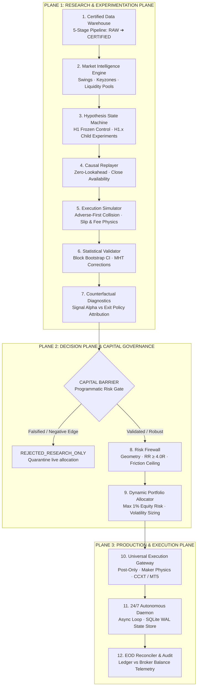

# Quantitative Systems Platform · Product 01: Crypto Platform

[](https://www.python.org/)
[]()
[]()
[]()
[]()
[]()

> **Scientific Notice:** This repository is an institutional-grade quantitative research, simulation, and execution platform. It is engineered to discover, audit, stress-test, and systematically falsify systematic trading hypotheses under strict point-in-time causality, realistic market microstructure friction, and multi-tier capital governance. **The platform makes zero claims of guaranteed commercial profitability or unproven alpha.** All research results are documented with full statistical transparency.

---

## 1. System Architecture & 3-Plane Stack

The platform separates analytical research, risk gating, and live execution into three decoupled architectural planes:

```text
Wealth Multiplier Systems
└── Quantitative Systems Platform
    └── Product 01: Crypto Platform
        ├── Plane 1: Research Plane (Data Lake, Intelligence, Hypothesis Registry, Causal Replay, Statistical Validation)
        ├── Plane 2: Decision Plane (Risk Firewall, Position Sizer, Portfolio Allocator, 5-Tier Capital Barrier)
        └── Plane 3: Production Plane (Execution Gateways, Universal Broker Abstraction, SQLite WAL State Store, Reconciler)
```



---

## 2. Research Philosophy: The Platform is the Laboratory

1. **Platform $\neq$ Strategy:** The platform is the scientific laboratory and execution infrastructure (**119/119 unit/integration tests passing**, $100\%$). The trading strategy is an empirical hypothesis under continuous scrutiny.
2. **The System Must Be Allowed to Tell Us NO:** An unproven or negative-expectancy hypothesis is programmatically rejected by the `CapitalBarrier`. Negative outcomes (e.g., $H_1 = -0.5998\text{R}$) are preserved as empirical ground-truth and never curve-fitted with ad-hoc indicators to force an artificial backtest curve.
3. **One Variable at a Time:** Child hypotheses ($H_{1.x}$) isolate exactly one structural mechanism (entry timing, stop invalidation, target refresh, or trailing ratchet) to maintain causal attribution.
4. **Statistical Rigor over Trade Count:** Edge validity requires non-parametric stationary Block Bootstrap distributions ($B=1,000$), out-of-sample temporal partition consistency, transaction cost stress shocks ($2.0\times$), and Holm-Bonferroni multiple testing corrections.

---

## 3. Canonical Market Structure Strategy Ontology

The platform implements a unified, single-strategy multi-timeframe structural trading ontology (Smart Money Concepts / Pure Price Action):

```text
HTF Structure & Trend (BOS / CHOCH / Protected Swings)
  ↓
HTF Keyzones (Order Blocks / FVGs / Liquidity Pools)
  ↓
HTF Directional Bias (PERMIT_LONG / PERMIT_SHORT)
  ↓
MTF Independent Structural Shift (Causal Alignment CHOCH / BOS)
  ↓
Mark NEW Causal MTF Keyzone
  ↓
MTF Retest & Mitigation
  ↓
LTF Microstructure Trigger (Sweep + Displacement)
  ↓
LTF Structural Invalidation Stop Loss (Protected Swing)
  ↓
HTF Destination Target (Planned RR ≥ 4.0R Entry Qualification)
  ↓
MTF Structural Monotonic Trailing
```

### Timeframe Set Architecture

The same unified state machine executes independently across 5 distinct timeframe scales:

| Timeframe Set | HTF (Macro Trend) | MTF (Setup / Zone) | LTF (Micro Trigger) | Trading Horizon | Data Status |
| :--- | :---: | :---: | :---: | :---: | :---: |
| **SET 1** | Monthly (1M) | Weekly (1w) | Daily (1d) | Macro / Position | 🟢 Certified (2017–2026) |
| **SET 2** | Weekly (1w) | Daily (1d) | 4-Hour (4h) | Swing / Position | 🟢 Certified (2017–2026) |
| **SET 3** | Daily (1d) | 4-Hour (4h) | 1-Hour (1h) | Swing / Intraday | 🟢 Certified (2017–2026) |
| **SET 4** | 4-Hour (4h) | 1-Hour (1h) | 15-Minute (15m) | Intraday | 🟢 Certified (2017–2026) |
| **SET 5** | 15-Minute (15m) | 5-Minute (5m) | 1-Minute (1m) | Scalping / Micro | 🟡 Ingestion Queued |

---

## 4. Frozen Baseline Control ($H_1$) Empirical Results

The baseline control ($H_1$: `HTF_TREND_CONTINUATION_V1`) was replayed across all 24 canonical streams (BTC, ETH, SOL $\times$ SET 1–4 from 2017 to 2026) under realistic friction.

### Multi-Stream Empirical Performance ($N=128$)

| Asset | Total Trades ($N$) | Win Rate | Gross Realized R | Friction Drag | Net Realized R | Mean Net Expectancy ($E[R]$) |
| :--- | :---: | :---: | :---: | :---: | :---: | :---: |
| **BTC/USDT** | 30 | 30.00% | $-13.12\text{R}$ | $-1.86\text{R}$ | $-14.98\text{R}$ | **$-0.4993\text{R}$** |
| **ETH/USDT** | 49 | 26.53% | $-27.45\text{R}$ | $-3.18\text{R}$ | $-30.63\text{R}$ | **$-0.6251\text{R}$** |
| **SOL/USDT** | 49 | 26.53% | $-27.85\text{R}$ | $-3.31\text{R}$ | $-31.16\text{R}$ | **$-0.6359\text{R}$** |
| **COMBINED** | **128** | **27.34%** | **$-68.42\text{R}$** | **$-8.35\text{R}$** | **$-76.77\text{R}$** | **$-0.5998\text{R}$** |

```
===================================================================================================
CAPITAL BARRIER DECISION: REJECTED_RESEARCH_ONLY
===================================================================================================
• Point Expectancy: -0.5998R / trade
• Block Bootstrap 95% CI: [-0.7137R, -0.4683R]
• Probability of Positive Edge P(Edge > 0): 0.0%
• Profit Factor: 0.38 (Average Win: +0.62R vs Average Loss: -1.06R)
• Target Reachability: 0 / 128 trades reached planned 4.0R target (Max MFE observed: +2.58R)
===================================================================================================
```

---

## 5. Forensic Attribution & Implementation Correctness Audit

Our forensic audit decomposed all $15,445$ candidate setups and $128$ trades to isolate why $H_1$ produced negative expectancy:

### A. Bug vs. Strategy Hypothesis Classification
* **Missing Structural Anchors ($6,498$ candidates / $59.6\%$):** Not a bug. $H_1$'s canonical specification requires a multi-bar confirmed Protected Swing. Using the 0-bar sweep candle extreme changes the invalidation concept (registered as child hypothesis $H_{1.1}$).
* **Stale Target Geometry ($4,167$ candidates / $38.2\%$):** Not a bug. In $94.6\%$ of geometry violations, price reached and exceeded the initial HTF target anchor during MTF realignment prior to LTF entry. Dynamically refreshing to the next keyzone is a separate hypothesis ($H_{1.3}$).

### B. Counterfactual Exit Policy Simulation (Signal vs. Exit Quality)
Simulating 7 prospective trade-management policies (including break-even at $+0.75\text{R}, +1.0\text{R}, +1.5\text{R}$ and fixed targets) across the identical 128 entries produced expectancies between **$-0.55\text{R}$ and $-0.61\text{R}$**.
* **Scientific Conclusion:** Exit management is not the primary driver of negative expectancy. The primary failure mechanism is **late-stage entry confirmation latency / adverse selection**, causing $72.7\%$ of trades to suffer immediate $-1.0\text{R}$ stop-outs.

---

## 6. Active Child Hypothesis ($H_{1.1}$) Research Status

```
===================================================================================================
STATUS: EXPERIMENT IN PROGRESS / NOT YET EMPIRICALLY VALIDATED
===================================================================================================
Hypothesis ID: H1.1_EARLY_MTF_ALIGNMENT_ENTRY (Parent: HTF_TREND_CONTINUATION_V1, Trial 2)
Core Modification: Triggers execution upon MTF realignment and retest into the MTF keyzone,
                   bypassing secondary LTF liquidity sweep confirmation latency.
Preserved Invariants: Same HTF trend logic, bias, structural SL, target, 1% risk, 0/5/5 bps friction.
Pre-Flight Status: Simulator fidelity verified (0 discrepancies), zero-lookahead causality verified.
Execution Status: Candidate dispatch key mismatch resolved; 24-stream parallel matrix replay queued.
===================================================================================================
```

---

## 7. Zero-Lookahead & Causal Simulation Standards

1. **Candle-Close Availability:** Higher timeframe bars remain strictly invisible to the state machine until their exact period close timestamp ($t_{\text{close}} \le t_{\text{LTF}}$).
2. **Swing Confirmation Latency:** Swings require $N \ge 2$ subsequent bars before confirmation.
3. **Realistic Execution Friction:**
   * Maker Fee: 0 bps ($0.00\%$) on limit orders
   * Taker Fee: 5 bps ($0.05\%$) on market fills
   * Slippage: 5 bps ($0.05\%$) adverse penalty on stop-loss market executions
   * Adverse-First Intrabar Collision: If both SL and TP are touched in the same bar, SL executes first.

---

## 8. Research Governance & Documentation Index

Comprehensive documentation is maintained under [`docs/`](file:///home/mrcn2/crypto-platform/docs):

* [`docs/research_status.md`](file:///home/mrcn2/crypto-platform/docs/research_status.md) — Detailed scientific status of $H_1$ and $H_{1.x}$ lineage.
* [`docs/research_governance.md`](file:///home/mrcn2/crypto-platform/docs/research_governance.md) — Research protocols, falsification rules, and promotion criteria.
* [`docs/research_index.md`](file:///home/mrcn2/crypto-platform/docs/research_index.md) — Catalog of authoritative baseline datasets and experimental artifacts.
* [`research/experiments/reproducibility_manifest.json`](file:///home/mrcn2/crypto-platform/research/experiments/reproducibility_manifest.json) — Bit-for-bit reproducibility record.

---

## 9. How to Reproduce Validated Research

### Environment Setup
```bash
git clone https://github.com/Quantitative-Systems/crypto-platform.git
cd crypto-platform
python3 -m venv .venv
source .venv/bin/activate
pip install -r requirements.txt
```

### Run Test Suite (119 Unit & Integration Tests)
```bash
python3 -m pytest tests/unit/strategy_engine/ tests/unit/research/ tests/unit/execution_gateway/ tests/unit/market_data/
```

### Run H1 Forensic Analysis & Counterfactual Suite
```bash
PYTHONPATH=. python3 research/analytics/h1_forensic_investigator.py
PYTHONPATH=. python3 research/analytics/counterfactual_trade_manager_simulator.py
PYTHONPATH=. python3 research/analytics/regime_attribution_analyzer.py
```

### Verify Causality & Simulator Fidelity
```bash
PYTHONPATH=. python3 research/analytics/trade_lifecycle_forensic_tracer.py
PYTHONPATH=. python3 research/analytics/causality_lookahead_auditor.py
```

---

## 10. Repository Structure

```text
crypto-platform/
├── docs/                                  # Research governance, status, and indices
│   ├── research_status.md                 # Current empirical ledger
│   ├── research_governance.md             # Scientific experimentation protocol
│   └── research_index.md                  # Master research artifact catalog
├── market_data/                           # Data lake ingestion, certification & manifests
│   ├── cache/                             # Certified kline data lake (BTC, ETH, SOL)
│   ├── binance_fetcher.py                 # Historical kline paginator
│   ├── data_certifier.py                  # Gap, monotonic timestamp & volume validator
│   └── dataset_manifest.py                # SHA256 dataset fingerprinting
├── market_intelligence/                   # Pure SMC market language & primitives
│   ├── structure_engine.py                # BOS, CHOCH, protected/weak swing builder
│   ├── keyzone_engine.py                  # Order Block & FVG detection
│   └── trend_engine.py                    # Multi-timeframe trend state classifier
├── strategy_engine/                       # Stateful hypothesis state machines & lifecycle
│   ├── coordinator/                       # StrategyCoordinator multi-timeframe orchestrator
│   ├── hypotheses/                        # Isolated hypothesis state machines (H1, H1.1)
│   ├── lifecycle/                         # CandidateTracker & ActiveTradeManager
│   └── classifiers/                       # BiasClassifier & RegimeFilter
├── risk_engine/                           # Quantitative risk firewall & sizing
│   ├── sizing/position_sizer.py           # 1% max equity risk automatic lot sizer
│   └── validators/rr_validator.py         # Minimum 4.0R entry qualification gate
├── research/                              # Laboratory simulation, analytics & metrics
│   ├── analytics/                         # Forensic analyzers, tracers, counterfactual engines
│   ├── experiments/                       # Experiment runners & hypothesis lineage registry
│   ├── replayer/                          # CausalReplayer & TimeframeAligner
│   └── results/                           # Immutable baseline & experiment JSON artifacts
├── execution_gateway/                     # Universal multi-broker abstraction
│   ├── broker_factory.py                  # Gateway factory (CCXT, MT5, Mock)
│   ├── gateways/                          # Exchange & broker adapters
│   └── symbol_normalizer.py               # Universal symbol mapping
├── platform_core/                         # Systemic governance & capital barriers
│   └── capital_barrier.py                 # 5-tier graduated capital authorization governor
├── production/                            # Production service & live daemon
│   ├── live_trader.py                     # Atomic WAL-backed live trading engine
│   └── run_live_24_7.py                   # Master autonomous trading daemon
└── tests/                                 # 119+ unit, integration, and synthetic tests
```
