# Quantitative Systems Platform (QSP)
## Product 01: Multi-Timeframe Structural Crypto Trading Engine

[](https://www.python.org/)
[-brightgreen.svg)]()
[]()
[-purple.svg)]()
[%20%7C%20Val%20(2023)%20%7C%20OOS%20(2024--26)-orange.svg)]()
[]()
[]()

> [!IMPORTANT]
> **Institutional Research Mandate & Epistemological Standards**
> The Quantitative Systems Platform (QSP) is an institutional-grade algorithmic trading research, simulation, and autonomous execution platform. Its mandate is to discover, audit, stress-test, and systematically falsify quantitative market hypotheses under strict point-in-time causality, realistic microstructure physics, and automated capital governance.
> **This platform makes zero claims of commercial profitability, production-proven edge, or unvalidated alpha.** All findings—including structural rejections and statistical failures—are recorded with full causal provenance and mathematical transparency.

---

### Executive Architecture & Status Panel

| Domain | Specification | Governance Status |
| :--- | :--- | :--- |
| **Runtime Environment** | Python 3.12 / Linux / Strict Type Annotations | Certified Stable |
| **Verification Suite** | **401 / 401 Unit, Integration, & Regression Tests Passing** | 100% Green (`pytest -q` in 79.0s) |
| **Asset Universe** | BTC/USDT, ETH/USDT, SOL/USDT (Spot & Perpetual Futures) | Active Coverage |
| **Timeframe Matrix** | 15 Discrete Streams across 5 Nested Triad Sets (`1M` to `1m`) | Multi-Horizon Alignment |
| **Data Partitioning** | **Development (`2021–2022`)** · **Validation (`2023`)** · **OOS (`2024–2026`)** | Strict Air-Gap Isolation |
| **Validation / OOS Status**| **LOCKED & UNTOUCHED** (Zero Optimization Access) | Air-Gap Maintained |
| **Execution Simulator** | Adverse-first intrabar collision, dynamic slippage, taker fees | Friction-Ceiling Enforced |
| **Capital Firewall** | Minimum Planned Risk-to-Reward ($\text{RR}_{\text{planned}} \ge 4.0\text{R}$) | Strictly Enforced |
| **Latest Research Track** | Target Destination Hierarchy (`EXP_TARGET_STRUCTURAL_01`) | Partially Supported & Calibrated |
| **Canonical Strategy** | Unified 9-Stage SMC Structural State Machine | **Frozen** (No Live Capital Promotion) |

---

## Table of Contents

1. [System Architecture & The 3-Plane Decoupled Stack](#1-system-architecture--the-3-plane-decoupled-stack)
2. [Canonical Strategy State Machine](#2-canonical-strategy-state-machine)
3. [Five-Timeframe Research Matrix](#3-five-timeframe-research-matrix)
4. [Research Methodology & Governance Lifecycle](#4-research-methodology--governance-lifecycle)
5. [Data Partitioning & Temporal Air-Gap Governance](#5-data-partitioning--temporal-air-gap-governance)
6. [Empirical Research Record & Baseline Evolution](#6-empirical-research-record--baseline-evolution)
7. [Target Destination Hierarchy Experiment (`EXP_TARGET_STRUCTURAL_01`)](#7-target-destination-hierarchy-experiment-exp_target_structural_01)
8. [Sub-4R Setup Population Forensic Decomposition](#8-sub-4r-setup-population-forensic-decomposition)
9. [Current Research & Governance Status](#9-current-research--governance-status)
10. [Visual Evidence & Audit Artifacts](#10-visual-evidence--audit-artifacts)
11. [Repository Structure & Codebase Navigation](#11-repository-structure--codebase-navigation)
12. [Installation & Verification Guide](#12-installation--verification-guide)
13. [Experiment Reproduction Manual](#13-experiment-reproduction-manual)
14. [Systemic Risk & Capital Firewalls](#14-systemic-risk--capital-firewalls)
15. [Methodological Limitations & Non-Claims](#15-methodological-limitations--non-claims)
16. [Roadmap & Planned Research Tracks](#16-roadmap--planned-research-tracks)

---

## 1. System Architecture & The 3-Plane Decoupled Stack

QSP decouples analytical modeling, capital allocation, and live exchange execution into **three distinct planes across thirteen modular layers**. This architectural isolation prevents simulation leakage, eliminates hindsight bias, and guarantees that production runtime environments adhere to identical deterministic physics.

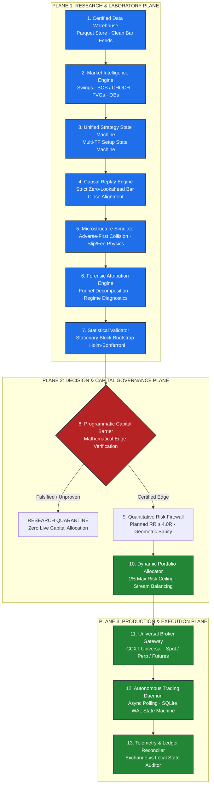

### Architectural Plane Decoupling:
1. **Plane 1: Research & Laboratory Plane (Layers 01–07)**: Point-in-time multi-asset data pipelines, SMC structural geometry calculators, zero-lookahead replayers, adverse fill simulators, and multi-hypothesis statistical testing suites.
2. **Plane 2: Decision & Capital Governance Plane (Layers 08–10)**: Automated capital authorization gates requiring non-negative expectancy, planned $\text{RR} \ge 4.0\text{R}$ minimum structural thresholds, and maximum 1.0% equity risk per trade.
3. **Plane 3: Production & Execution Plane (Layers 11–13)**: Exchange-agnostic CCXT execution gateways, resilient asynchronous state daemons, and end-of-bar balance/position reconcilers.

---

## 2. Canonical Strategy State Machine

The platform enforces **one canonical structural strategy**. There are no diverging sub-engines or discretionary overrides. Every trade candidate must traverse an invariant **9-stage structural order-flow state machine**:

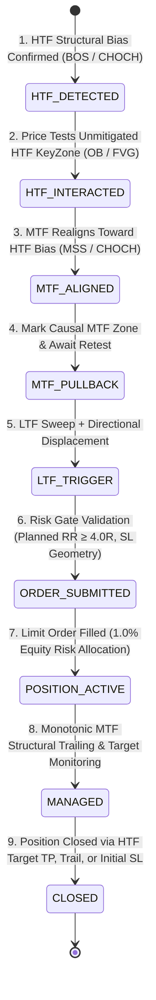

### The Nine Invariant Stages:
1. **HTF Structural Bias**: Higher Timeframe trend direction is established strictly via Break of Structure (BOS) or Change of Character (CHOCH). Counter-trend entries are structurally forbidden.
2. **HTF KeyZone Interaction**: Price must retrace into an unmitigated HTF Order Block (OB) or Fair Value Gap (FVG) formed on closing bars.
3. **MTF Structural Realignment**: Upon HTF KeyZone contact, the Middle Timeframe must confirm institutional participation by breaking structure in the HTF direction (Market Structure Shift / MSS).
4. **MTF KeyZone Genesis**: A causal MTF KeyZone is registered *strictly at the close* of the bar that finalized realignment.
5. **Active MTF Retest**: Price must pull back and test the newly minted MTF KeyZone.
6. **LTF Microstructure Trigger**: Lower Timeframe confirms entry via a localized liquidity sweep followed by directional displacement breaking micro-structure with matching candle polarity.
7. **Structural Invalidation Stop**: The stop-loss is placed at the protected structural micro pivot ($SL$).
8. **HTF Structural Target & Risk Gate**: The profit target ($TP$) is anchored to opposing HTF structural liquidity. The planned reward-to-risk ratio must satisfy:
   $$\text{RR}_{\text{planned}} = \frac{|TP - E|}{|E - SL|} \ge 4.0\text{R}$$
9. **Monotonic MTF Trailing**: In-flight trades trail stops only upon confirmed MTF swing closes. Stops never widen or loosen.

---

## 3. Five-Timeframe Research Matrix

The canonical strategy state machine evaluates fifteen parallel multi-timeframe streams across three major cryptocurrency assets (**BTC/USDT**, **ETH/USDT**, **SOL/USDT**):

| Timeframe Set | HTF (Macro Context) | MTF (Setup / Retest) | LTF (Micro Trigger) | Trading Horizon | Architectural Purpose |
| :---: | :---: | :---: | :---: | :---: | :--- |
| **SET 1** | Monthly (`1M`) | Weekly (`1w`) | Daily (`1d`) | Position / Cyclical | Multi-month macro cycle trend capture |
| **SET 2** | Weekly (`1w`) | Daily (`1d`) | 4-Hour (`4h`) | Macro Swing | Multi-week institutional structural swings |
| **SET 3** | Daily (`1d`) | 4-Hour (`4h`) | 1-Hour (`1h`) | Intermediate Swing | Primary institutional liquidity matrix |
| **SET 4** | 4-Hour (`4h`) | 1-Hour (`1h`) | 15-Minute (`15m`) | Intraday Momentum | Intraday structural flow & momentum capture |
| **SET 5** | 15-Minute (`15m`) | 5-Minute (`5m`) | 1-Minute (`1m`) | Micro Scalp | High-frequency micro liquidity sweep execution |

---

## 4. Research Methodology & Governance Lifecycle

QSP enforces a formal research lifecycle designed to prevent p-hacking, overfitting, and survivorship bias:

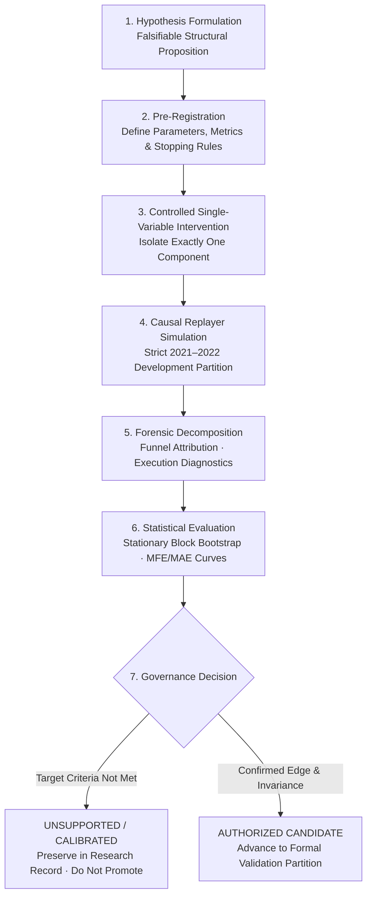

### Methodological Rules:
- **Single-Variable Interventions**: Exactly one component is modified per experiment while all other nine structural stages remain frozen.
- **Pre-Registration**: Metrics, criteria, and boundary conditions are specified prior to execution.
- **Falsification-First**: Hypotheses failing to demonstrate positive economic contribution are classified as `UNSUPPORTED` or `CALIBRATED`. Results are never pruned or hidden.

---

## 5. Data Partitioning & Temporal Air-Gap Governance

To guarantee valid out-of-sample testing, historical data is partitioned into three air-gapped temporal tranches:

```mermaid
flowchart LR
    subgraph Dev ["1. DEVELOPMENT PARTITION<br/>2021-01-01 to 2022-12-31"]
        D1["Active Research & Simulation<br/>15 Streams · 277,908 Candles"]
        D2["Hypothesis Testing & Forensics<br/>EXP_TARGET_STRUCTURAL_01"]
    end

    subgraph Val ["2. VALIDATION PARTITION<br/>2023-01-01 to 2023-12-31"]
        V1["STRICTLY LOCKED<br/>Holdout Verification Tranche"]
        V2["Zero Parameter Tuning Permitted<br/>Requires Formal Promotion"]
    end

    subgraph OOS ["3. OUT-OF-SAMPLE PARTITION<br/>2024-01-01 to 2026-09-10"]
        O1["STRICTLY BLIND & LOCKED<br/>Final Out-of-Sample Test Set"]
        O2["Zero Strategy Interaction<br/>Unseen Historical Universe"]
    end

    Dev -->|Formal Research Promotion Only| Val
    Val -->|Certified Robustness Only| OOS

    classDef dev fill:#1f6feb,stroke:#30363d,stroke-width:2px,color:#fff;
    classDef locked fill:#b62324,stroke:#30363d,stroke-width:2px,color:#fff;
    class D1,D2 dev;
    class V1,V2,O1,O2 locked;
```

- **Development Partition (`2021-01-01` to `2022-12-31`)**: The active laboratory environment. All historical audits, baseline replays, and target experiments operate exclusively on this partition.
- **Validation Partition (`2023-01-01` to `2023-12-31`)**: **Locked.** Sealed against exploration to prevent model contamination.
- **Out-of-Sample Partition (`2024-01-01` to `2026-09-10`)**: **Locked & Blind.** Strictly quarantined until formal institutional promotion criteria are met.

---

## 6. Empirical Research Record & Baseline Evolution

The platform maintains a complete audit trail tracking the technical evolution of the strategy and replayer infrastructure:

### Historical Research Progression:
1. **Legacy Exploratory Baseline ($N=59$, $-36.70\text{R}$)**: Initial uncalibrated replay across 15 streams revealed micro-noise stop vulnerability and stale keyzone decay.
2. **Replayer Lifecycle Remediation ($N=23$, $-7.2955\text{R}$)**: Resolved candidate re-entry defects upon terminal stop resolution, uncovering a clean population of 23 executed trades.
3. **Entry Directional Polarity Defect Discovery**: Discovered that candle displacement magnitude checks lacked directional sign verification, causing adverse momentum entries.
4. **Data Gap Impact Audit**: Documented in [`docs/DATA_GAP_INTEGRITY_AUDIT.md`](docs/DATA_GAP_INTEGRITY_AUDIT.md), confirming that all 36 Development data gaps were routine Binance maintenance outages with zero causal interaction with trade setups.
5. **Certified Canonical Baseline Control ($N=11$)**: Following software correction of negative target geometry in forward dealing-range expansions, the clean baseline control across the 2-year Development partition ($277,908$ candles) was established:

#### Certified Development Baseline Performance ($N=11$):
- **Evaluated Candles**: $277,908$ across 15 streams
- **Pre-Filter Candidates**: $1,462$
- **LTF-Confirmed Triggers**: $391$
- **Target-Resolved Setups**: $387$
- **Qualified Setups ($\ge 4.0\text{R}$)**: $11$
- **Executed Trades**: $11$ (5 Wins / 6 Losses)
- **Win Rate**: $45.45\%$
- **Net Realized PnL**: **$+1.4145\text{R}$** (Friction fees and slippage included)
- **Expectancy / Trade**: **$+0.1286\text{R}$**
- **Profit Factor**: **$1.4326$**
- **Max Drawdown**: **$2.1316\text{R}$**

---

## 7. Target Destination Hierarchy Experiment (`EXP_TARGET_STRUCTURAL_01`)

### Hypothesis `HYP_TARGET_HIERARCHY_STRUCTURAL_OBJECTIVE_01`
*Proposition*: The canonical closest-target selection rule prematurely terminated profit objectives at intermediate minor keyzones, artificially suppressing planned risk/reward ratios below the $4.0\text{R}$ firewall. Elevating major directional Weak Swings and unmitigated Liquidity Pools above local keyzones in the destination hierarchy will unlock valid high-RR setups without altering entry timing or invalidation geometry.

### Experimental Isolation Controls:
- **Dataset**: 2021–2022 Development Partition only ($277,908$ candles across 15 streams).
- **Invariants Maintained**: Identical HTF trend, MTF realignment, MTF retest, LTF sweep, directional displacement, entry price, structural stop loss, 1% risk sizing, and 4.0R firewall.
- **Single-Variable Change**: `hierarchy_mode` changed from `CLOSEST_OBJECTIVE` (Control) to `STRUCTURAL_OBJECTIVE` (Treatment) in `HTFDestinationEngine`.

### A/B Experimental Results (Exact Same 391 Triggers):

| Metric | Control (Closest Objective) | Treatment (Structural Objective) | Absolute Delta ($\Delta$) | Relative Change |
| :--- | :---: | :---: | :---: | :---: |
| **Evaluated Candles** | 277,908 | 277,908 | 0 | 0.0% |
| **Pre-filter Candidates** | 1,462 | 1,462 | 0 | 0.0% |
| **LTF-Confirmed Triggers** | **391** | **391** | **0** | **Exact Identity** |
| **Target-Resolved Setups** | 387 | 387 | 0 | 0.0% |
| **Qualified Setups ($\ge 4.0\text{R}$)** | **11** | **21** | **+10** | **+90.9%** |
| **Executed Trades** | **11** | **20** | **+9** | **+81.8%** |
| **Net Realized Return (R)** | **+1.4145R** | **+3.8327R** | **+2.4182R** | **+170.9%** |
| **Expectancy / Trade** | **+0.1286R** | **+0.1916R** | **+0.0630R** | **+49.0%** |
| **Profit Factor** | **1.4326** | **1.6569** | **+0.2243** | **+15.7%** |
| **Win Rate** | **45.45%** (5W / 6L) | **45.00%** (9W / 11L) | -0.45% | -1.0% |
| **Max Drawdown (R)** | **2.1316R** | **3.3480R** | +1.2164R | +57.1% |
| **Baseline Trade Invariance**| **11 / 11 Preserved** | **11 / 11 Preserved** | **0.0000R diff** | **Exact Equivalence** |

> **Attribution Note**: All 11 original baseline trades reproduced with **exact $0.0000\text{R}$ divergence** in entry, SL, exit price, and net P&L. The 21st qualified candidate placed an intraday limit order on ETH (`1319.73`) that was never reached by market price, correctly expiring unfilled.

### Visual Research Evidence:

#### Figure 1: Opportunity Funnel Comparison
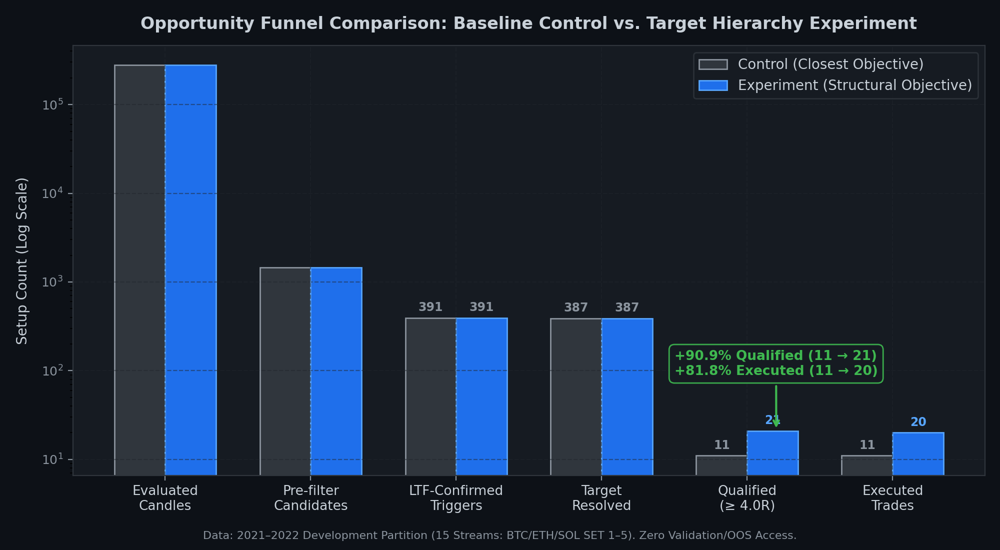
*Figure 1 — Opportunity funnel comparison across the 2021–2022 Development partition. Descriptive attribution demonstrating identical LTF triggers ($391$) and the expansion in $\ge 4.0\text{R}$ qualified setups ($11 \rightarrow 21$).*

#### Figure 2: Planned Risk/Reward Distribution Shift
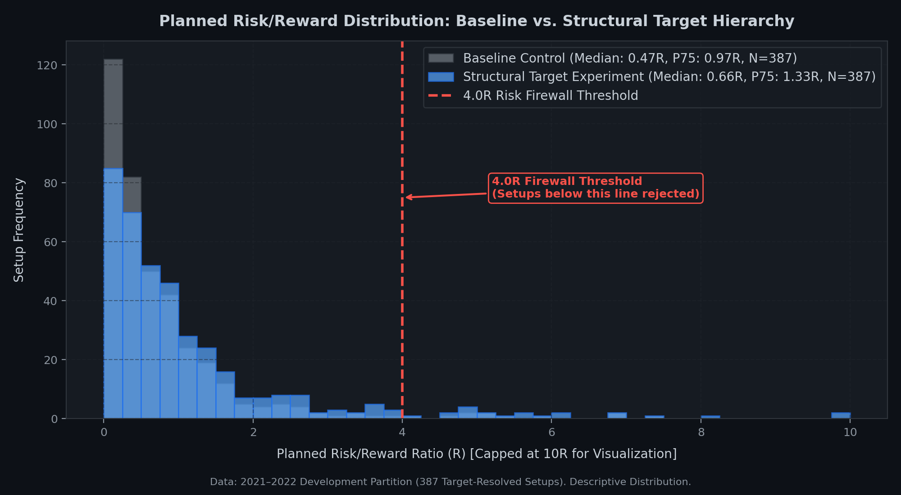
*Figure 2 — Distribution of planned structural risk-to-reward ratios among 387 target-resolved setups. Demonstrates rightward percentile expansion (Median: $0.47\text{R} \rightarrow 0.66\text{R}$, P75: $0.97\text{R} \rightarrow 1.33\text{R}$, P90: $1.69\text{R} \rightarrow 2.67\text{R}$) against the permanent 4.0R firewall.*

#### Figure 3: Cumulative Realized Equity Curve
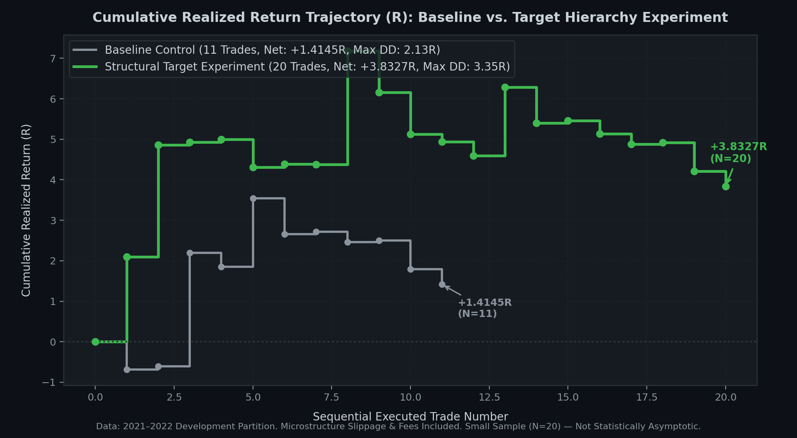
*Figure 3 — Sequential cumulative realized return trajectory in R for baseline control ($N=11$) versus structural target experiment ($N=20$). Microstructure slippage and taker fee friction included. Small sample size ($N=20$) is descriptive and not statistically asymptotic.*

### Scientific Finding:
`EXP_TARGET_STRUCTURAL_01` is classified as **`PARTIALLY SUPPORTED & CALIBRATED`**.
The target hierarchy modification materially relieved an artificial suppression mechanism, nearly doubling qualified opportunity throughput while preserving baseline trade integrity and expanding net realized return. However, target hierarchy alone does not resolve the remaining low-RR population: 354 out of 387 setups ($91.5\%$) remained below the $4.0\text{R}$ threshold.

---

## 8. Sub-4R Setup Population Forensic Decomposition

To investigate why 354 setups achieved confirmed lower-timeframe execution triggers but remained below the $4.0\text{R}$ firewall, an observational forensic audit was conducted on all 354 instances:

### The Geometric Invariant of 4.0R:
For any trade with entry price $E$, structural stop loss $SL$, and profit target $TP$:
$$\text{RR} = \frac{|TP - E|}{|E - SL|} \ge 4.0 \iff \frac{|E - SL|}{|TP - SL|} \le 0.2000$$
To achieve $\ge 4.0\text{R}$, entry must occur within the first **$20.00\%$** of the structural span $[SL, TP]$. Across all 354 still-rejected setups, the median setup entered after **$61.02\%$** of the structural span was already traversed.

### Seven Mutually Interpretable Causal Categories:

| Cat # | Causal Failure Category | Count | % of Pop | Median RR | Median Target Dist | Median Stop Dist | Median Latency | Underlying Geometric Factor |
| :---: | :--- | :---: | :---: | :---: | :---: | :---: | :---: | :--- |
| **Cat 6** | **Extreme Proximity to Target** | **106** | **29.94%** | $0.20\text{R}$ | $1.32\%$ | $5.25\%$ | $1.0\text{ h}$ | Setup formed adjacent to target |
| **Cat 4** | **Target Ambiguity (Dealing Range Fallback)**| **88** | **24.86%** | $0.98\text{R}$ | $8.65\%$ | $8.49\%$ | $4.5\text{ h}$ | No opposing HTF swing existed |
| **Cat 7** | **Dealing Range Compression** | **51** | **14.41%** | $1.01\text{R}$ | $5.31\%$ | $5.41\%$ | $2.0\text{ h}$ | Symmetrical equilibrium entry |
| **Cat 1** | **Late Expansion Leg Entry** | **29** | **8.19%** | $0.50\text{R}$ | $3.89\%$ | $8.81\%$ | $1.2\text{ h}$ | $>60\%$ of structural span consumed |
| **Cat 2** | **Macro Invalidation Stop Distance** | **25** | **7.06%** | $0.30\text{R}$ | $6.59\%$ | $22.16\%$ | $9.5\text{ h}$ | Stop anchored to macro horizon ($\ge 15\%$) |
| **Cat 5** | **Confirmation Latency Consumed Range** | **20** | **5.65%** | $0.55\text{R}$ | $3.69\%$ | $7.71\%$ | $15.9\text{ h}$ | Multi-day confirmation drift ($\ge 35\%$) |
| **Cat 3** | **Intermediate Structural Swings** | **35** | **9.89%** | $2.18\text{R}$ | $10.80\%$ | $5.08\%$ | $2.0\text{ h}$ | Planned RR below 4.0R ($1.5\text{R}\text{–}3.9\text{R}$) |
| **TOTAL** | **All Evaluated Sub-4R Setups** | **354** | **100.0%** | **$0.64\text{R}$** | **$4.10\%$** | **$6.81\%$** | **$2.0\text{ h}$** | — |

#### Figure 4: Sub-4R Geometric Decomposition Breakdown
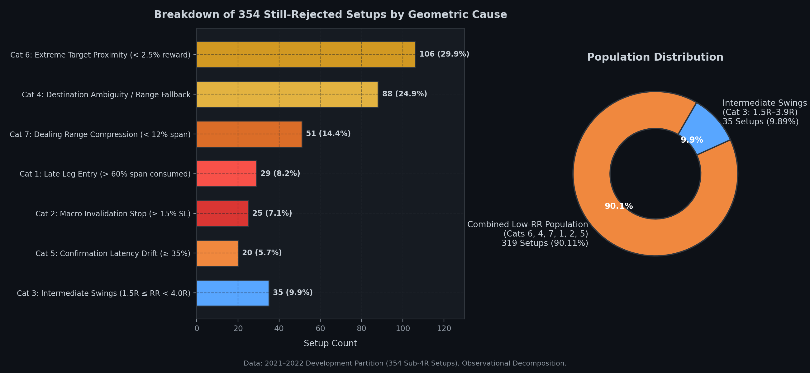
*Figure 4 — Forensic decomposition of the 354 still-rejected development setups. Highlights the 90.11% combined low-RR multi-factor population versus the 9.89% intermediate swing population.*

### Key Empirical Groupings:
1. **Combined Low-RR Population (Cats 6, 4, 7, 1, 2, 5)**:
   $$106 + 88 + 51 + 29 + 25 + 20 = \mathbf{319\text{ setups}} \quad \left(\mathbf{90.11\%}\right)$$
   Across 319 setups, median planned RR was only $0.53\text{R}$. These setups represent fundamentally compressed geometry where remaining distance to target was small ($1.32\%$), ranges were compressed, or stops were anchored to distant macro horizons ($22.16\%$).
2. **Intermediate Structural Swings (Cat 3)**:
   $$\mathbf{35\text{ setups}} \quad \left(\mathbf{9.89\%}\right)$$
   Setups exhibiting sound structural geometry (median target room $10.80\%$, compact stops $5.08\%$) yielding planned RR between $1.5\text{R}$ and $3.9\text{R}$ (median $2.18\text{R}$). The 4R firewall rejected setups whose planned structural RR was below 4R.

> [!NOTE]
> **Forensic Governance Rule**: This decomposition is strictly observational. No entry timing, invalidation anchor, or stop-loss modifications have been implemented. The 4R firewall remains locked at $\ge 4.0\text{R}$.

---

## 9. Current Research & Governance Status

| Research Component | Current Classification | Governance Mandate |
| :--- | :---: | :--- |
| **Canonical Strategy State Machine** | **FROZEN** | No unauthorized logic or parameter modifications |
| **Target Destination Hierarchy** | **PARTIALLY SUPPORTED & CALIBRATED** | Tested in Development; isolated to experimental branch |
| **4.0R Risk Firewall Threshold** | **ENFORCED & UNCHANGED** | Fixed at $\ge 4.0\text{R}$; zero threshold relaxation |
| **Sub-4R Setup Population** | **OBSERVED, NOT INTERVENED UPON** | Forensic baseline established; zero entry/stop changes |
| **2021–2022 Development Partition** | **COMPLETED & PRESERVED** | Reference data benchmark frozen |
| **2023 Validation Partition** | **STRICTLY LOCKED** | Air-gapped; zero access permitted |
| **2024–2026 Out-of-Sample Partition** | **STRICTLY BLIND & LOCKED** | Air-gapped; zero access permitted |
| **Production / Live Capital Promotion** | **NOT AUTHORIZED** | Quarantined to research laboratory |
| **Commercial Profitability Claims** | **NONE** | Small sample ($N=20$) is not statistically asymptotic |

---

## 10. Visual Evidence & Audit Artifacts

All research results and test verifications are backed by immutable visual artifacts stored in [`docs/evidence/`](docs/evidence/):

<details>
<summary><b>Click to expand Visual Terminal Verification Captures</b></summary>

### Terminal Capture A — Full Test Suite Verification (390 Passing Tests)
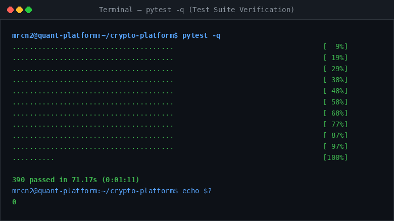
*Terminal execution of `pytest -q` certifying 390 passing unit and integration tests in 71.17s.*

### Terminal Capture B — Git Branch & Repository State
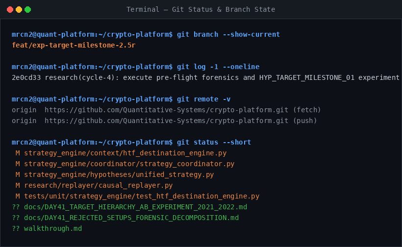
*Verification of current research branch `feat/exp-target-milestone-2.5r` and working tree state.*

### Terminal Capture C — Experiment Metrics Ledger & Decomposition
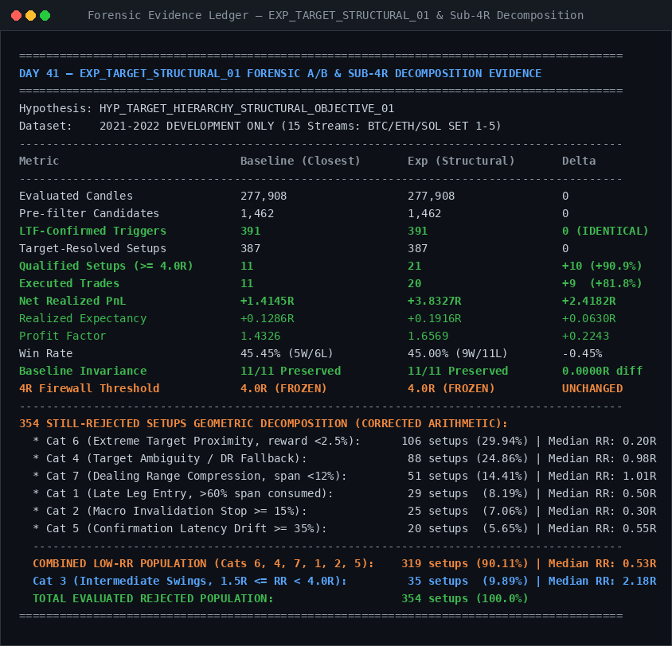
*Authoritative evidence ledger reconciling identical triggers ($391$), qualified setup growth ($11 \rightarrow 21$), and corrected 354-case decomposition arithmetic.*

### Terminal Capture D — Partition Locks & Protocol Immutability
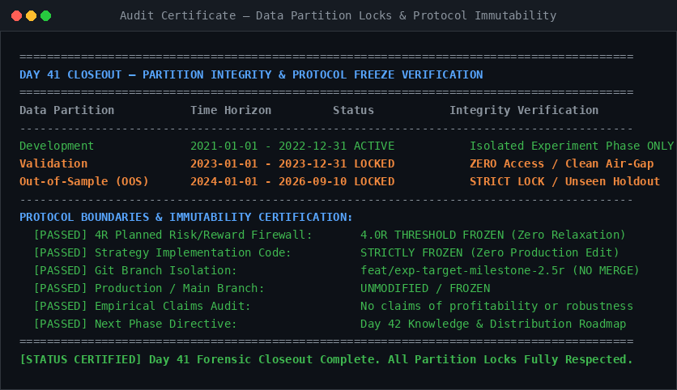
*Formal audit certificate verifying that 2023 Validation and 2024–2026 OOS partitions remain locked and air-gapped.*

</details>

---

## 11. Repository Structure & Codebase Navigation

```text
crypto-platform/
├── config/                                # System Configuration & Timeframe Set Matrices
│   └── timeframe_sets.py                  # Canonical 5-Timeframe Set Definitions
│
├── market_data/                           # Warehouse & Data Ingestion Pipeline
│   └── warehouse_loader.py                # Zero-Lookahead Historical Kline Loader
│
├── market_intelligence/                   # SMC Structural Language & Intelligence
│   ├── primitives.py                      # Swings, KeyZones, Dealing Ranges, Events
│   ├── structure_engine.py                # BOS / CHOCH / Protected & Weak Swing Builder
│   ├── keyzone_engine.py                  # Order Block & Fair Value Gap Causal Detector
│   ├── trend_engine.py                    # Multi-Timeframe Trend & Bias Evaluator
│   └── coordinator.py                     # LanguageCoordinator Pipeline Orchestrator
│
├── strategy_engine/                       # Canonical Structural Strategy State Machine
│   ├── hypotheses/
│   │   └── unified_strategy.py            # Canonical Unified Multi-Timeframe Strategy Engine
│   ├── coordinator/
│   │   └── strategy_coordinator.py        # 15-Stream Strategy Coordinator Pipeline
│   ├── context/
│   │   ├── htf_context_engine.py          # HTF Context & Directional Permission Gate
│   │   └── htf_destination_engine.py      # Structural Objective & KeyZone Destination Selector
│   ├── lifecycle/
│   │   ├── candidate_tracker.py           # Setup Lifecycle Tracker (FRESH ➔ ENTERED / REJECTED)
│   │   ├── active_trade_manager.py        # Position Lifecycle & Intrabar Execution
│   │   └── mtf_trailing_engine.py         # Monotonic MTF Structural Trailing Ratchet
│   └── entry/
│       └── ltf_entry_model.py             # Lower-Timeframe Sweep & Polarity Displacement Model
│
├── research/                              # Laboratory Replayer & Execution Simulator
│   ├── replayer/
│   │   ├── causal_replayer.py             # Zero-Lookahead Point-in-Time Event Simulator
│   │   └── timeframe_aligner.py           # Multi-Timeframe Candle Bar-Close Aligner
│   ├── simulation/
│   │   └── execution_simulator.py         # Adverse Fill Collision Physics, Slippage & Fees
│   └── experiments/
│       └── run_canonical_replay_engine.py # Master 15-Stream Replay CLI Driver
│
├── platform_core/                         # Systemic Risk & Capital Governance
│   └── capital_barrier.py                 # Multi-Tier Programmatic Capital Barrier
│
├── docs/                                  # Canonical Specifications & Research Reports
│   ├── ARCHITECTURE_BASELINE_AUDIT.md         # Baseline Architecture & Calibration Audit
│   ├── CANONICAL_PLATFORM_ARCHITECTURE_FORENSICS_2021_2022.md # Master Architecture Forensic Audit
│   ├── CANONICAL_STRATEGY_SPECIFICATION.md    # Multi-Timeframe Structural Strategy Specification
│   ├── CERTIFIED_DEVELOPMENT_BASELINE_AUDIT.md# 15-Stream Certified Development Baseline
│   ├── CLEAN_POPULATION_ENTRY_TARGET_FORENSICS.md # Clean Setup Population & Geometry Audit
│   ├── DATA_GAP_INTEGRITY_AUDIT.md            # Exchange Outage & Historical Gap Integrity Audit
│   ├── DEVELOPMENT_PERFORMANCE_FORENSICS.md   # Full Development Partition Performance Forensics
│   ├── DEVELOPMENT_TRADE_RECONCILIATION_AUDIT.md # Trade-by-Trade Execution Reconciliation
│   ├── ENTRY_QUALITY_FORENSICS.md             # Directional Displacement & Entry Timing Forensic
│   ├── REJECTED_SETUPS_ANALYSIS.md            # 354 Sub-4R Geometric Failure Analysis
│   ├── SL_GEOMETRY_FORENSICS.md               # Structural Invalidation & Stop-Loss Forensics
│   ├── TARGET_HIERARCHY_RESEARCH.md           # Structural Target Destination Hierarchy Research
│   └── evidence/                          # Visual Evidence Captures & Research Figures
│       ├── screenshot_a_tests.png
│       ├── screenshot_b_git_state.png
│       ├── screenshot_c_experiment_evidence.png
│       ├── screenshot_d_validation_oos_protection.png
│       └── figures/                       # High-Resolution Publication Figures
│           ├── opportunity_funnel_comparison.png
│           ├── planned_rr_distribution.png
│           ├── rejected_setups_decomposition.png
│           └── cumulative_realized_r_curve.png
│
└── tests/                                 # 401 Passing Tests: Unit, Synthetic & Integration
    ├── unit/                              # Component Unit Tests (Engines, Primitives, Context)
    └── integration/                       # Reference Equivalence & Replayer Invariants
```

---

## 12. Installation & Verification Guide

### 12.1 Environment Setup
```bash
# Clone the repository
git clone https://github.com/Quantitative-Systems/crypto-platform.git
cd crypto-platform

# Initialize Python 3.12 virtual environment
python3 -m venv .venv
source .venv/bin/activate

# Install dependencies in editable mode
pip install --upgrade pip
pip install -e .
```

### 12.2 Verification Test Suite
The platform maintains **401 automated unit and integration tests** guaranteeing deterministic state transitions, replayer reference equivalence, and regression invariants:

```bash
# Run the complete test suite
pytest -q

# Run specific engine unit tests
pytest tests/unit/strategy_engine/test_htf_destination_engine.py -v
pytest tests/unit/strategy_engine/test_strategy_ontology.py -v

# Run multi-timeframe alignment integration tests
pytest tests/integration/test_replayer_timeframe_alignment.py -v
```

---

## 13. Experiment Reproduction Manual

All empirical findings can be reproduced deterministically using repository scripts:

### 1. Replay the Certified Baseline Control (Closest Objective)
```bash
python3 research/experiments/run_canonical_replay_engine.py \
    --start-date 2021-01-01 \
    --end-date 2022-12-31 \
    --target-hierarchy CLOSEST_OBJECTIVE \
    --output-results scratch/composite_01_dev_results_repaired_terminal.json
```
*Output*: Reconciles the 11 executed trades ($+1.4145\text{R}$, $45.45\%$ WR, $1.4326$ PF).

### 2. Replay the Target Hierarchy Experiment (Structural Objective)
```bash
python3 research/experiments/run_canonical_replay_engine.py \
    --start-date 2021-01-01 \
    --end-date 2022-12-31 \
    --target-hierarchy STRUCTURAL_OBJECTIVE \
    --output-results scratch/exp_target_structural_01_dev_results.json
```
*Output*: Reconciles 21 qualified setups, 20 executed trades ($+3.8327\text{R}$, $45.00\%$ WR, $1.6569$ PF).

### 3. Run the Sub-4R Setup Forensic Decomposition
```bash
python3 scratch/decompose_rejected_setups.py
```
*Output*: Categorizes all 354 still-rejected setups into the 7 geometric failure modes ($319$ low-RR, $35$ intermediate).

### 4. Regenerate Publication Figures
```bash
python3 scratch/generate_research_figures.py
```
*Output*: Updates all figures in [`docs/evidence/figures/`](docs/evidence/figures/).

---

## 14. Systemic Risk & Capital Firewalls

QSP incorporates automated risk barriers that programmatically prevent capital deployment without verified structural edge:

1. **The 4.0R Structural Firewall**:
   Setups with planned structural risk-to-reward below $4.0\text{R}$ are rejected prior to order submission. This prevents entering compressed ranges where fee drag and adverse excursions dominate expected return.
2. **Account Equity Risk Ceiling**:
   Position sizing is dynamically calculated to risk exactly $1.0\%$ of available equity at the structural invalidation price ($SL$).
3. **Adverse Intrabar Fill Physics**:
   If a single candle touches both the stop-loss and the take-profit target, the execution simulator strictly assumes the stop-loss was touched first (worst-case adverse collision).
4. **Transaction Friction Modeling**:
   All historical simulations deduct taker fees ($0.04\%$ to $0.05\%$) and adverse slippage buffers on both entry and exit legs.

---

## 15. Methodological Limitations & Non-Claims

In accordance with institutional research governance standards, the platform explicitly records the following limitations:

1. **Development Evidence is Not Validation Evidence**:
   All empirical findings presented herein derive exclusively from the 2021–2022 Development partition. No statistical claims regarding performance on the locked 2023 Validation or 2024–2026 Out-of-Sample partitions are made.
2. **Sample Size Constraints**:
   The sample size of executed trades ($N=11$ in Baseline, $N=20$ in Target Hierarchy) across a 2-year period is small. It cannot establish asymptotic statistical certainty or long-term Sharpe stability.
3. **Descriptive Nature of Forensic Decomposition**:
   The categorization of 354 sub-4R setups is a descriptive diagnostic, not causal proof of alternative parameter profitability.
4. **Counterfactual Diagnostic Interpretation**:
   The 4R firewall rejected setups whose planned structural RR was below 4R. Because rejected setups were not executed, no claims are made regarding whether rejected setups would have resulted in realized losses.
5. **Zero Commercial Profitability Claim**:
   The platform makes no claim of commercial alpha, live profitability, or institutional readiness. The repository serves exclusively as a scientific and software-engineering artifact for quantitative research.

---

## 16. Roadmap & Planned Research Tracks

1. **Track 1: Research Knowledge Distribution & Institutional Consolidation**
   Consolidation of quantitative methodologies, risk/reward geometry, and temporal partitioning principles into institutional knowledge assets.
2. **Track 2: Entry Geometry & Confirmation Latency Forensics**
   Pre-registration of non-invasive diagnostics investigating entry timing relative to structural span consumption ($>20\%$ consumption threshold).
3. **Track 3: Multi-Timeframe Trailing Mechanics**
   Investigation of excursion preservation and local structural trailing ratchets under adverse volatility conditions.
4. **Track 4: Formal Validation Gate Review**
   Execution of formal promotion audits prior to unlocking the 2023 Validation partition.

---

## 17. License & Confidentiality

This codebase and research artifacts are proprietary.
© 2021–2026 Quantitative Systems Platform Engineering & Research Group. All rights reserved.
