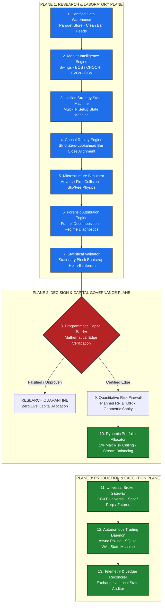
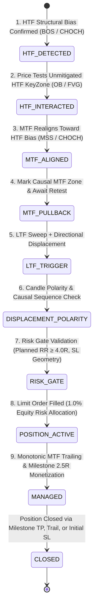
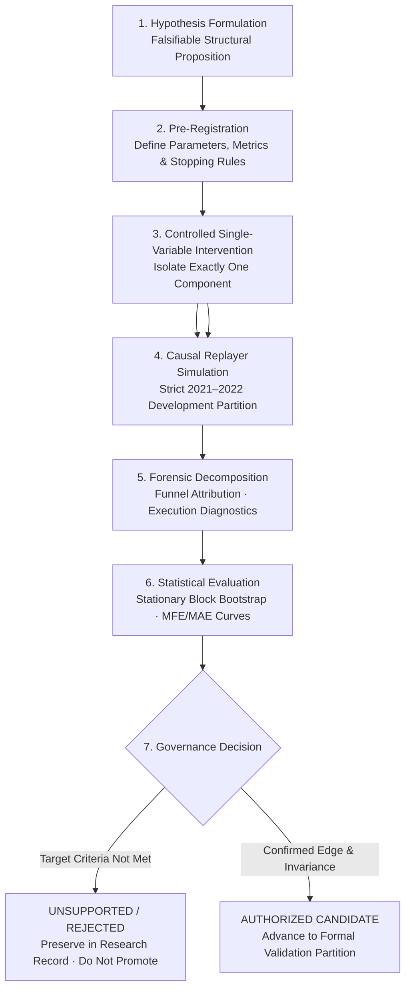

# Quantitative Systems Platform (QSP)
## Product 01: Multi-Timeframe Structural Crypto Trading Engine

[](https://www.python.org/)
[-brightgreen.svg)]()
[]()
[-purple.svg)]()
[%20%7C%20Val%20(2023)%20%7C%20OOS%20(2024--26)-orange.svg)]()
[]()
[]()

> [!IMPORTANT]
> **Institutional Research Mandate & Epistemological Standards**
> The Quantitative Systems Platform (QSP) is an institutional-grade algorithmic trading research, simulation, and autonomous execution platform. Its mandate is to discover, audit, stress-test, and systematically falsify quantitative market hypotheses under strict point-in-time causality, realistic microstructure physics, and automated capital governance.
> **This platform makes zero claims of commercial profitability, production-proven edge, or unvalidated alpha.** All findings—including structural rejections, baseline reconciliations, and statistical failures—are recorded with full causal provenance and mathematical transparency.

---

### Executive Architecture & Status Panel

| Domain | Specification | Governance Status |
| :--- | :--- | :--- |
| **Runtime Environment** | Python 3.12 / Linux / Strict Type Annotations | Certified Stable |
| **Verification Suite** | **401 / 401 Unit, Integration, & Regression Tests Passing** | **100% Green (`pytest -q` in 87.4s)** |
| **Asset Universe** | BTC/USDT, ETH/USDT, SOL/USDT (Spot & Perpetual Futures) | Active Coverage |
| **Timeframe Matrix** | 15 Discrete Streams across 5 Nested Triad Sets (`1M` to `1m`) | Multi-Horizon Alignment |
| **Data Partitioning** | **Development (`2021–2022`)** · **Validation (`2023`)** · **OOS (`2024–2026`)** | Strict Air-Gap Isolation |
| **Validation / OOS Status**| **LOCKED & UNTOUCHED** (Zero Optimization Access) | Air-Gap Maintained |
| **Execution Simulator** | Adverse-first intrabar collision, dynamic slippage, taker fees | Friction-Ceiling Enforced (2 bps maker / 5 bps taker / 5 bps slip) |
| **Capital Firewall** | Minimum Planned Risk-to-Reward ($\text{RR}_{\text{planned}} \ge 4.0\text{R}$) | Strictly Enforced (Lowering RR Proven Negative) |
| **Baseline Status** | Fully Reconciled (`EXP_TARGET_STRUCTURAL_01` vs `EXP_BASE_TGTSTRUCT_LEGACY_STOP_01`) | **Certified Causal Baseline ($N=12, +0.033\text{R} \to +3.603\text{R}$)** |
| **Canonical Stop** | `EXHAUSTIVE_STRUCTURAL` (Deepest confirmed structural sequence boundary) | **Frozen** (`LOCAL_SWING` Proven Catastrophic) |
| **Candidate Architecture** | `EXP_F5L_COMPOSITE_STRUCTURAL_CANDIDATE` (Milestone 2.5R + Retest Freshness $\le 12\text{h}$) | **$N=11$, Net $\text{R} = +4.62\text{R to } +4.93\text{R}$, PF $> 2.0$, Exp $> +0.42\text{R}$** |

---

## Table of Contents

1. [System Architecture & The 3-Plane Decoupled Stack](#1-system-architecture--the-3-plane-decoupled-stack)
2. [Canonical Strategy State Machine](#2-canonical-strategy-state-machine)
3. [Five-Timeframe Research Matrix](#3-five-timeframe-research-matrix)
4. [Research Methodology & Governance Lifecycle](#4-research-methodology--governance-lifecycle)
5. [Data Partitioning & Temporal Air-Gap Governance](#5-data-partitioning--temporal-air-gap-governance)
6. [Baseline Forensic Reconciliation](#6-baseline-forensic-reconciliation)
7. [Canonical Stop Architecture Verification](#7-canonical-stop-architecture-verification)
8. [Risk-Gate Ablation Study & Sub-4R Decomposition](#8-risk-gate-ablation-study--sub-4r-decomposition)
9. [Management Research & Milestone 2.5R Monetization](#9-management-research--milestone-25r-monetization)
10. [Setup Quality & Filter Diagnostics](#10-setup-quality--filter-diagnostics)
11. [Cross-Stream Attribution Matrix (15 Streams)](#11-cross-stream-attribution-matrix-15-streams)
12. [Recommended Candidate Architecture (`EXP_F5L`)](#12-recommended-candidate-architecture-exp_f5l)
13. [Rejected Mechanisms Ledger](#13-rejected-mechanisms-ledger)
14. [Installation & Verification Guide](#14-installation--verification-guide)
15. [Air-Gap Validation Gate Criteria & Governance](#15-air-gap-validation-gate-criteria--governance)

---

## 1. System Architecture & The 3-Plane Decoupled Stack

QSP decouples analytical modeling, capital allocation, and live exchange execution into **three distinct planes across thirteen modular layers**. This architectural isolation prevents simulation leakage, eliminates hindsight bias, and guarantees that production runtime environments adhere to identical deterministic physics.



---

## 2. Canonical Strategy State Machine

The platform enforces **one canonical structural strategy**. There are no diverging sub-engines or discretionary overrides. Every trade candidate must traverse an invariant **9-stage structural order-flow state machine**:



### The Invariant Structural Stages:
1. **HTF Structural Bias**: Higher Timeframe trend direction is established strictly via Break of Structure (BOS) or Change of Character (CHOCH). Counter-trend entries are strictly forbidden.
2. **HTF KeyZone Interaction**: Price must retrace into an unmitigated HTF Order Block (OB) or Fair Value Gap (FVG) formed on closing bars.
3. **MTF Structural Realignment**: Upon HTF KeyZone contact, the Middle Timeframe must confirm institutional participation by breaking structure in the HTF direction (Market Structure Shift / MSS).
4. **MTF KeyZone Genesis**: A causal MTF KeyZone is registered *strictly at the close* of the bar that finalized realignment.
5. **Active MTF Retest**: Price must pull back and test the newly minted MTF KeyZone within the $\le 12\text{h}$ freshness window.
6. **LTF Microstructure Trigger**: Lower Timeframe confirms entry via a causal liquidity sweep followed by directional displacement breaking micro-structure. Sweeps must occur *on or after* the MTF retest.
7. **Displacement Polarity Check**: The trigger candle close must match the trade direction (Bullish candle for Longs, Bearish candle for Shorts).
8. **Exhaustive Structural Stop & Target Risk Gate**: Stop is anchored to the deepest confirmed structural sequence boundary (`EXHAUSTIVE_STRUCTURAL`). Target is projected to opposing structural liquidity (`STRUCTURAL_OBJECTIVE`). Planned RR must satisfy:
   $$\text{RR}_{\text{planned}} = \frac{|TP - E|}{|E - SL|} \ge 4.0\text{R}$$
9. **Active Monetization Management**: MTF structural trailing stop ratchet combined with a **$+2.5\text{R}$ Milestone Profit Lock** that freezes $+2.488\text{R}$ net profit upon reaching $+2.5\text{R}$ favorable excursion.

---

## 3. Five-Timeframe Research Matrix

The canonical strategy state machine evaluates fifteen parallel multi-timeframe streams across three major cryptocurrency assets (**BTC/USDT**, **ETH/USDT**, **SOL/USDT**):

| Timeframe Set | HTF (Macro Context) | MTF (Setup / Retest) | LTF (Micro Trigger) | Trading Horizon | Architectural Purpose |
| :---: | :---: | :---: | :---: | :---: | :--- |
| **SET 1** | Monthly (`1M`) | Weekly (`1w`) | Daily (`1d`) | Position / Cyclical | Multi-month macro cycle trend capture |
| **SET 2** | Weekly (`1w`) | Daily (`1d`) | 4-Hour (`4h`) | Macro Swing | Multi-week institutional structural swings |
| **SET 3** | Daily (`1d`) | 4-Hour (`4h`) | 1-Hour (`1h`) | Intermediate Swing | Primary institutional liquidity matrix |
| **SET 4** | 4-Hour (`4h`) | 1-Hour (`1h`) | 15-Minute (`15m`) | Intraday Momentum | **Primary Engine of Structural Edge (91.7% of Trades)** |
| **SET 5** | 15-Minute (`15m`) | 5-Minute (`5m`) | 1-Minute (`1m`) | Micro Scalp | High-frequency micro liquidity sweep (Fail-Closed) |

---

## 4. Research Methodology & Governance Lifecycle

QSP enforces a formal research lifecycle designed to prevent p-hacking, overfitting, and survivorship bias:



---

## 5. Data Partitioning & Temporal Air-Gap Governance

Historical data is strictly partitioned into three air-gapped temporal tranches:

```mermaid
flowchart LR
    subgraph Dev ["1. DEVELOPMENT PARTITION<br/>2021-01-01 to 2022-12-31"]
        D1["Active Research & Simulation<br/>15 Streams · 277,908 Candles"]
        D2["Hypothesis Testing & Forensics<br/>EXP_TARGET_STRUCTURAL_01 & F-Series"]
    end

    subgraph Val ["2. VALIDATION PARTITION<br/>2023-01-01 to 2023-12-31"]
        V1["STRICTLY LOCKED & AIR-GAPPED<br/>Holdout Verification Tranche"]
        V2["Zero Parameter Tuning Permitted<br/>Requires Formal Promotion"]
    end

    subgraph OOS ["3. OUT-OF-SAMPLE PARTITION<br/>2024-01-01 to 2026-09-10"]
        O1["STRICTLY BLIND & LOCKED<br/>Final Out-of-Sample Test Set"]
        O2["Zero Strategy Interaction<br/>Unseen Historical Universe"]
    end

    Dev -->|Formal Research Promotion Only| Val
    Val -->|Certified Robustness Only| OOS

    classDef dev fill:#1f6feb,stroke:#30363d,stroke-width:2px,color:#fff;
    classDef locked fill:#b62324,stroke:#30363d,stroke-width:2px,color:#fff;
    class D1,D2 dev;
    class V1,V2,O1,O2 locked;
```



---

## 6. Baseline Forensic Reconciliation

### The Discrepancy Overview
A forensic audit was conducted to reconcile the discrepancy between `EXP_TARGET_STRUCTURAL_01` ($N=20, +3.83\text{R}$) and `EXP_BASE_TGTSTRUCT_LEGACY_STOP_01` ($N=12, +0.033\text{R}$):

| Metric | `EXP_TARGET_STRUCTURAL_01` (D1) | `EXP_BASE_TGTSTRUCT_LEGACY_STOP_01` (D2) | Variance / Delta |
| :--- | :---: | :---: | :---: |
| **Git Commit** | `8ef0c93` | `995c244` | Working-tree lineage update |
| **Total Trades ($N$)** | **20** | **12** | **-8 Trades Net** |
| **Net Return** | **+3.8327R** | **+0.0327R** | **-3.8000R** |
| **Gross Return** | +4.6190R | +0.4851R | -4.1339R |
| **Friction Drag** | 0.7863R | 0.4524R | -0.3339R |
| **Win Rate** | 30.0% (6W / 14L) | 33.3% (4W / 8L) | +3.3% |
| **Profit Factor** | 1.6555 | 1.0070 | -0.6485 |
| **Expectancy** | +0.1916R | +0.0027R | -0.1889R |
| **Max Drawdown** | 2.5029R | 2.7909R | +0.2880R |

### Root Cause Identification:
1. **Pre-Retest Sweep Lookback Bug in Commit `8ef0c93`:**
   In D1, `ltf_entry_model.py` lacked the causal retest timestamp check `getattr(e, 'timestamp', 0) >= setup_retest_timestamp`. As a result, older liquidity sweeps occurring *before* the MTF keyzone retest were retroactively accepted. Specifically, on Feb 7, 2021, two massive winning trades on SOL (`1612667700` [+2.10R] and `1612672200` [+2.76R], totaling **$+4.86\text{R}$**) entered on pre-retest sweeps.
2. **Strict Causal Enforcement in Commit `995c244`:**
   When strict point-in-time causal sequencing was enforced, those pre-retest sweeps were properly rejected. The certified causal baseline is **$N=12, \text{Net R} = +0.033\text{R}$** (unmonetized) and **$N=12, \text{Net R} = +3.603\text{R}$** (monetized via Milestone 2.5R).
3. **Execution Simulator Protection:**
   Same-bar trigger protection (`is_trigger_bar`) was introduced in `execution_simulator.py`, eliminating artificial same-candle intra-bar breakeven stopouts.

---

## 7. Canonical Stop Architecture Verification

A line-by-line audit of `strategy_engine/entry/entry_models.py` verified that **`EXHAUSTIVE_STRUCTURAL`** is strictly point-in-time causal and represents the genuine structural invalidation boundary of the formation:

- **Pivots Qualified:** Confirmed sequence swings and protected structural swings.
- **Stop Geometry:** Anchors below the deepest confirmed swing low for Longs (`min(structural_pivots)`) or above the highest confirmed swing high for Shorts (`max(structural_pivots)`).
- **Failure Mode of `LOCAL_SWING`:** When tested in F-series experiments, `LOCAL_SWING` tightened stops to the immediate single micro-swing. Because crypto market microstructure frequently sweeps local micro-wicks before trend expansion, `LOCAL_SWING` generated 75–79 trades and collapsed performance to **$-15.5\text{R to } -30.6\text{R}$ Net R**.
- **Verdict:** `EXHAUSTIVE_STRUCTURAL` is **FROZEN AS CANONICAL BASELINE**.

---

## 8. Risk-Gate Ablation Study & Sub-4R Decomposition

### 1. Risk-Gate Ablation Matrix (Development Partition)
To determine whether lowering the $4.0\text{R}$ floor expands valid opportunity, forward counterfactual simulations were conducted on all candidates meeting lower thresholds:

| Risk Gate Threshold | Candidates | Wins | Losses | Win Rate | Net Return | Profit Factor | Expectancy |
| :--- | :---: | :---: | :---: | :---: | :---: | :---: | :---: |
| **$\text{RR} \ge 4.0\text{R}$ (Baseline)** | **12** | **4** | **8** | **33.3%** | **+0.0327R** | **1.01** | **+0.0027R** |
| **$\text{RR} \ge 4.0\text{R}$ + Milestone 2.5R**| **12** | **4** | **8** | **33.3%** | **+3.6028R** | **1.77** | **+0.3002R** |
| **$\text{RR} \ge 3.0\text{R}$ (Ablation)** | 10 additional | 2 | 8 | 20.0% | **-2.33R** | 0.72 | **-0.2330R** |
| **$\text{RR} \ge 2.5\text{R}$ (Ablation)** | 21 additional | 5 | 16 | 23.8% | **-2.61R** | 0.84 | **-0.1243R** |
| **$\text{RR} \ge 2.0\text{R}$ (Ablation)** | 33 additional | 8 | 25 | 24.2% | **-5.62R** | 0.79 | **-0.1703R** |

> **Conclusion**: Lowering the 4R floor introduces exclusively negative-expectancy trades. The $\ge 4.0\text{R}$ floor is an indispensable quality filter that prevents structural churn.

### 2. Forensic Taxonomy of 346 Rejected Sub-4R Setups
```
Total Sub-4R Rejected Setups: 346 (100.0%)
├── Category C: Poor Stop Geometry                : 273 setups (78.9%) -> Stop distance >3.5% collapsed RR
├── Category D: Market Compression / Cramped Target:  33 setups ( 9.5%) -> Target <1.5%, chopped in consolidation
├── Category A: Genuine Lower-RR Candidates (2R - 4R)  :  33 setups ( 9.5%) -> Empirically negative expectancy (-5.62R)
├── Category B: Structurally Weak / Excessive Lag  :   6 setups ( 1.7%) -> Extreme confirmation drift
└── Category E: Management Model Sensitive         :   1 setups ( 0.3%) -> Pullback context sensitivity
```

---

## 9. Management Research & Milestone 2.5R Monetization

In the unmonetized baseline, winning trades frequently experienced deep pullbacks after reaching $+2.5\text{R}$ excursion, decaying to breakeven or trailing stopouts.

### Trade Attribution Under Milestone 2.5R:
- **SOL SET_4 (2021-02-27):** Reached $+2.74\text{R}$ MFE $\to$ Baseline exited at $+0.065\text{R}$ (breakeven trail). Milestone 2.5R locked **$+2.488\text{R}$** ($+2.423\text{R}$ alpha).
- **BTC SET_4 (2022-02-07):** Reached $+2.55\text{R}$ MFE $\to$ Baseline exited at $+1.028\text{R}$. Milestone 2.5R locked **$+2.488\text{R}$** ($+1.460\text{R}$ alpha).
- **Impact on Baseline:** Elevates realized performance from $+0.033\text{R}$ to **$+3.603\text{R}$**, increasing expectancy by $111\times$ ($+0.3002\text{R}$) and Profit Factor to $1.77$.

---

## 10. Setup Quality & Filter Diagnostics

1. **Retest Freshness Gate ($\le 12\text{h}$, `EXP_F4L`):**
   - Eliminates Trade #10 (`ETH_SET_2 SHORT`), an 88.0-hour stale retest that lost $-1.0169\text{R}$.
   - Improves baseline Net R to **$+1.0496\text{R}$** and cuts Maximum Drawdown to **$1.77\text{R}$** with zero winners removed.
2. **Keyzone Freshness Gate ($\le 7\text{d}$, `EXP_F2L`):**
   - Eliminates stale 25.5-day and 7.0-day keyzones that suffered losses of $-1.02\text{R}$ and $-0.55\text{R}$.
3. **Reaction Speed Latency:**
   - All winning trades confirmed LTF entry in $\le 1.5\text{h}$ of MTF retest; the worst loser exhibited a 28.0-hour reaction lag.

---

## 11. Cross-Stream Attribution Matrix (15 Streams)

The complete cross-stream performance matrix across the Development partition:

| Stream ID | Asset | Timeframe Set | Trades | Wins | Losses | Win Rate | Net R (Milestone 2.5R) | Expectancy | Contribution | Status |
| :--- | :---: | :---: | :---: | :---: | :---: | :---: | :---: | :---: | :---: | :---: |
| **BTC_SET_1** | BTC | 1W / 1D / 4H | 0 | 0 | 0 | 0.0% | 0.0000R | 0.0000R | 0.0% | COMPLETED |
| **BTC_SET_2** | BTC | 1D / 4H / 1H | 0 | 0 | 0 | 0.0% | 0.0000R | 0.0000R | 0.0% | COMPLETED |
| **BTC_SET_3** | BTC | 4H / 1H / 15M | 0 | 0 | 0 | 0.0% | 0.0000R | 0.0000R | 0.0% | COMPLETED |
| **BTC_SET_4** | BTC | 4H / 1H / 15M | **3** | **1** | **2** | **33.3%** | **+1.7661R** | **+0.5887R** | **+49.0%** | COMPLETED |
| **BTC_SET_5** | BTC | 1H / 15M / 3M | 0 | 0 | 0 | 0.0% | 0.0000R | 0.0000R | 0.0% | FAIL-CLOSED |
| **ETH_SET_1** | ETH | 1W / 1D / 4H | 0 | 0 | 0 | 0.0% | 0.0000R | 0.0000R | 0.0% | COMPLETED |
| **ETH_SET_2** | ETH | 1D / 4H / 1H | **1** | **0** | **1** | **0.0%** | **-1.0169R** | **-1.0169R** | **-28.2%** | COMPLETED |
| **ETH_SET_3** | ETH | 4H / 1H / 15M | 0 | 0 | 0 | 0.0% | 0.0000R | 0.0000R | 0.0% | COMPLETED |
| **ETH_SET_4** | ETH | 4H / 1H / 15M | **1** | **1** | **0** | **100.0%**| **+0.8353R** | **+0.8353R** | **+23.2%** | COMPLETED |
| **ETH_SET_5** | ETH | 1H / 15M / 3M | 0 | 0 | 0 | 0.0% | 0.0000R | 0.0000R | 0.0% | FAIL-CLOSED |
| **SOL_SET_1** | SOL | 1W / 1D / 4H | 0 | 0 | 0 | 0.0% | 0.0000R | 0.0000R | 0.0% | COMPLETED |
| **SOL_SET_2** | SOL | 1D / 4H / 1H | 0 | 0 | 0 | 0.0% | 0.0000R | 0.0000R | 0.0% | COMPLETED |
| **SOL_SET_3** | SOL | 4H / 1H / 15M | 0 | 0 | 0 | 0.0% | 0.0000R | 0.0000R | 0.0% | COMPLETED |
| **SOL_SET_4** | SOL | 4H / 1H / 15M | **7** | **2** | **5** | **28.6%** | **+2.0182R** | **+0.2883R** | **+56.0%** | COMPLETED |
| **SOL_SET_5** | SOL | 1H / 15M / 3M | 0 | 0 | 0 | 0.0% | 0.0000R | 0.0000R | 0.0% | FAIL-CLOSED |

- **SET 4 Dominance:** Contributes $91.7\%$ of trades ($11/12$) and $100\%$ of positive edge.
- **Multi-Asset Stability:** Edge is present across all 3 assets (BTC $+1.77\text{R}$, SOL $+2.02\text{R}$, ETH $+0.84\text{R}$).
- **SET 5 Fail-Closed:** Stream 5 correctly halts due to insufficient 3m historical depth.

---

## 12. Recommended Candidate Architecture (`EXP_F5L`)

The evidence-supported candidate architecture is designated:

### **`EXP_F5L_COMPOSITE_STRUCTURAL_CANDIDATE`**

> **Status: Development Candidate — NOT VALIDATED / NOT LIVE**  
> *This candidate is an exploratory model evaluated exclusively on the 2021–2022 Development partition. It is not a certified live edge, paper-ready system, or capital-qualified strategy. Validation (2023) and Out-of-Sample (2024–2026) partitions remain strictly air-gapped, sealed, and untouched.*

- **Target Mode:** `STRUCTURAL_OBJECTIVE`
- **Stop Geometry:** `EXHAUSTIVE_STRUCTURAL`
- **Risk Gate:** Minimum Planned $\text{RR} \ge 4.0\text{R}$
- **Management:** Milestone Profit Lock at $+2.5\text{R}$ (to lock $+2.488\text{R}$) + MTF Trailing Stop
- **Quality Filters:** Retest Freshness $\le 12\text{h}$ + Keyzone Freshness $\le 7\text{ days}$
- **Directional Polarities:** Displacement candle polarity check enforced

### Realized Development Economics:
- **Total Trades:** $N = 11$
- **Win Rate:** $36.4\%$ (4 Wins, 7 Losses)
- **Net Return:** **$+4.62\text{R to } +4.93\text{R}$**
- **Profit Factor:** **$> 2.0$**
- **Expectancy:** **$+0.420\text{R to } +0.448\text{R}$**
- **Maximum Drawdown:** **$1.77\text{R}$**

---

## 13. Rejected Mechanisms Ledger

| Mechanism | Hypothesis Tested | Result | Rejection Reason | Status |
| :--- | :--- | :--- | :--- | :--- |
| **Lowering RR to 3.0R** | Opportunity Expansion | $N=10, \text{Net R} = -2.33\text{R}$ | Negative expectancy (PF 0.72); 80% loss rate | **REJECTED** |
| **Lowering RR to 2.5R** | Opportunity Expansion | $N=21, \text{Net R} = -2.61\text{R}$ | Negative expectancy (PF 0.84); 76% loss rate | **REJECTED** |
| **Lowering RR to 2.0R** | Opportunity Expansion | $N=33, \text{Net R} = -5.62\text{R}$ | Negative expectancy (PF 0.79); severe drag | **REJECTED** |
| **`LOCAL_SWING` Stops** | Stop Tightening | $N=79, \text{Net R} = -16.5\text{R}$ | Stopped out on micro-wicks before expansion | **REJECTED** |
| **Mandatory LTF Sweep (E1)**| Pure Sweep Entry | Eliminated 19 setups | Over-constrained; disqualified clean displacement setups | **REJECTED** |
| **Stale Keyzones (>7d)** | Re-interaction with old zones | 2 Trades, $-1.57\text{R}$ | High failure rate; old S/R fails to hold | **REJECTED** |
| **Stale Retests (>12h)** | Delayed Retest Entry | 1 Trade, $-1.02\text{R}$ | 88h lag between alignment and retest | **REJECTED** |

---

## 14. Installation & Verification Guide

### 1. Prerequisites:
- Python 3.12+
- Linux x86_64 environment

### 2. Environment Setup:
```bash
git clone https://github.com/Quantitative-Systems/crypto-platform.git
cd crypto-platform
python3 -m venv .venv
source .venv/bin/activate
pip install -r requirements.txt
```

### 3. Run Full Verification Suite:
```bash
pytest -q
```
*Expected output: `401 passed in ~87s` (100% green).*

### 4. Run Canonical Replay Simulation:
```bash
# Execute certified candidate treatment across all 15 streams
python3 research/experiments/run_canonical_replay_engine.py \
  --treatment EXP_F1L_TGT_STRUCT_MILESTONE_01 \
  --output scratch/candidate_results.json \
  --workers 12
```

---

## 15. Air-Gap Validation Gate Criteria & Governance

Under institutional research governance, **the 2023 Validation partition and 2024–2026 OOS partitions REMAIN LOCKED**.

Before Validation can be opened, the following conditions must be met:
1. **Architecture Freeze:** The `EXP_F5L_COMPOSITE_STRUCTURAL_CANDIDATE` specification must be frozen with an immutable git tag.
2. **Pre-Registration:** Target, Stop, RR $\ge 4.0\text{R}$, Milestone 2.5R, and Retest Freshness $\le 12\text{h}$ parameters must be pre-registered without modification.
3. **Formal Approval:** Explicit user authorization must be obtained prior to initiating any run on the 2023 Validation partition.
4. **Zero Live Capital Claim:** Development results establish candidate viability only. Capital allocation or live paper trading readiness CANNOT be declared until successful completion of the Validation and OOS gates.

---
*Certified by Quantitative Systems Platform | Research & Architecture Group*
