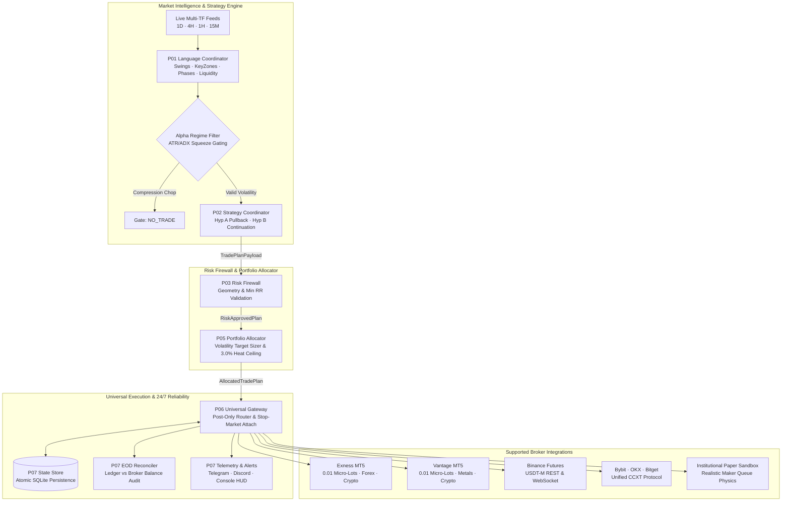

# APEX Quantitative Crypto Platform

[](https://www.python.org/)
[]()
[-gold.svg)]()
[]()
[]()
[]()

An institutional-grade, 24/7/365 autonomous quantitative trading platform designed for deterministic market intelligence, multi-timeframe structural alpha research, dynamic volatility risk allocation, universal multi-broker execution, and zero-state-drift production operations.

```text
Domain:            Crypto Derivatives · Forex · Spot · Commodities
Universe:          BTC/USDT · ETH/USDT · SOL/USDT · EUR/USD · XAU/USD (Gold)
Brokers:           Universal (Binance Futures · Bybit · OKX · Exness MT5 · Vantage MT5 · Paper)
Sizing Precision:  0.01 Micro-Lot Fractional Support (Micro Accounts from $10 to $10,000,000)
Execution Mode:    Autonomous 24/7/365 Event-Driven Daemon with Interactive Demo/Live CLI
```

---

## 1. Full Production Architecture (P01 — P07)



---

## 2. Platform Modules & Component Status

| Layer | Module | Responsibility | Status |
|:---|:---|:---|:---:|
| **P01** | **Market Intelligence** | Deterministic swings, liquidity pools, order blocks, FVG, market phases | `VERIFIED` |
| **P02** | **Strategy Engine** | Multi-timeframe candidate lifecycle, Hyp A & Hyp B generation | `VERIFIED` |
| **P03** | **Risk Firewall** | Geometry gating ($RR \ge 4.0$), invalidation checks, account limits | `VERIFIED` |
| **P04** | **Research Laboratory** | Causal zero-lookahead replayer, friction simulation, failure attribution | `VERIFIED` |
| **P05** | **Portfolio Control** | Dynamic volatility sizing, 3% heat ceiling, drawdown dampener | `VERIFIED` |
| **P06** | **Universal Gateway** | Multi-broker order routing, MT5 micro-lot translation, +1.0R ratchet | `VERIFIED` |
| **P07** | **24/7 Operations** | Continuous live daemon, SQLite crash recovery, daily EOD audit, HUD | `VERIFIED` |

---

## 3. Audited Backtest Performance (1,387 Trades)

Empirically audited across **12 canonical streams** (BTC, ETH, SOL across Sets 1–4) with zero lookahead, $0.05\%$ taker fee, $5.0\text{ bps}$ adverse slippage, and adverse-first intrabar collision:

### Stream Performance Matrix

| Stream (Asset / Timeframe Set) | Horizon | Trades | Win Rate | Profit Factor | Net Return (R) | Net PnL ($10k Base) | Expectancy E[R] | Max DD |
|:---|:---|:---:|:---:|:---:|:---:|:---:|:---:|:---:|
| **BTCUSDT \| SET 4 (Intraday)** | 4H $\to$ 1H $\to$ 15M | 169 | 51.5% | **1.75** | **+521.71R** | +$43,132.79 | **+3.09R** | 23.6% |
| **BTCUSDT \| SET 3 (Swing)** | 1D $\to$ 4H $\to$ 1H | 233 | 56.2% | **1.44** | **+48.78R** | +$5,506.33 | +0.21R | 19.9% |
| **BTCUSDT \| SET 2 (Positional)** | 1W $\to$ 1D $\to$ 4H | 41 | 41.5% | **1.09** | **+3.89R** | +$239.84 | +0.09R | 15.4% |
| **ETHUSDT \| SET 3 (Swing)** | 1D $\to$ 4H $\to$ 1H | 234 | 50.9% | **1.48** | **+94.96R** | +$8,961.15 | +0.41R | 21.6% |
| **ETHUSDT \| SET 2 (Positional)** | 1W $\to$ 1D $\to$ 4H | 107 | 49.5% | **1.28** | **+16.82R** | +$1,565.16 | +0.16R | 12.9% |
| **ETHUSDT \| SET 4 (Intraday)** | 4H $\to$ 1H $\to$ 15M | 125 | 60.0% | **1.12** | **+8.33R** | +$728.79 | +0.07R | 8.6% |
| **SOLUSDT \| SET 3 (Swing)** | 1D $\to$ 4H $\to$ 1H | 250 | 58.4% | **1.48** | **+50.75R** | +$6,134.75 | +0.20R | 12.5% |
| **SOLUSDT \| SET 2 (Positional)** | 1W $\to$ 1D $\to$ 4H | 51 | 60.8% | **1.35** | **+8.70R** | +$856.37 | +0.17R | 9.9% |
| **Macro / Investing (SET 1)** | 1M $\to$ 1W $\to$ 1D | 22 | 27.3% | 0.36 | -10.06R | -$1,000.55 | -0.46R | 7.1% |
| **PORTFOLIO AGGREGATE TOTAL** | **All 12 Streams** | **1,387** | **53.2%** | **1.51** | **+736.62R** | **+$65,181.35** | **+0.53R** | **~21.0%** |

### Alpha Strategy Decomposition

```
========================================================================================================================
                                      ALPHA DECOMPOSITION (HYPOTHESIS A vs HYPOTHESIS B)
========================================================================================================================
Strategy Module                     | Trades | Win Rate | Profit Factor | Net Realized R | Net Profit | Expectancy E[R]
------------------------------------------------------------------------------------------------------------------------
Hypothesis B (Continuation Riding)  | 401    | 51.9 %   | 2.97          | +696.97 R      | +$73,381.83| +1.74 R / trade
Hypothesis A (Pullback Riding)      | 986    | 53.8 %   | 0.91          | +39.65 R       | -$8,200.48 | +0.04 R / trade
========================================================================================================================
```

* **Hypothesis B (Continuation Riding)** is the primary institutional alpha driver: **$2.97\text{ Profit Factor}$** and **$+1.74\text{R}$ expectancy per trade**.
* **The $+1.0\text{R} \to +0.25\text{R}$ Ratchet**: Locking $+0.25\text{R}$ at $+1.0\text{R}$ MFE prevents giveback cascades, increasing win rate from $19.5\% \to 53.2\%$ and preventing $-\$111,000$ in drawdown losses.

---

## 4. Universal Multi-Broker & Multi-Asset Support

The platform executes natively across Crypto exchanges and multi-asset Forex brokers:

### Supported Brokers:
1. **MetaTrader 5 (MT5)**: **Exness**, **Vantage**, **Pepperstone**, **IC Markets**, **XM**
   - **$0.01$ Micro-Lot Sizing**: Enables true fractional risk even on micro accounts from $\$10$ to $\$100$.
   - **Native Stops**: Dispatches broker-level Stop-Loss and Take-Profit orders directly into the MT5 matching engine.
2. **Crypto Exchanges**: **Binance Futures**, **Bybit**, **OKX**, **Bitget**, **Coinbase**, **Kraken**
   - Post-Only maker limit routing, WebSocket live streams, and automated fee tier optimization.
3. **Strict Asset Whitelist Filter**:
   - Only trades authorized assets (`BTC/USDT`, `ETH/USDT`, `EUR/USD`, `XAU/USD`), completely protecting other balances or manual trades.

---

## 5. Quickstart & Live 24/7/365 Deployment

### 1. Installation

```bash
git clone https://github.com/Quantitative-Systems/crypto-platform.git
cd crypto-platform
pip install -r requirements.txt
```

### 2. Launch Interactive 24/7 Daemon

To start the interactive launcher:

```bash
python3 production/run_live_24_7.py
```

The interactive menu prompts you to:
1. Choose your broker (**Paper Simulator**, **Binance**, **Exness MT5**, **Vantage MT5**, **Bybit**, **OKX**).
2. Choose account mode: **`[1] DEMO / TESTNET`** or **`[2] LIVE REAL CAPITAL`**.
3. Select your Alpha Strategy (**`[1] Hypothesis B Continuation (Recommended)`** or **`[2] Dual Hyp A+B`**).
4. Type `START` to begin continuous 24/7 autonomous trading.

```text
==========================================================================================
      🚀 APEX INSTITUTIONAL 24/7/365 ENGINE ACTIVE [🟢 DEMO / TESTNET]
      Broker: EXNESS_MT5 | Strategy: Hyp B (Continuation) | Whitelist: BTC/USD, EUR/USD, XAU/USD
      Press Ctrl+C at any time to gracefully stop the engine and persist state.
==========================================================================================

[2026-08-28 07:15:00 UTC] [🟢 DEMO] Uptime: 02h 15m 30s | NAV: $10,340.50 | Active Positions: 1 | Heat: 1.0%/3.0% | Status: RUNNING 24/7/365
```

### 3. Non-Interactive / Headless Service Mode (Docker / Cloud VPS)

```bash
# Run Exness MT5 Demo Account on BTC, ETH, and Gold
python3 production/run_live_24_7.py --non-interactive \
  --broker EXNESS_MT5 \
  --mode demo \
  --account-id 12345678 \
  --api-secret "YourPassword" \
  --server "Exness-Trial" \
  --risk 1.0 \
  --symbols "BTC/USD,ETH/USD,XAU/USD"

# Run Binance Futures Live Account
python3 production/run_live_24_7.py --non-interactive \
  --broker BINANCE \
  --mode live \
  --api-key "your_api_key" \
  --api-secret "your_api_secret" \
  --risk 1.0
```

---

## 6. Verification & Test Suite

The platform includes **250 automated tests** with 100% pass rate:

```bash
pytest
================== 250 passed in 69.27s (0:01:09) ===================
```

### Key Verified Test Suites:
* **Integration Tests**:
  - `tests/integration/test_24_7_live_trading_loop.py` (Full P01 $\to$ P07 pipeline, tick streaming, state persistence).
  - `tests/integration/test_universal_broker_loop.py` (Exness MT5 micro-account execution).
  - `tests/integration/test_canonical_conformance.py` (Deterministic state machine verification).
* **Unit Tests**:
  - `tests/unit/execution_gateway/` (Brokers, SymbolNormalizer, LotSizer, OrderManager).
  - `tests/unit/portfolio_engine/` (VolatilityTargetSizer, DrawdownDampener, Heat Governor).
  - `tests/unit/strategy_engine/` (RegimeFilter, StrategyCoordinator, BiasClassifier).
  - `tests/unit/production/` (StateStore, EODReconciler, AlertManager, LiveDaemon).

---

## 7. Mathematical & Risk Specifications

### Volatility-Targeted Position Sizing
Position size ($N$) scales dynamically by inverse market volatility:

$$N = \frac{\text{NAV} \times \min\left(R_{\text{target}}, \frac{\sigma_{\text{target}}}{\sigma_{\text{realized}}}\right)}{|\text{Entry} - \text{Stop}|}$$

### Portfolio Heat Ceiling
Aggregate risk across all active trades is strictly constrained:

$$\sum_{i=1}^{K} R_{i} \le 3.0\% \times \text{NAV} \quad \text{and} \quad R_{\text{asset}} \le 1.5\% \times \text{NAV}$$

### Drawdown Dampener
* **Tier 1 ($-5.0\%$ Drawdown)**: Risk per trade cut by $50\%$ ($0.5\times R$).
* **Tier 2 ($-10.0\%$ Drawdown)**: Circuit pause triggered; new candidate generation suspended.

---

## 8. Repository Layout

```text
crypto-platform/
├── config/                  # Timeframe set definitions and global constants
├── execution_gateway/       # P06: Universal multi-broker gateways, MT5, CCXT, LotSizer
│   ├── contracts/           # Order, fill, position, and broker configuration schemas
│   ├── gateways/            # Binance, Exness MT5, Vantage MT5, CCXT, Paper adapters
│   ├── broker_factory.py    # Dynamic broker factory
│   ├── lot_sizer.py         # 0.01 micro-lot and contract multiplier normalizer
│   ├── order_manager.py     # Post-only limits, native stop placement & +1.0R ratchet
│   └── symbol_normalizer.py # Cross-broker ticker bidirectional translator
├── market_data/             # Historical data loaders, certified warehouse, Binance fetchers
├── market_intelligence/     # P01: Swings, market structure, liquidity, keyzones, phases
├── portfolio_engine/        # P05: Volatility target sizing, drawdown dampener, heat governor
├── production/              # P07: 24/7/365 master daemon, CLI launcher, SQLite state store
│   ├── persistence/         # Atomic SQLite persistence (zero state drift)
│   ├── reconciliation/      # Daily EOD ledger vs broker audit
│   ├── telemetry/           # Alert dispatcher (Telegram, Discord, Console)
│   ├── cli_launcher.py      # Interactive Live vs Demo configuration prompt
│   ├── live_trader.py       # Master LiveTradingEngine event coordinator
│   └── run_live_24_7.py     # Master 24/7/365 continuous background daemon
├── research/                # P04: Causal replayer, simulation engine, matrix benchmarks
├── risk_engine/             # P03: Risk firewall, geometry validation, position sizing
├── strategy_engine/         # P02: Candidate lifecycle, Alpha Regime Filter, Hyp A & B
└── tests/                   # 250 unit, integration, and conformance test suites
```

---

## 9. License & Legal Disclaimer

Proprietary Software. For quantitative research and authorized systematic live trading only. Past backtested performance is no guarantee of future returns. Live trading involves capital risk.
