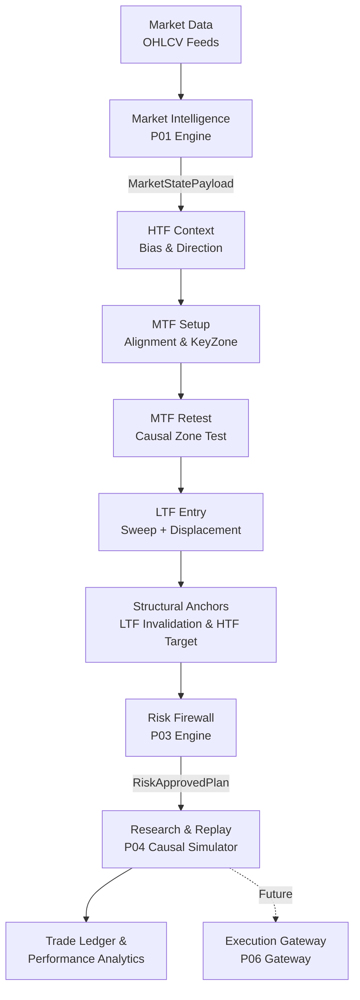

# Crypto Platform

A research-first cryptocurrency trading platform for deterministic market intelligence, multi-timeframe strategy research, risk-controlled trade planning, historical replay, execution simulation, and automated execution.

```text
Domain:            Cryptocurrency Markets
Initial Assets:    BTC/USDT · ETH/USDT · SOL/USDT
Architecture:      Event-driven · Causal · Stateful · Modular
Primary Objective: Research, validate, risk-control, and automate systematic trading strategies
```

---

## 1. System Pipeline

Crypto Platform evaluates market state causally across multi-timeframe hierarchies to produce risk-approved execution plans and research telemetry:



---

## 2. Core Trading Model

The trading architecture coordinates three discrete analytical horizons:

$$\text{HTF Bias} \longrightarrow \text{MTF Setup} \longrightarrow \text{LTF Entry}$$

with structural execution boundaries:
* **Initial Invalidation (Stop Loss)**: Derived from the LTF structural swing.
* **Target Destination (Take Profit)**: Derived from the HTF structural expansion target.
* **Open Position Management**: Managed dynamically via MTF structural trailing.

```
HTF (Higher Timeframe)
├─ Establishes directional bias from external market structure (BOS / CHOCH).
├─ Identifies structural phase (Expansion vs. Pullback vs. Compression).
└─ Defines macro structural destination / target context.

MTF (Middle Timeframe)
├─ Identifies setup formation and structural realignment toward HTF bias.
├─ Discovers causal MTF KeyZones (Order Blocks, Fair Value Gaps).
├─ Verifies causal KeyZone retest.
└─ Manages active positions using MTF structural trailing.

LTF (Lower Timeframe)
├─ Generates point-in-time micro execution triggers (Liquidity Sweep + Displacement).
└─ Establishes the initial structural invalidation anchor (Stop Loss).
```

---

## 3. Strategy Hypotheses

The platform formalizes and evaluates trading hypotheses as independent, isolated research modules:

### Hypothesis A — Pullback Riding
* **Concept**: HTF establishes a directional bias. During an expected retracement toward an HTF KeyZone, MTF structure temporarily moves counter to the HTF bias. The system waits for MTF structure to realign with the HTF bias, discovers the causal MTF KeyZone, waits for a retest, and executes upon an LTF micro-trigger.
* **Causal Flow**:
  $$\text{HTF Bias} \rightarrow \text{HTF Pullback} \rightarrow \text{HTF KeyZone} \rightarrow \text{MTF Realignment} \rightarrow \text{MTF KeyZone} \rightarrow \text{MTF Retest} \rightarrow \text{LTF Entry} \rightarrow \text{Risk Gate} \rightarrow \text{MTF Trailing}$$

### Hypothesis B — Continuation Riding
* **Concept**: HTF has interacted with a structural zone and continuation in the HTF direction is expected. The system waits for MTF setup formation aligned with the HTF bias, waits for an MTF KeyZone retest, and triggers on LTF confirmation.
* **Causal Flow**:
  $$\text{HTF Bias} \rightarrow \text{HTF Continuation} \rightarrow \text{MTF Setup} \rightarrow \text{MTF Realignment} \rightarrow \text{MTF KeyZone} \rightarrow \text{MTF Retest} \rightarrow \text{LTF Entry} \rightarrow \text{Risk Gate} \rightarrow \text{MTF Trailing}$$

> [!NOTE]
> All strategy hypotheses are strictly isolated in code and telemetry to maintain independent measurement and prevent cross-contamination.

---

## 4. Multi-Timeframe Configurations

Strategy hypotheses are tested across four standardized timeframe configurations representing independent research populations:

| Timeframe Set | HTF | MTF | LTF | Trading Horizon |
|:---|:---:|:---:|:---:|:---|
| **Set 1** | 1M | 1W | 1D | Macro / Position |
| **Set 2** | 1W | 1D | 4H | Position / Swing |
| **Set 3** | 1D | 4H | 1H | Swing |
| **Set 4** | 4H | 1H | 15M | Intraday |

Empirical results from one timeframe set are not assumed to transfer to others.

---

## 5. Market Intelligence (P01)

Product 01 converts raw OHLCV candle streams into a deterministic, point-in-time domain ontology:

* **Market Structure**: Raw geometric swings, sequence labeling (`HH`, `HL`, `LH`, `LL`, `EQH`, `EQL`), internal and external swing hierarchy.
* **Structural Shifts**: Break of Structure (`BOS`), Change of Character (`CHOCH`), Market Structure Shift (`MSS`), and Failed Breakouts / Wick Rejections.
* **Structural Anchors**: Dynamic assignment of protected and weak swings.
* **Liquidity Dynamics**: Buy-Side Liquidity (`BSL`), Sell-Side Liquidity (`SSL`), Liquidity Sweeps, and Inducements.
* **KeyZones**: Order Blocks (`OB`), Fair Value Gaps (`FVG`), Breaker Blocks, and Mitigation tracking.
* **Ontological State**: Market Phase classification (Accumulation, Expansion, Pullback, Reversal, Compression, Distribution) and Trend state derivation.

All market intelligence outputs are encapsulated in a single immutable contract: `MarketStatePayload`.

---

## 6. Risk Engine & Firewall (P03)

Risk controls operate as an independent verification gate between strategy generation and trade execution:

* **Capital Allocation**: Maximum 1.0% account risk per trade calculated against structural invalidation distance.
* **Planned Geometry Gate**: Minimum planned Risk-to-Reward ratio ($\ge 4.0\text{R}$) evaluated against directional structural anchors.
* **Domain Separation**: Strategy generation (`TradePlanPayload`) is decoupled from risk approval (`RiskApprovedPlan`).
* **Fail-Closed Principle**: Incomplete, ambiguous, or directionally invalid trade geometries fail closed and are rejected as diagnostic telemetry.

> [!IMPORTANT]
> The $4.0\text{R}$ threshold is an architectural constraint under active empirical evaluation to measure valid geometry occurrence and historical expectancy.

---

## 7. Research & Simulation Methodology

The research platform follows a strict evidence-driven validation pipeline:

```text
1. Deterministic Historical Replay
   ↓
2. Causal Point-in-Time State Reconstruction (Zero-Lookahead)
   ↓
3. Strategy Hypothesis Evaluation
   ↓
4. Risk Firewall Validation
   ↓
5. Execution Simulation (Adverse-First Intrabar Collision & Friction Modeling)
   ↓
6. Trade Ledger Generation
   ↓
7. Performance Attribution & Failure Mode Diagnostics
   ↓
8. Out-of-Sample Validation
   ↓
9. Walk-Forward Analysis
   ↓
10. Robustness & Permutation Testing
   ↓
11. Paper Trading
   ↓
12. Automated Production Execution (Upon empirical verification)
```

**Core Policy**: Evidence before optimization. Indicators and filters are never added to mask strategy defects without causal empirical validation.

---

## 8. Engineering Principles

* **Temporal Causality**: At decision timestamp $T$, no component may consume information timestamped $> T$.
* **Deterministic Reproducibility**: Identical data and configuration must produce bit-for-bit identical state and execution records across runs.
* **Domain Isolation**: Subsystems communicate strictly via explicit data contracts (`MarketStatePayload`, `TradePlanPayload`, `RiskApprovedPlan`).
* **State Provenance**: Every trade plan and state change is traceable to its originating market events and swing IDs.
* **Fail Closed**: Incomplete or directionally invalid geometry yields `NO_TRADE` rejection rather than assumption.
* **Hypothesis Isolation**: Strategies remain independently measurable without shared state or blended metrics.
* **Evidence Before Optimization**: Parameters, indicators, and rules are modified only when supported by raw empirical evidence.

---

## 9. Platform Architecture & Status


| Component | Responsibility | Current Status |
|:---|:---|:---:|
| **P01 — Market Intelligence** | Deterministic market structure, keyzones, phases, trends | `VERIFIED` |
| **P02 — Strategy Engine** | Multi-timeframe candidate lifecycle & hypotheses | `VERIFIED` |
| **P03 — Risk Firewall** | Position sizing, drawdown validation, RR gates | `VERIFIED` |
| **P04 — Research Laboratory** | Causal replay, execution simulation, telemetry forensics | `UNDER RESEARCH` |
| **P05 — Portfolio Control** | Multi-asset exposure management & correlation gates | `PLANNED` |
| **P06 — Execution Gateway** | Exchange connectivity, order routing, fill reconciliation | `PLANNED` |
| **P07 — Operations** | Real-time monitoring, heartbeat, circuit breakers | `PLANNED` |

---

## 10. Verification Status

Verified repository test suite metrics (as of Day 34 checkpoint `7fef77d`):

```text
PYTHONPATH=. pytest -q
============================= 189 passed in 49.90s =============================
```

* **Canonical Conformance Suite**: `14 / 14 PASS` (`tests/integration/test_canonical_conformance.py`)
* **Contract & Type Identity**: `6 / 6 PASS` (`tests/unit/market_intelligence/test_enum_contract_identity.py`)
* **Pipeline Integration**: `1 / 1 PASS` (`tests/integration/test_product_03_pipeline.py`)

---

## 11. Current Research Status

Empirical findings from the Vertical Slice 001 (`BTCUSDT` S3: `1D` $\rightarrow$ `4H` $\rightarrow$ `1H`) forensic diagnostic:

* [x] **Market Intelligence Causality**: P01 produces zero-lookahead structural state across 50,000 historical 1H candles.
* [x] **HTF Directional Bias**: Causal bias propagates through the pipeline (12,090 active bias observations).
* [x] **MTF Alignment & Retest**: Causal MTF KeyZones activate and register valid retests (1,867 retests).
* [x] **LTF Entry Model**: Micro-triggers (Liquidity Sweep + Displacement) activate within retest windows (2,572 candidate residency ticks).
* [x] **Forensic Root Cause Identified**: A forensic audit discovered that `PullbackRidingHypothesis` mapped Long targets to `protected_high` (which is `None` or an obsolete cycle anchor during bullish trends) and Short targets to `protected_low`, resulting in inverted geometry.
* [ ] **Genuine RR Distribution**: Directional geometry validation is being corrected before measuring true $RR \ge 4.0$ empirical feasibility.
* [ ] **Profitability**: Strategy profitability and expectancy have **not** yet been established.
* [ ] **Live Trading**: Live execution is **not** authorized.

---

## 12. Repository Structure

```text
crypto-platform/
├── config/                  # Timeframe sets and platform configuration
├── market_data/             # Historical data loaders, caches, and exchange fetchers
├── market_intelligence/     # P01: Swings, structure, liquidity, keyzones, phase, trend
├── strategy_engine/         # P02: Candidate lifecycle, hypotheses, entry models
├── risk_engine/             # P03: Position sizing, drawdown validation, risk plans
├── research/                # P04: Causal replayer, execution simulator, metrics engine
├── docs/                    # Technical architecture specifications and research logs
├── scratch/                 # Diagnostic probes and forensic audit scripts
└── tests/                   # Conformance, integration, and unit test suites
    ├── integration/
    └── unit/
```

---

## 13. Technical Roadmap

### Current Focus
- Correct structural target mapping for Pullback Riding (aligning targets with expansion extremes).
- Enforce strict directional geometry validation ($SL < Entry < TP$ for Longs, $TP < Entry < SL$ for Shorts).
- Empirically measure genuine RR distribution across 50,000-bar datasets.

### Next Milestones
- Validate strategy performance across all 4 Timeframe Sets (Sets 1–4).
- Multi-asset baseline evaluation across universe (`BTC/USDT`, `ETH/USDT`, `SOL/USDT`).
- Out-of-sample partition testing and walk-forward parameter stability analysis.

### Future Infrastructure
- Portfolio exposure controller (P05).
- Exchange execution gateway with dry-run paper trading (P06).
- Operational monitoring, health metrics, and kill-switch architecture (P07).
