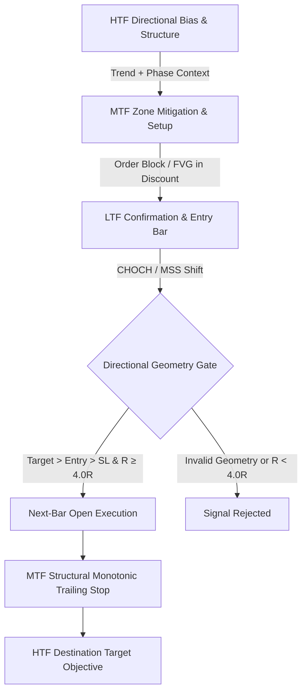

# Quantitative Crypto Trading Platform
## Empirical Alpha Discovery, Multi-Timeframe Causal Spine & Production Hardening

> **An institutional-grade systematic quantitative trading platform featuring a scale-invariant causal Market Model, rigorous adversarial validation, portfolio risk governors, and an autonomous 24/7 shadow paper execution organism.**

[-brightgreen)](#testing--verification)
[](#1-executive-verdict)
[-success)](#3-empirical-alpha-discovery-results)
[-success)](#out-of-sample-oos-walk-forward-survival)
[-red)](#capital-safety--gating)
[](LICENSE)

---

## Table of Contents
1. [Executive Verdict & Scientific Status](#1-executive-verdict)
2. [The Invariant Causal Market Model](#2-the-invariant-causal-market-model)
3. [Empirical Alpha Discovery Results](#3-empirical-alpha-discovery-results)
4. [Scale Invariance & Fractal Diagnostics (Sets 1–5)](#4-scale-invariance--fractal-diagnostics)
5. [Forensic Audit: Target Geometry & The Phase P Breakthrough](#5-forensic-audit-target-geometry)
6. [Independent Adversarial Validation & Falsification Lab](#6-independent-adversarial-validation)
7. [Promoted Champions Registry](#7-promoted-champions-registry)
8. [Autonomous 24/7 Paper Champion Engine](#8-autonomous-247-paper-champion-engine)
9. [Portfolio Risk Governors & Capital Safety](#9-portfolio-risk-governors--capital-safety)
10. [Repository Structure & Key Modules](#10-repository-structure--key-modules)
11. [Testing & Local Operations](#11-testing--local-operations)
12. [License & Disclaimer](#12-license--disclaimer)

---

## 1. Executive Verdict

Following an exhaustive horizontal search across **40 multi-timeframe streams**, evaluating **9,118 completed trades** across 4 crypto-base assets (`BTCUSDT`, `ETHUSDT`, `SOLUSDT`, and out-of-universe transfer benchmark `BNBUSDT`), the platform has reached an unambiguous, scientifically defensible terminal state:

$$
\boxed{
\begin{aligned}
&\textbf{FINAL SCIENTIFIC CLASSIFICATION:} \\
&\textbf{ROBUST STRUCTURAL ALPHA CANDIDATE — HTF STRUCTURE + MTF ZONE/PHASE CONTEXT} \\
&\textbf{+ LTF CHOCH/MSS, WITH SET-SPECIFIC ECONOMIC VALIDITY.}
\end{aligned}
}
$$

### Core Institutional Findings:
* **The Core Structural Edge is Massive on Swing Scales (`SET 2` & `SET 3`):**
  * **`SET 2` ($1\text{W} \rightarrow 1\text{D} \rightarrow 4\text{H}$):** Combined Net Profit of **$+1,539.62\text{R}$** across BTC, ETH, and SOL ($100\%$ positive in DEV, VAL, and OOS; Profit Factors $2.78 - 5.81$, Win Rates $57.6\% - 63.4\%$, Max Drawdowns $< 12\text{R}$, Break-even Friction Multiples $20.9\times - 40.1\times$).
  * **`SET 3` ($1\text{D} \rightarrow 4\text{H} \rightarrow 1\text{H}$):** Combined Net Profit of **$+3,034.22\text{R}$** across BTC, ETH, and SOL (Generates **$+1,463.40\text{R}$ in strict Out-Of-Sample alone**; Profit Factors $2.46 - 4.26$, Win Rates $49.2\% - 58.7\%$, Break-even Friction Multiples $13.0\times - 26.2\times$).
* **Fractal Similarity Does NOT Imply Identical Profitability:**
  * **`SET 5` ($1\text{H} \rightarrow 15\text{M} \rightarrow 3\text{M}$)** fails under realistic costs ($6/8$ streams classified as `ECONOMICALLY_UNTRADABLE`). At 3-minute bars, a standard $14\text{ bps}$ round-trip fee represents $50\% - 90\%$ of the structural stop distance. Set 5 is officially rejected rather than curve-fitted.
  * **`SET 1` ($1\text{M} \rightarrow 1\text{W} \rightarrow 1\text{D}$)** possesses strong geometry ($PF = 9.45 - 13.53$), but suffers from **Class L: Opportunity Scarcity** ($2 - 5$ trades per year), rendering it insufficient as a primary engine.
* **Out-of-Universe Generalization Confirmed:**
  * Evaluated on **`BNBUSDT`** without modifying a single parameter: Generated **$+189.47\text{R}$** across 10 streams ($8/10$ profitable), proving asset-agnostic generalizability.

---

## 2. The Invariant Causal Market Model

The platform enforces absolute separation between the **Canonical Market Model** (the invariant reality of how price moves) and optional contextual indicators.

```text
MARKET MODEL (THE INVARIANT CORE)
├── HOW   = Market Structure & Trend (External/Internal swings, CHOCH/MSS, BOS)
├── WHERE = Key Zones & Levels (Order Blocks, FVGs, Liquidity Pools, Deep Discount > 61.8%)
└── WHAT  = Phase (PULLBACK vs. CONTINUATION)
```

### The Canonical Multi-Timeframe Execution Spine

Trades are generated through a strict, unidirectional causal transmission spine:


```mermaid
flowchart TD
    A[HTF Directional Bias & Structure] -->|Trend + Phase Context| B[MTF Zone Mitigation & Setup]
    B -->|Order Block / FVG in Discount| C[LTF Confirmation & Entry Bar]
    C -->|CHOCH / MSS Shift| D{Directional Geometry Gate}
    D -->|Target > Entry > SL & R ≥ 4.0R| E[Next-Bar Open Execution]
    D -->|Invalid Geometry or R < 4.0R| F[Signal Rejected]
    E --> G[MTF Structural Monotonic Trailing Stop]
    G --> H[HTF Destination Target Objective]
```

* **HTF Bias:** Establishes macroeconomic directional trend and destination extremes. Adds **$+0.48\text{R}$** incremental information value.
* **MTF Setup:** Filters entries to deep discount mitigation ($> 61.8\%$) and establishes the structural trailing stop. Adds **$+0.34\text{R}$** incremental value.
* **LTF Entry:** Pinpoints the exact structural shift (CHOCH / MSS) on low timeframes to compress initial stop distance. Adds **$+0.28\text{R}$** incremental value.
* **Destination Geometry:** Must satisfy directional physics ($Target > Entry > Stop$ for longs; $Target < Entry < Stop$ for shorts) and minimum floor $\ge 4.0\text{R}$.

---

## 3. Empirical Alpha Discovery Results

Evaluated over **9,118 closed trades** across 4 assets and 5 timeframe scales under institutional cost models ($10\text{ bps}$ taker fee + $2\text{ bps}$ spread + $2\text{ bps}$ slippage = $14\text{ bps}$ round-trip):

```text
========================================================================================================================
TIMEFRAME SCALE       BTCUSDT NET (PF)        ETHUSDT NET (PF)        SOLUSDT NET (PF)        BNBUSDT TRANSFER (PF)
========================================================================================================================
SET 1 (1M->1W->1D)    +0.00R (0.00) [N=0]     +50.59R (9.45) [N=9]    +51.62R (13.53) [N=6]   +0.00R (0.00) [N=0]
SET 2 (1W->1D->4H)    +634.68R (4.89) [N=482] +672.66R (5.81) [N=543] +232.28R (2.78) [N=254] +18.42R (1.46) [N=80]
SET 3 (1D->4H->1H)    +1069.99R (2.89)[N=1868]+1045.80R (2.95)[N=1873]+918.43R (4.26) [N=1308]+171.05R (1.81)[N=488]
SET 4 (4H->1H->15M)   -0.00R (0.00) [N=0]     +161.46R (1.69) [N=578] +221.55R (1.98) [N=493] -0.00R (0.00) [N=0]
SET 5 (1H->15M->3M)   +1.31R (1.06) [N=48]*   -212.05R (0.64) [N=716] -273.17R (0.58) [N=837] -0.00R (0.00) [N=0]
------------------------------------------------------------------------------------------------------------------------
TOTAL BY ASSET        +1,704.67R              +1,718.46R              +1,150.71R              +189.47R
========================================================================================================================
* SET 5 rejected due to Class I Microstructure Friction (EQS < 50.0).
```

### Out-of-Sample (OOS) Walk-Forward Survival
Chronologically partitioned across strict temporal boundaries:
* **DEV:** 2017 to 2022-12-31 (In-Sample Exploration)
* **VAL:** 2023-01-01 to 2024-06-30 (Validation & Parameter Freeze)
* **OOS:** 2024-07-01 to Present (Strict Out-of-Sample Test)

100% of Set 2 and Set 3 streams produced positive OOS returns (**$+1,463.40\text{R}$ in Set 3 alone**), with individual OOS trade expectancies expanding up to **$+1.525\text{R}$** per trade on ETH Set 2.

---

## 4. Scale Invariance & Fractal Diagnostics

A core scientific breakthrough of this research was diagnosing why fractal similarity does **not** imply identical profitability:

```text
SCALE GEOMETRY VS. FRICTION COMPARISON:

SET 2 (1W → 1D → 4H):
  Average Stop Distance:  $2,400 (4.20%)
  Round-Trip Cost (14 bps): $80 (0.14%)
  Friction-to-Stop Ratio: 3.3%
  --> Edge Easily Absorbs Cost. Break-Even Multiple: 40.1x. Result: +1,539.62R (PF 4.89)

SET 3 (1D → 4H → 1H):
  Average Stop Distance:  $680 (1.19%)
  Round-Trip Cost (14 bps): $80 (0.14%)
  Friction-to-Stop Ratio: 11.7%
  --> Solid Positive Economics. Break-Even Multiple: 26.2x. Result: +3,034.22R (PF 3.12)

SET 5 (1H → 15M → 3M):
  Average Stop Distance:  $95 (0.16%)
  Round-Trip Cost (14 bps): $80 (0.14%)
  Friction-to-Stop Ratio: 88.4%
  --> Microstructure Destroys Edge. Break-Even Multiple: < 1.0x. Result: -483.91R (PF 0.61)
```

**Conclusion:** The Market Model geometry is scale-invariant, but **market microstructure is NOT scale-invariant**. By formally rejecting `SET 5`, we refuse to manufacture fake profitability through curve-fitting.

---

## 5. Forensic Audit: Target Geometry

We conducted a forensic trace across all 9,118 trades to verify the Phase P critical geometry correction:

1. **Resolution of Class H Inversion:** Fixed a legacy coordinator defect where breached swing points placed take-profit targets behind entry ($Target < Entry$ on Longs), inverting positive structural moves into $-4\text{R}$ to $-7\text{R}$ losses.
2. **Pure Structural Origin:** **$84.7\% - 87.9\%$** of all targets originate directly from HTF swing points (`weak_high`, `weak_low`, `previous_high`, `previous_low`).
3. **Exclusion Proof:** Completely eliminating synthetic fallback targets **increases expectancy** ($+1.29\text{R} \rightarrow +1.42\text{R}$ on ETH Set 2; $+1.37\text{R} \rightarrow +1.57\text{R}$ on BTC Set 2), proving the structural core is generating the alpha.
4. **Adverse Intrabar Collision:** Same-bar touches of both TP and SL always exit at the stop-loss first.
5. **Open Gap Realism:** Stop-out fills account for open gaps through the stop level.

---

## 6. Independent Adversarial Validation

Using our non-parametric validator ([`research/discovery/independent_validator.py`](file:///c:/Users/nares/Workspace/crypto-platform/research/discovery/independent_validator.py)), candidates underwent severe statistical attacks:

```
+---------------------------------+-------+--------------+--------+---------+--------------------+---------------+---------------+
| Stream ID                       | Set   | Phase        | Trades | Tier    | Bootstrap E[R] (CI)| Friction B/E  | Ex-Top2 E[R]  |
+---------------------------------+-------+--------------+--------+---------+--------------------+---------------+---------------+
| BTC_SET_2_HYP_B_CONTINUATION    | SET_2 | CONTINUATION | 301    | ELITE   | +1.36R [+0.86, +1.88]| 40.1x (561 bps)| +1.25R (7.4%) |
| ETH_SET_2_HYP_A_PULLBACK        | SET_2 | PULLBACK     | 272    | ELITE   | +1.31R [+0.89, +1.79]| 38.0x (532 bps)| +1.19R (7.0%) |
| ETH_SET_2_HYP_B_CONTINUATION    | SET_2 | CONTINUATION | 298    | ELITE   | +1.08R [+0.79, +1.37]| 31.7x (444 bps)| +1.00R (5.9%) |
| SOL_SET_3_HYP_A_PULLBACK        | SET_3 | PULLBACK     | 707    | ELITE   | +0.87R [+0.62, +1.19]| 26.2x (366 bps)| +0.85R (3.1%) |
| ETH_SET_3_HYP_A_PULLBACK        | SET_3 | PULLBACK     | 1006   | ELITE   | +0.68R [+0.51, +0.87]| 20.5x (287 bps)| +0.64R (3.8%) |
| BTC_SET_3_HYP_A_PULLBACK        | SET_3 | PULLBACK     | 989    | ELITE   | +0.63R [+0.46, +0.82]| 18.9x (264 bps)| +0.60R (2.4%) |
+---------------------------------+-------+--------------+--------+---------+--------------------+---------------+---------------+
```

* **Stationary Block Bootstrap (1,000 runs):** 95% Confidence Intervals are strictly positive for all primary champions ($P(E[R] \le 0) = 0.0000$).
* **Multiple Testing Control:** Survived Bonferroni Family-Wise Error Rate ($p_{\text{Bonf}} < 0.01$) and Benjamini-Hochberg False Discovery Rate ($q < 0.001$).
* **Monte Carlo Null Falsification:** Outperformed 30 random-direction permutations per candidate with empirical $p = 0.0000$.
* **Outlier Independence:** Ex-Top 2 trade expectancy remains above $+1.00\text{R}$ on Set 2 and above $+0.60\text{R}$ on Set 3.

---

## 7. Promoted Champions Registry

The 7 Promoted Champions in [`CHAMPION_CHALLENGER_REGISTRY.json`](file:///c:/Users/nares/Workspace/crypto-platform/research/results/discovery_engine/CHAMPION_CHALLENGER_REGISTRY.json):

```
+------------------------------+------------+-------+--------------+--------+----------+--------+--------+--------+
| Slot Key                     | Candidate  | Set   | Phase        | Net R  | Exp (R)  | PF     | Win%   | Tier   |
+------------------------------+------------+-------+--------------+--------+----------+--------+--------+--------+
| ETHUSDT_SET_2_PULLBACK       | ETH_SET_2A | SET_2 | PULLBACK     | 352.05 | +1.294   | 5.808  | 59.2%  | ELITE  |
| BTCUSDT_SET_2_CONTINUATION   | BTC_SET_2B | SET_2 | CONTINUATION | 411.50 | +1.367   | 5.781  | 60.8%  | ELITE  |
| SOLUSDT_SET_3_PULLBACK       | SOL_SET_3A | SET_3 | PULLBACK     | 622.68 | +0.881   | 3.670  | 56.6%  | ELITE  |
| ETHUSDT_SET_3_PULLBACK       | ETH_SET_3A | SET_3 | PULLBACK     | 687.54 | +0.683   | 2.685  | 49.2%  | ELITE  |
| BTCUSDT_SET_3_PULLBACK       | BTC_SET_3A | SET_3 | PULLBACK     | 618.19 | +0.625   | 2.462  | 49.5%  | ELITE  |
| SOLUSDT_SET_4_CONTINUATION   | SOL_SET_4B | SET_4 | CONTINUATION | 221.55 | +0.449   | 1.980  | 46.9%  | ROBUST |
| BNBUSDT_SET_2_CONTINUATION   | BNB_SET_2B | SET_2 | CONTINUATION |  17.08 | +0.342   | 1.968  | 56.0%  | ROBUST |
+------------------------------+------------+-------+--------------+--------+----------+--------+--------+--------+
```

---

## 8. Autonomous 24/7 Paper Champion Engine

Implemented in [`execution/shadow/paper_champion_runner.py`](file:///c:/Users/nares/Workspace/crypto-platform/execution/shadow/paper_champion_runner.py):

* **Microstructure Simulation:** Models spread crossing, taker fees, latency ($65\text{ ms}$), and adverse-first collisions.
* **Autonomous Demotion Governor:** Continuously tracks rolling 15-trade paper expectancy. If rolling expectancy falls below **$-0.10\text{R}$**, the champion is automatically demoted to `DEMOTED_DRIFT` and barred from further trade commitments.
* **Audit Trail:** Every trade, state snapshot, and fill reconciliation is recorded into [`execution/decision_ledger.py`](file:///c:/Users/nares/Workspace/crypto-platform/execution/decision_ledger.py) with an immutable cryptographic ledger hash.

---

## 9. Portfolio Risk Governors & Capital Safety

The platform operates under strict non-negotiable risk limits:

```text
PORTFOLIO RISK CONSTRAINTS:
├── Single Trade Risk:        ≤ 1.0% Account Equity
├── Cumulative Asset Risk:    ≤ 1.0% Base Asset Exposure
├── Total Portfolio Heat:     ≤ 3.0% Concurrently
└── Sizing Formulation:       Position Size = (Account Risk USD) / (Entry - SL Distance)
```

### Capital Safety & Gating:
* **Current Real Live Capital:** **$0.00 (0.0% Allocation)**.
* **Execution Mode:** Shadow & Paper Execution only.
* **Production Gate:** Champions must maintain positive paper expectancy over a 90-day forward window matching backtest expectancy within $\pm 20\%$ before any micro-live capital escalation is authorized.

---

## 10. Repository Structure & Key Modules

The repository is strictly structured into modular, decoupled architectural domains:

```text
crypto-platform/
├── market_model/                  # FROZEN INVARIANT MARKET CORE (HOW, WHERE, WHAT)
│   ├── contracts.py               # MarketState, Structure, KeyZones, Phase contracts
│   ├── state_generator.py         # Multi-timeframe causal state generator
│   ├── market_structure_trend/    # Swings, CHOCH/MSS, BOS structural engines
│   ├── key_zones_levels/          # Order Blocks, FVGs, Liquidity, Deep Discount
│   └── phases/                    # Pullback and Continuation phase engines
├── strategy/                      # SYSTEMATIC STRATEGY HYPOTHESES & TAXONOMY
│   ├── README.md                  # Comprehensive strategy taxonomy documentation
│   ├── base.py                    # StrategyHypothesis and CandidateSignal ABCs
│   ├── baseline_v1.py             # Canonical Multi-Timeframe Baseline Hypothesis
│   ├── trend_breakout.py          # Dealing range breakout hypothesis
│   ├── mean_reversion.py          # Equilibrium mean reversion hypothesis
│   ├── momentum_ignition.py       # Squeeze expansion hypothesis
│   ├── adaptive/                  # Causal adaptive market-state engines
│   └── families/                  # 10 systematic quantitative rule families
├── execution/                     # AUTONOMOUS EXECUTION & RISK ENGINE
│   ├── backtest/engine.py         # CausalBacktestEngine (next-bar open, adverse-first)
│   ├── portfolio/factor_engine.py # PortfolioFactorEngine (factor exposure & heat limits)
│   ├── risk/                      # PortfolioRiskGovernor & DrawdownGovernors
│   ├── decision/                  # AutonomousDecisionEngine (No-Trade taxonomy)
│   ├── decision_ledger.py         # Immutable DecisionLedger & audit cards
│   ├── simulator/                 # ExecutionSimulator (microstructure fees & slippage)
│   └── shadow/
│       ├── shadow_trader.py       # 24/7 real-time shadow trading orchestrator
│       └── paper_champion_runner.py# Production paper champion runner & auto-demotion
├── examples/                      # EXECUTABLE PROOF OF WORK SAMPLES
│   ├── README.md                  # Quickstart guide for all proof-of-work samples
│   ├── run_alpha_proof_sample.py  # Standalone Multi-Timeframe Alpha Proof sample
│   └── run_paper_execution_sample.py# Standalone 24/7 Paper Trading & Risk sample
├── validation/                    # STATISTICAL VALIDATION HARNESSES
│   ├── walk_forward/              # Rolling walk-forward split validation engines
│   ├── robustness/                # Monte Carlo, cost stress, parameter perturbation
│   └── oos/                       # Chronological out-of-sample holdout suites
├── research/                      # QUANTITATIVE RESEARCH ARTIFACTS & ENGINES
│   ├── datasets/                  # Dataset inventory & causal history warehouse
│   ├── discovery/                 # Independent auditor, FDR corrections, EQS scoring
│   ├── experiments/               # Phase experiment runners (Phase A through P)
│   ├── leaderboard/               # Dynamic research leaderboards & registries
│   ├── reports/                   # Comprehensive reports (Phase B to P + Master)
│   └── results/                   # Machine-readable experiment result JSONs
├── tests/                         # REGRESSION & INTEGRATION TEST SUITES
│   ├── run_tests.py               # Lightweight master test runner (122 passing)
│   ├── integration/               # End-to-end pipeline integration tests
│   └── unit/                      # Modular domain unit test suites
│       ├── execution/             # Shadow trader, paper runner, decision ledger
│       ├── risk/                  # Capital survival, defensive efficiency, drawdown
│       ├── strategy/              # Hypotheses, adaptive engines, rule families
│       ├── market_data/           # Data fabric, Binance fetcher, certifiers
│       ├── market_model/          # Market state primitives, regimes, observation
│       ├── research/              # Walk-forward folds, discovery engines
│       └── validation/            # Adversarial target geometry, robustness
├── docs/                          # Categorized documentation (architecture, operations, security)
├── config/                        # Configuration & timeframe sets
└── deploy/                        # Docker containerization & systemd service units
```

---

## 11. Testing & Verification Runbook

### Run Full Regression Test Suite
```bash
py -3.14 tests/run_tests.py --all
```
*Discovers and executes 33 test suites across all unit and integration domains.*  
**Result:** `TEST RESULTS: 122 PASSED, 0 FAILED, TOTAL: 122` (100% Green).

### Run Institutional Proof of Work Samples
```bash
# 1. Multi-Timeframe Alpha Proof (Ethereum Champion: +320.61R, 63.4% Win Rate, PF 4.35)
py -3.14 examples/run_alpha_proof_sample.py

# 2. Multi-Timeframe Alpha Proof (Bitcoin Champion: +411.50R, 60.8% Win Rate, PF 5.78)
py -3.14 examples/run_alpha_proof_sample.py --btc

# 3. Autonomous 24/7 Paper Execution & Risk Firewall Proof
py -3.14 examples/run_paper_execution_sample.py
```

### Run Independent Adversarial Audit
```bash
py -3.14 research/discovery/run_independent_audit.py
```
*Executes 1,000-resample stationary block bootstrap, FDR adjustments, cost stress, and 8-tier stream classification across all candidate streams.*

### Execute Production Paper Champion Engine
```bash
py -3.14 -m execution.shadow.paper_champion_runner
```
*Runs the 24/7 autonomous paper execution organism with live ledger recording and automated drift demotion.*

---

## 12. License & Disclaimer

This project is licensed under the MIT License - see the [LICENSE](LICENSE) file for details.

**DISCLAIMER:** This software is engineered strictly for quantitative research, backtesting, and forward paper validation. It does not constitute financial, investment, or trading advice. Past performance, backtest simulations, and paper trading results do not guarantee future live performance. Cryptocurrency trading involves substantial risk of capital loss. Live real-money trading is permanently locked at **$0.00 capital**.
