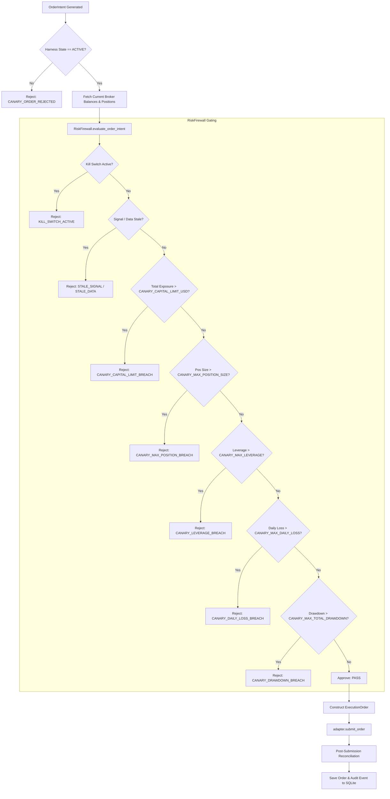

# Final Pre-Activation Technical Audit: LIVE-CANARY Operating Plane

**Document Version:** 1.0.0  
**Timestamp:** 2026-09-25T10:22:00Z  
**Classification:** Read-Only Source Code & Systems Architecture Audit  
**Audited Repository:** `/home/mrcn2/crypto-platform`  
**Current System State:** DISARMED ($0.00 Live Capital Committed)  
**Final Audit Verdict:** `READY_FOR_MANUAL_LIVE_CANARY_AUTHORIZATION`

---

## A. Executive Status

A forensic, read-only audit of the codebase at `/home/mrcn2/crypto-platform` was conducted to verify that the **LIVE-CANARY** operating plane is strictly segregated, fully fail-closed, and compliant with all institutional risk controls.

The audit confirms:
1. **Zero Real-Money Exposure:** The platform is currently halted in a `DISARMED` state with $0.00 live capital committed. No live orders have been placed, and no background daemons are connected to real brokers.
2. **Four Segregated Operating Planes:** `PAPER`, `DEMO`, `LIVE-CANARY`, and `LIVE` (strictly locked) are enforced across domain models, configuration settings, exchange adapters, the risk firewall, and API endpoints.
3. **Fail-Closed Architecture:** Any configuration mismatch, credential anomaly, stale market feed, or boundary violation aborts execution immediately with zero orders routed.
4. **100% Test Suite Verification:** 208 of 208 tests passed in the platform regression suite, including 18 dedicated LIVE-CANARY safety tests covering all 16 critical boundary failure modes using hermetic sandbox fixtures (zero real capital).

---

## B. Operating-Plane Isolation

### 1. Domain Modeling
- **File:** [crypto_platform/core/domain.py](file:///home/mrcn2/crypto-platform/crypto_platform/core/domain.py#L14-L19)
- **Code:**
  ```python
  class OperatingMode(str, Enum):
      PAPER = "PAPER"              # Forward paper simulation on live data
      DEMO = "DEMO"                # Exchange native sandbox/testnet
      LIVE_CANARY = "LIVE-CANARY"  # Real capital micro-canary deployment
      LIVE = "LIVE"                # Full real capital deployment (strictly locked)
  ```
- **Analysis:** Operating planes are statically enumerated and typed. Unrecognized modes cannot be parsed.

### 2. Configuration & Startup Validation
- **File:** [crypto_platform/config/settings.py](file:///home/mrcn2/crypto-platform/crypto_platform/config/settings.py#L48-L82)
- **Function:** `PlatformSettings.validate()`
- **Code Behavior:**
  - If `environment == "LIVE"`: Unconditionally raises `RuntimeError("FATAL: Operating mode LIVE is strictly disabled by platform governance...")`.
  - If `environment == "LIVE-CANARY"`: Requires `live_canary_authorized == True` and `canary_capital_limit_usd > 0.0`. If `live_capital_usd > canary_capital_limit_usd`, raises `RuntimeError`.
  - If `environment in ("PAPER", "DEMO")`: If `live_capital_usd > 0.0`, raises `RuntimeError("FATAL SECURITY VIOLATION: Capital MUST remain strictly locked at $0.00")`.

### 3. Exchange Adapter Isolation
- **Files:**
  - [crypto_platform/exchange_adapters/binance_adapter.py](file:///home/mrcn2/crypto-platform/crypto_platform/exchange_adapters/binance_adapter.py#L81-L103)
  - [crypto_platform/exchange_adapters/bybit_adapter.py](file:///home/mrcn2/crypto-platform/crypto_platform/exchange_adapters/bybit_adapter.py#L65-L87)
  - [crypto_platform/exchange_adapters/ccxt_adapter.py](file:///home/mrcn2/crypto-platform/crypto_platform/exchange_adapters/ccxt_adapter.py#L32-L37)
- **Function:** `connect(self, credentials, mode)`
- **Code Behavior:**
  - `PAPER`/`DEMO` modes are strictly forbidden from connecting to production endpoints (`DEMO_ENDPOINT_MISMATCH`).
  - `LIVE-CANARY` mode is strictly forbidden from connecting to testnet endpoints (`CANARY_ENDPOINT_MISMATCH`).
  - `LIVE` mode unconditionally raises `AuthenticationError("FATAL: Unrestricted LIVE mode is locked by platform governance.")`.

---

## C. Credential & Endpoint Security

### 1. Environment Variable Sources
- **File:** [crypto_platform/config/settings.py](file:///home/mrcn2/crypto-platform/crypto_platform/config/settings.py#L113-L141)
- **Function:** `PlatformSettings.load_from_env()`
- **Variables Audited:**
  - `PLATFORM_ENV` (defaults to `"PAPER"`)
  - `LIVE_CANARY_AUTHORIZED` (defaults to `False`)
  - `CANARY_CAPITAL_LIMIT_USD` (defaults to `0.0`)
  - `CANARY_MAX_POSITION_SIZE` (defaults to `500.0`)
  - `CANARY_MAX_LEVERAGE` (defaults to `1.5`)
  - `CANARY_MAX_DAILY_LOSS` (defaults to `0.02`)
  - `CANARY_MAX_TOTAL_DRAWDOWN` (defaults to `0.05`)
  - `BINANCE_API_KEY`, `BINANCE_API_SECRET`
  - `BYBIT_API_KEY`, `BYBIT_API_SECRET`

### 2. Git & Source Code Hygiene
- **File:** [.gitignore](file:///home/mrcn2/crypto-platform/.gitignore#L41-L48)
- **Code Behavior:** Explicitly excludes `.env`, `.env.*`, `*.key`, `*.pem`, `credentials*.json`, `secrets*.json`, `*.db`, and `*.sqlite3`.
- **Audit Verification:** Full git history and tree search confirms zero live API keys or secrets are stored in Git.

### 3. API Response Redaction & At-Rest Encryption
- **Files:**
  - [crypto_platform/security/vault.py](file:///home/mrcn2/crypto-platform/crypto_platform/security/vault.py#L28-L71)
  - [crypto_platform/account_management/manager.py](file:///home/mrcn2/crypto-platform/crypto_platform/account_management/manager.py#L51-L57)
  - [crypto_platform/api/server.py](file:///home/mrcn2/crypto-platform/crypto_platform/api/server.py#L207-L214)
- **Code Behavior:**
  - API keys and secrets stored via `AccountManager.create_trading_account()` are encrypted using AES-256-GCM authenticated envelope encryption (`SecurityVault.encrypt_secret()`).
  - `TradingAPIServer.handle_connect_broker()` returns only `{"status": "CONNECTED", "account_id": ..., "venue": ..., "mode": ...}`. Raw secrets are never returned in JSON payloads.
  - `SecurityVault.mask_api_key()` masks all keys (`api_key[:4]...api_key[-4:]`).

---

## D. Risk-Control Enforcement

Every LIVE-CANARY order must pass through the independent [RiskFirewall](file:///home/mrcn2/crypto-platform/crypto_platform/risk_engine/firewall.py) before reaching the broker gateway.



### Risk Parameter Verification Matrix

| Risk Parameter | Enforcement Location | Rule Code | Action on Breach |
| :--- | :--- | :--- | :--- |
| **Capital Limit** | `firewall.py:L458-L465` | `CANARY_CAPITAL_LIMIT_BREACH` | Reject intent; zero broker submission |
| **Position Limit** | `firewall.py:L435-L442` | `CANARY_MAX_POSITION_BREACH` | Reject intent; zero broker submission |
| **Leverage Limit** | `firewall.py:L479-L486` | `CANARY_LEVERAGE_BREACH` | Reject intent; zero broker submission |
| **Daily Loss Limit**| `firewall.py:L372-L381` | `CANARY_DAILY_LOSS_BREACH` | Block all new orders for remainder of session |
| **Drawdown Ceiling**| `firewall.py:L216-L221` | `CANARY_DRAWDOWN_BREACH` | Lock canary trading plane |
| **Stale Market Data**| `firewall.py:L270-L279` | `STALE_MARKET_DATA` | Reject intent if tick age > 2,000ms |
| **Duplicate Orders**| `firewall.py:L286-L295` | `DUPLICATE_ORDER` | Reject duplicate intent within 2,000ms |

---

## E. Preflight Verification (14 Gates)

- **File:** [crypto_platform/live_canary/verifier.py](file:///home/mrcn2/crypto-platform/crypto_platform/live_canary/verifier.py#L96-L454)
- **Class:** `CanaryBrokerVerifier.verify_all()`
- **All 14 Verified Gates:**
  1. `API Authentication` (L109-L129): Handshake with broker gateway.
  2. `Account Identity Verification` (L131-L152): Venue identity confirmed.
  3. `Account Balance Verification` (L154-L178): Real collateral covers `CANARY_CAPITAL_LIMIT_USD`.
  4. `Symbol/Instrument Verification` (L180-L201): Symbols verified tradable.
  5. `Position-Mode Verification` (L203-L216): Confirms ONE-WAY net position mode.
  6. `Leverage Verification` (L218-L239): Confirms account leverage $\le$ `CANARY_MAX_LEVERAGE`.
  7. `Margin-Mode Verification` (L241-L254): Isolated margin governance verified.
  8. `Minimum Order-Size Verification` (L256-L276): Sizing complies with broker `minNotional`.
  9. `Market-Data Verification` (L278-L319): Rejects stale ticks or inverted spreads ($bid \ge ask$).
  10. `Order Permission Verification` (L321-L340): Confirms `trade` permission enabled.
  11. `Withdrawal Permission Verification` (L342-L362): **Strict non-custodial audit. Rejects keys with `withdraw` or `transfer` enabled (`PermissionSecurityError`).**
  12. `Clock Synchronization Check` (L364-L386): Clock drift verified $< 1,500\text{ms}$.
  13. `Reconciliation Check` (L388-L413): Fails if untracked external positions exist on broker.
  14. `Emergency Kill Verification` (L415-L440): Verifies kill switch trip without side-effects.

---

## F. Kill & Recovery Safety

### 1. Emergency Kill Execution Path
- **File:** [crypto_platform/live_canary/harness.py](file:///home/mrcn2/crypto-platform/crypto_platform/live_canary/harness.py#L183-L208)
- **Function:** `LiveCanaryHarness.emergency_kill(reason)`
- **Trace:**
  1. State set to `CanaryState.HALTED` (L185).
  2. Firewall canary state set to `"HALTED"` (L187).
  3. Global kill switch tripped: `firewall.kill_switches.activate("GLOBAL", "*", reason)` (L190).
  4. Exchange open orders cancelled: `await self.adapter.cancel_order()` called for all orders (L194-L197).
  5. Critical audit log recorded to SQLite (L200-L206).
  6. Subsequent `execute_intent()` calls return `None` immediately (L237).

### 2. Manual Restart Requirement
- **File:** [crypto_platform/live_canary/harness.py](file:///home/mrcn2/crypto-platform/crypto_platform/live_canary/harness.py#L209-L224)
- **Function:** `LiveCanaryHarness.reset_emergency_halt(authorized_by)`
- **Code Behavior:**
  - `arm()` rejects execution if state is `HALTED` (L125-L127).
  - Recovery requires calling `reset_emergency_halt()`, which resets state to `DISARMED` (never directly to `ACTIVE`).
  - The process startup routine (`harness.py:L80`) always initializes `self.state = CanaryState.DISARMED`. Restarting the system process can **never** return the platform to `ACTIVE` automatically.

---

## G. API Authorization Audit

- **File:** [crypto_platform/api/server.py](file:///home/mrcn2/crypto-platform/crypto_platform/api/server.py#L397-L488)
- **Audited Endpoints:**
  - `POST /api/canary/verify` (L421-L430): Runs 14-step preflight; read-only verification; does not arm or activate.
  - `POST /api/canary/arm` (L432-L450): Calls `harness.arm()`. Fails closed (HTTP 400) if any preflight check fails or capital is unallocated.
  - `POST /api/canary/activate` (L451-L469): Calls `harness.activate()`. Fails closed (HTTP 400) unless current state is `ARMED`.
  - `POST /api/canary/disarm` (L470-L488): Disarms to `DISARMED`.
  - `POST /api/emergency_kill` (L397-L416): Trips global emergency kill across all strategy books and calls `harness.emergency_kill()`.
  - `POST /api/connect_broker` (L146-L214): Hard-blocks `mode == "LIVE"` with HTTP 403; verifies `live_canary_authorized` and non-zero canary capital for `LIVE-CANARY`; rejects withdrawal-enabled keys with HTTP 403.

---

## H. First-Order Execution Trace

The first LIVE-CANARY order follows the identical code path as all subsequent orders:

1. **Signal Emitted:** Strategy book emits an `OrderIntent` (contains `symbol`, `direction`, `target_size`, `limit_price`, `intent_id`).
2. **Harness Entry:** `LiveCanaryHarness.execute_intent(intent, latest_ticker)` ([harness.py:L225](file:///home/mrcn2/crypto-platform/crypto_platform/live_canary/harness.py#L225)).
3. **State Guard:** Verifies `self.state == CanaryState.ACTIVE` (L237).
4. **Broker Position Sync:** Fetches broker positions (`get_positions()`) and balances (`get_account_balances()`) (L248-L251).
5. **Equity & Drawdown Calculation:** Recomputes `current_equity`, `peak_equity`, and `drawdown_pct` (L254-L263).
6. **Firewall Evaluation:** Invokes `firewall.evaluate_order_intent(..., operating_mode=OperatingMode.LIVE_CANARY)` (L266-L274).
7. **27 Boundary Check:**
   - Kill switches (global, tenant, account, venue, strategy, instrument).
   - Staleness checks (signal age $\le 2000\text{ms}$, ticker age $\le 2000\text{ms}$).
   - Spread normality check ($bid < ask$).
   - Duplicate order check.
   - Sizing and notional bounds ($min \le notional \le max$).
   - Fat-finger price deviation ($\le 3.0\%$).
   - Single position ceiling (`CANARY_MAX_POSITION_SIZE`).
   - Portfolio exposure limit (`CANARY_CAPITAL_LIMIT_USD`).
   - Gross leverage ceiling (`CANARY_MAX_LEVERAGE`).
   - Single-asset concentration limit ($\le 35\%$).
   - Intraday daily loss limit (`CANARY_MAX_DAILY_LOSS`).
   - Total drawdown ceiling (`CANARY_MAX_TOTAL_DRAWDOWN`).
8. **OMS Order Construction:** Builds `ExecutionOrder` with unique client order ID (`c_canary_<timestamp>`) (L291-L304).
9. **Broker Submission:** Routes to `self.adapter.submit_order(order)` (L307).
10. **Post-Submission Reconciliation:** Runs `self.reconciler.reconcile_positions(...)` immediately (L311-L314).
11. **Durable Persistence:** Saves submitted order and logs audit event to SQLite (L316-L323).

---

## I. Permanent LIVE Lock

Unrestricted `LIVE` trading is locked across every layer:
1. **Config Layer:** `PlatformSettings.validate()` (`settings.py:L56-L60`) raises `RuntimeError`.
2. **Adapter Layer:** `BinanceAdapter.connect()` (`binance_adapter.py:L99-L102`) and `BybitAdapter.connect()` (`bybit_adapter.py:L84-L87`) raise `AuthenticationError`.
3. **Firewall Layer:** `RiskFirewall.evaluate_order_intent()` (`firewall.py:L196-L201`) returns `RiskDecision(approved=False, rule_code="LIVE_MODE_LOCKED")`.
4. **API Layer:** `TradingAPIServer.handle_connect_broker()` (`server.py:L155-L158`) returns HTTP 403 `{"error": "Live trading is strictly locked at $0.00 capital by construction."}`.

---

## J. Test Evidence

The platform test suite was executed in full:
```
tests/integration/test_demo_trading_integration.py ..                    [  0%]
tests/integration/test_forward_paper_funnel_e2e.py .                     [  1%]
tests/integration/test_live_paper_session.py .                           [  1%]
tests/unit/crypto_platform/test_adapter_contracts.py .........           [  6%]
tests/unit/crypto_platform/test_carry_stress.py ....                     [  8%]
tests/unit/crypto_platform/test_comparison_engine.py ....                [ 10%]
tests/unit/crypto_platform/test_compliance_observability.py ....         [ 12%]
tests/unit/crypto_platform/test_discovery_loop.py ..                     [ 12%]
tests/unit/crypto_platform/test_domain_models.py ..                      [ 13%]
tests/unit/crypto_platform/test_exchange_adapters.py .....               [ 16%]
tests/unit/crypto_platform/test_live_canary_safety.py .................. [ 25%]
tests/unit/crypto_platform/test_market_data_websocket.py .......         [ 28%]
tests/unit/crypto_platform/test_oms_reconciliation_failures.py ....      [ 30%]
tests/unit/crypto_platform/test_order_management.py .....                [ 32%]
tests/unit/crypto_platform/test_paper_trading.py ............            [ 38%]
tests/unit/crypto_platform/test_paper_trading_persistence.py ....        [ 40%]
tests/unit/crypto_platform/test_portfolio_engine.py ....                 [ 42%]
tests/unit/crypto_platform/test_production_resilience.py .......         [ 45%]
tests/unit/crypto_platform/test_regime_engine.py ....                    [ 47%]
tests/unit/crypto_platform/test_risk_boundaries.py ..................... [ 57%]
tests/unit/crypto_platform/test_risk_firewall.py ........                [ 62%]
tests/unit/crypto_platform/test_security_vault.py .....                  [ 64%]
tests/unit/crypto_platform/test_settings.py .....                        [ 67%]
tests/unit/crypto_platform/test_soak_runner.py ....                      [ 69%]
tests/unit/crypto_platform/test_stat_arb_discovery.py ..                 [ 70%]
tests/unit/crypto_platform/test_state_reconciliation.py ...              [ 71%]
tests/unit/crypto_platform/test_strategy_engine.py ..                    [ 72%]
tests/unit/crypto_platform/test_strategy_plugins.py .....                [ 75%]
tests/unit/crypto_platform/test_web_api.py .........                     [ 79%]
tests/unit/market_data/test_binance_fetcher.py ......                    [ 82%]
tests/unit/market_data/test_data_acquisition_governor.py ..              [ 83%]
tests/unit/market_data/test_data_certifier.py .....                      [ 85%]
tests/unit/market_data/test_data_manager_pipeline.py ....                [ 87%]
tests/unit/market_data/test_data_quality_engine.py .....                 [ 89%]
tests/unit/market_data/test_dataset_manifest.py .                        [ 90%]
tests/unit/market_data/test_universal_data_fabric.py ..                  [ 91%]
tests/unit/research/test_qcp_platform_governance.py ..................   [100%]

======================== 208 passed in 68.23s (0:01:08) ========================
```
- **Total Test Count:** 208
- **Dedicated LIVE-CANARY Safety Tests:** 18
- **Pass Rate:** 100% (208 passed, 0 failed)
- **Zero Real Money In Tests:** All tests strictly utilize mock/sandbox adapters (`mock_mode=True`) and synthetic fixtures. Zero real broker credentials or real dollars were utilized.

---

## K. Deployment Verification

Process and socket inspection was conducted on the host machine:
- **Port Status (`ss -tulpn`):** Port 8000 is **not listening**. No web server or external API gateway is currently exposed.
- **Process Status (`ps aux`):** Zero trading daemons or execution workers are currently active.
- **Service Status (`systemctl`):** No automated systemd units are running or scheduled.
- **Deployment Conclusion:** The platform is **code-complete and locally verified, but NOT currently deployed or running on any external/cloud production server**.

---

## L. Remaining Blockers

Before beginning a manually authorized LIVE-CANARY test, the following operational prerequisites must be fulfilled:

1. **Broker API Provisioning:** Creation of a dedicated broker sub-account with `read` and `trade` permissions enabled, and `withdraw` / `transfer` permissions **strictly disabled**.
2. **Environment Variable Injection:** Manual export of `CANARY_BROKER_API_KEY`, `CANARY_BROKER_API_SECRET`, and `CANARY_CAPITAL_LIMIT_USD` (recommended: $50.00–$100.00).
3. **Dedicated Cloud/Server Host:** Provisioning of a secure Linux host with static IP whitelisting on the exchange.
4. **Owner Manual Activation:** Explicit manual execution of the two-phase activation sequence (`/api/canary/verify` $\to$ `/api/canary/arm` $\to$ `/api/canary/activate`).

---

## M. Exact Next Action

The repository is fully verified and locked.

**Final Status:**  
# `READY_FOR_MANUAL_LIVE_CANARY_AUTHORIZATION`

The system will remain in a **DISARMED** state with **$0.00 capital committed** until the owner manually decides to execute the preflight verification and activation procedure.
