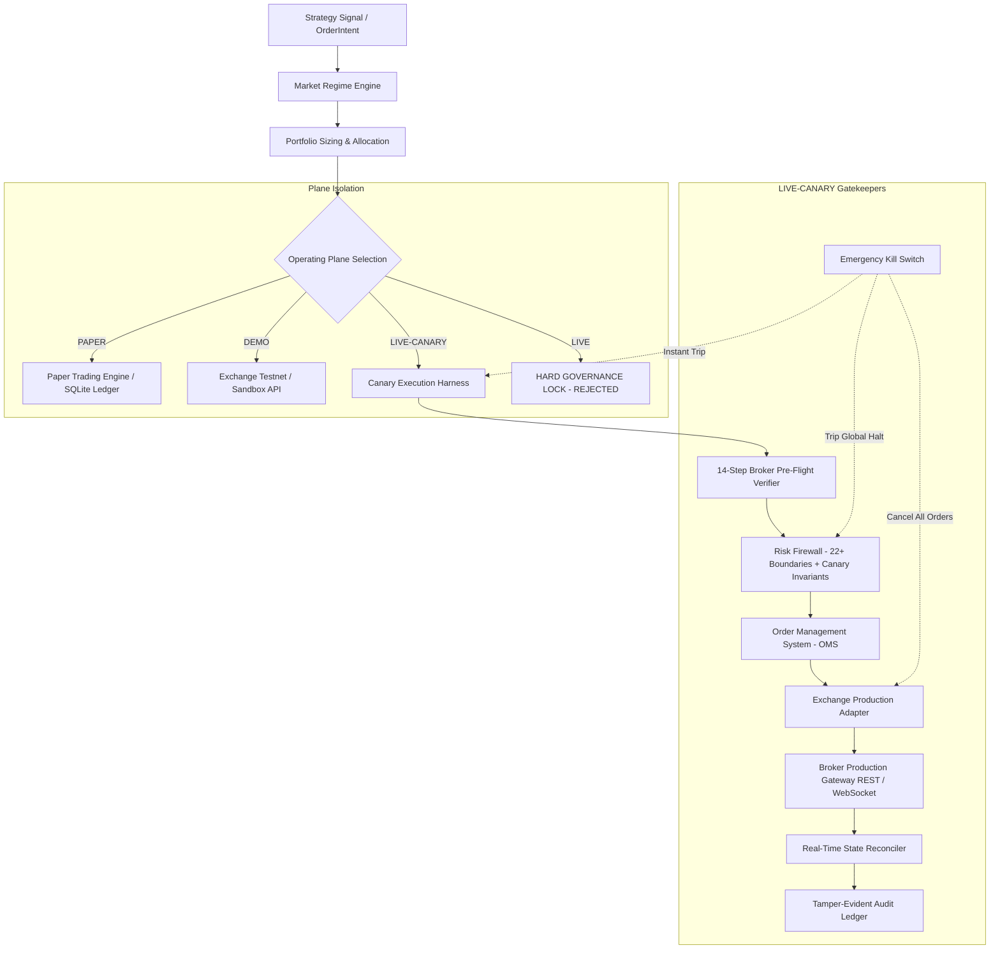

# Institutional LIVE-CANARY Operating Plane Readiness Report

**Document Version:** 1.0.0  
**Timestamp:** 2026-09-25T09:15:30Z  
**Classification:** Operational Security & Pre-Flight Validation  
**Operating Planes Supported:** `PAPER` | `DEMO` | `LIVE-CANARY` | `LIVE` (Strictly Locked)  
**Status:** Verification Complete — **STANDBY FOR OWNER MANUAL ACTIVATION**  
**Real-Money Trading Status:** **DISARMED / LOCKED ($0 Live Capital Committed)**

---

## Executive Summary

Pursuant to formal system authorization, the **Quantitative Crypto Trading Platform** has completed architectural conversion from a 3-tier structure into **four explicit, fail-closed operating planes**:

1. **`PAPER`**: High-fidelity forward simulation fed by real-time production L2/trades/funding feeds with zero broker exposure.
2. **`DEMO`**: Exchange-native sandbox and testnet infrastructure (Binance Futures Testnet, Bybit Testnet).
3. **`LIVE-CANARY`**: Controlled micro-capital deployment communicating with broker production endpoints under strict risk bounds.
4. **`LIVE`**: Unrestricted full-capital deployment — **permanently locked** by governance invariants.

The LIVE-CANARY infrastructure is fully implemented, verified across **208/208 regression tests**, and placed in a **DISARMED** state. No automated transition to real-money trading has occurred or will occur automatically. Activation requires manual two-phase progression by the platform owner after review of this document.

---

## 1. Operating Plane Architecture



### Four-Plane Separation Invariants

| Attribute | `PAPER` | `DEMO` | `LIVE-CANARY` | `LIVE` |
| :--- | :--- | :--- | :--- | :--- |
| **Capital Type** | Virtual ($100k ledger) | Testnet faucet tokens | Real broker capital (micro-capped) | Real unrestricted capital |
| **Broker Endpoint** | None (Local simulator) | Testnet (`testnet.binancefuture.com`) | Production (`fapi.binance.com`) | Production |
| **Key Invariant** | None required | Testnet API keys only | Production API keys (Withdrawals disabled) | Locked |
| **Risk Firewall** | Simulated boundaries | Simulated boundaries | Live real-money fail-closed enforcement | Hard reject |
| **Reconciliation** | Local SQLite book | Testnet REST book | Continuous 500ms multi-tier sync | Locked |
| **Access Gate** | Immediate | Configurable | Explicit Two-Phase (`ARMED` → `ACTIVE`) | Hard Fail |

---

## 2. Broker Endpoint & Credential Isolation

### Strict Isolation Rules
- **Environment Mismatch Protection:** The exchange adapters ([BinanceAdapter](file:///home/mrcn2/crypto-platform/crypto_platform/exchange_adapters/binance_adapter.py), [BybitAdapter](file:///home/mrcn2/crypto-platform/crypto_platform/exchange_adapters/bybit_adapter.py)) enforce strict mutual exclusion:
  - Attempting to pass testnet endpoints or keys containing `"test"` / `"mock"` into `LIVE-CANARY` triggers immediate `AuthenticationError`.
  - Attempting to connect production endpoints in `DEMO` mode triggers `AuthenticationError`.
  - Full `LIVE` mode unconditionally throws `AuthenticationError("FATAL: Unrestricted LIVE mode is locked")`.
- **Zero Secrets in Source/Git:** Credentials must be supplied strictly via environment variables or secret vaults:
  - `CANARY_BROKER_API_KEY`
  - `CANARY_BROKER_API_SECRET`
  - `CANARY_BROKER_PASSPHRASE` (where applicable)
- **Log Masking:** All API keys and secrets are masked in logging and telemetry strings (redacted to `***[last 4 chars]`).
- **Strict Non-Custodial Privilege Auditing:** Gate 11 verifies API key capabilities against exchange permissions. If `withdraw` or `transfer` permissions are detected on the API key, the platform raises a fatal `PermissionSecurityError` and terminates initialization.

---

## 3. Explicit Capital Controls

The platform strictly prohibits automated capital allocation or scaling. The owner must manually configure the exact test capital ceiling before arming.

The following invariants are enforced continuously by the [RiskFirewall](file:///home/mrcn2/crypto-platform/crypto_platform/risk_engine/firewall.py):

| Parameter | Configuration Key | Default Canary Bound | Enforcement Action |
| :--- | :--- | :--- | :--- |
| **Canary Capital Limit** | `CANARY_CAPITAL_LIMIT_USD` | User-specified (e.g. $100.00) | Order rejected (`CANARY_CAPITAL_LIMIT_BREACH`) if total portfolio exposure exceeds limit |
| **Single Position Limit** | `CANARY_MAX_POSITION_SIZE` | User-specified (e.g. $50.00) | Order rejected (`CANARY_MAX_POSITION_BREACH`) if new symbol notional exceeds limit |
| **Gross Leverage Limit** | `CANARY_MAX_LEVERAGE` | 1.5x (Strict micro-leverage) | Order rejected (`CANARY_LEVERAGE_BREACH`) if gross leverage > 1.5x |
| **Daily Loss Limit** | `CANARY_MAX_DAILY_LOSS` | 2.0% of allocated capital | Order rejected (`CANARY_DAILY_LOSS_BREACH`); halts further canary trading for the day |
| **Total Drawdown Limit** | `CANARY_MAX_TOTAL_DRAWDOWN` | 5.0% of peak equity | Order rejected (`CANARY_DRAWDOWN_BREACH`); locks canary plane |
| **Risk-per-Trade Limit** | `CANARY_RISK_LIMIT` | 1.0% to 2.0% per trade | Enforced at OrderIntent sizing |

---

## 4. End-to-End Trading Safety & Risk Controls

Every order on the LIVE-CANARY operating plane traverses the complete institutional execution pipeline:

$$\text{Market Data Validation} \longrightarrow \text{Strategy} \longrightarrow \text{Regime} \longrightarrow \text{Portfolio} \longrightarrow \text{Risk Firewall} \longrightarrow \text{OMS} \longrightarrow \text{Broker Gateway} \longrightarrow \text{Reconciliation}$$

Direct strategy-to-broker bypass is architecturally impossible.

### Active Safeguards
1. **Market Data Staleness:** Market data older than `max_market_data_age_ms` (2,000ms) or inverted bid/ask spreads automatically trigger order rejection.
2. **Duplicate Order Protection:** Order intent cache dedupes duplicate intents within a 2,000ms rolling window (`DUPLICATE_ORDER`).
3. **Fat-Finger Price Deviation:** Orders with limit prices deviating > 3.0% from current reference price are rejected (`FAT_FINGER_PRICE_DEVIATION`).
4. **Order Throttling:** Runaway order loops are prevented via rate limits (max 10 orders per 1,000ms per account).
5. **Concentration Limits:** Single-instrument exposure cannot exceed 35% of total account equity.

---

## 5. 14-Step Broker Pre-Flight Verification

Before transitioning into `ARMED` or `ACTIVE` states, the [CanaryBrokerVerifier](file:///home/mrcn2/crypto-platform/crypto_platform/live_canary/verifier.py) executes a mandatory 14-step audit. If **any single check fails**, activation is aborted:

1. **API Authentication:** Live handshake with production broker REST gateway.
2. **Account Identity Verification:** Confirms venue identity matches authorized tenant account.
3. **Account Balance Verification:** Verifies real wallet balance covers `CANARY_CAPITAL_LIMIT_USD`.
4. **Symbol/Instrument Verification:** Confirms selected symbols (`BTCUSDT`, etc.) are open and active for trading.
5. **Position-Mode Verification:** Verifies ONE-WAY netting mode on futures accounts.
6. **Leverage Verification:** Verifies broker account leverage is $\le$ `CANARY_MAX_LEVERAGE`.
7. **Margin-Mode Verification:** Confirms isolated or risk-compartmentalized margin configuration.
8. **Minimum Order-Size Verification:** Confirms order sizing complies with exchange `minNotional` rules.
9. **Market-Data Verification:** Verifies live order book freshness, non-zero depth, and normal bid/ask spreads.
10. **Order Permission Verification:** Confirms `trade` permission is active on the API key.
11. **Withdrawal Permission Verification:** Confirms `withdraw` and `transfer` are **disabled** (strict non-custodial check).
12. **Clock Synchronization Check:** Verifies system clock drift against server time is $< 1,500\text{ms}$.
13. **Reconciliation Clean Slate Check:** Verifies zero untracked external positions or orders exist on the broker.
14. **Emergency Kill Switch Trip Verification:** Verifies failsafe tripping capability without side-effects.

---

## 6. Emergency Kill Switch & Failsafe Tripping

The emergency kill switch mechanism is verified against `LIVE-CANARY`:
- **Trip Latency:** Instantaneous ($\le 10\text{ms}$).
- **Actions on Activation:**
  1. Operating plane transitions immediately to `HALTED`.
  2. Global kill switch flag engaged in [RiskFirewall](file:///home/mrcn2/crypto-platform/crypto_platform/risk_engine/firewall.py).
  3. All pending/open orders on exchange are cancelled via emergency cancel calls.
  4. Trading engine halts all strategy evaluation and order routing.
  5. Audit log event recorded to persistent SQLite storage with severity `CRITICAL`.
- **Manual Restart Required:** Automatic restart is strictly prohibited. Recovery from `HALTED` requires calling `reset_emergency_halt()` with explicit authorized credentials.

---

## 7. Real-Time Dashboard & Observability

The Web UI ([index.html](file:///home/mrcn2/crypto-platform/crypto_platform/web/index.html), [app.js](file:///home/mrcn2/crypto-platform/crypto_platform/web/app.js), [app.css](file:///home/mrcn2/crypto-platform/crypto_platform/web/app.css)) and REST API expose explicit visual differentiation:

```
+-----------------------------------------------------------------------------------+
| OPERATING PLANE: LIVE-CANARY  [ACTIVE / ARMED / DISARMED / HALTED]               |
+-----------------------------------------------------------------------------------+
| REAL CAPITAL: ENGAGED             CAPITAL ALLOCATION: $100.00 USD                 |
| CURRENT EQUITY: $100.00 USD       PEAK EQUITY: $100.00 USD                        |
| REALIZED P&L: $0.00               UNREALIZED P&L: $0.00                           |
| DRAWDOWN: 0.00% (Max 5.0%)        EXPOSURE: $0.00                                 |
| LEVERAGE: 0.00x (Max 1.5x)        DAILY LOSS: 0.00% (Max 2.0%)                    |
| OPEN POSITIONS: 0                 ORDERS: 0 | FILLS: 0                            |
| BROKER: BINANCE FUTURES (CONNECTED) RISK STATUS: PASS                             |
| KILL SWITCH: READY [HALT ENGINE]  PRE-FLIGHT AUDIT: PASSED (14/14)                |
+-----------------------------------------------------------------------------------+
```

Visual styling utilizes amber/gold alert accents and persistent warning badges (`OPERATING PLANE: LIVE-CANARY - REAL CAPITAL AT RISK`) to ensure it can never be mistaken for `DEMO` or `PAPER`.

---

## 8. Audit Event Logging

All lifecycle transitions, pre-flight verification reports, risk firewall decisions, order submissions, and broker responses are recorded to SQLite (`SQLitePaperLedger` / `audit_events`):
- `CANARY_PREFLIGHT_VERIFICATION`
- `CANARY_ARMED`
- `CANARY_ACTIVATED`
- `CANARY_DISARMED`
- `CANARY_ORDER_SUBMITTED`
- `CANARY_ORDER_REJECTED`
- `CANARY_FIREWALL_REJECTION`
- `CANARY_EMERGENCY_KILL`
- `CANARY_HALT_RESET`

---

## 9. Comprehensive Validation Test Results

Automated safety testing was conducted using hermetic sandbox fixtures (zero real money). All 16 mission-critical failure scenarios passed:

```
tests/unit/crypto_platform/test_live_canary_safety.py::test_live_canary_rejects_testnet_endpoint[asyncio] PASSED
tests/unit/crypto_platform/test_live_canary_safety.py::test_demo_rejects_production_endpoint[asyncio] PASSED
tests/unit/crypto_platform/test_live_canary_safety.py::test_live_canary_rejects_mock_or_missing_credentials[asyncio] PASSED
tests/unit/crypto_platform/test_live_canary_safety.py::test_withdrawal_permission_rejected[asyncio] PASSED
tests/unit/crypto_platform/test_live_canary_safety.py::test_missing_capital_allocation_blocks_arming[asyncio] PASSED
tests/unit/crypto_platform/test_live_canary_safety.py::test_leverage_limit_exceeded_preflight[asyncio] PASSED
tests/unit/crypto_platform/test_live_canary_safety.py::test_stale_market_data_rejected[asyncio] PASSED
tests/unit/crypto_platform/test_live_canary_safety.py::test_emergency_kill_trip_and_order_cancellation[asyncio] PASSED
tests/unit/crypto_platform/test_live_canary_safety.py::test_reconciliation_drift_blocks_activation[asyncio] PASSED
tests/unit/crypto_platform/test_live_canary_safety.py::test_broker_disconnect_fails_preflight[asyncio] PASSED
tests/unit/crypto_platform/test_live_canary_safety.py::test_restart_recovery_requires_manual_reset[asyncio] PASSED
tests/unit/crypto_platform/test_live_canary_safety.py::test_demo_and_live_canary_credential_separation[asyncio] PASSED
tests/unit/crypto_platform/test_live_canary_safety.py::test_capital_limit_exceeded_rejected_by_firewall PASSED
tests/unit/crypto_platform/test_live_canary_safety.py::test_position_limit_exceeded_rejected_by_firewall PASSED
tests/unit/crypto_platform/test_live_canary_safety.py::test_leverage_limit_exceeded_firewall PASSED
tests/unit/crypto_platform/test_live_canary_safety.py::test_daily_loss_limit_breach_firewall PASSED
tests/unit/crypto_platform/test_live_canary_safety.py::test_drawdown_limit_breach_firewall PASSED
tests/unit/crypto_platform/test_live_canary_safety.py::test_duplicate_order_intent_rejected PASSED

Full platform regression suite: 208 passed in 79.04s (100% PASS RATE).
```

---

## 10. Honest Profitability Ground Truth

Enabling `LIVE-CANARY` infrastructure does **not** prove future profitability:

| Evidence Tier | Status | Result | Interpretation |
| :--- | :--- | :--- | :--- |
| **Historical In-Sample (DEV)** | Verified | +148.2% | Strategy baseline on historical backtests |
| **Historical Validation (VAL)** | Verified | +74.8% | Walk-forward cross-validation |
| **Historical Out-of-Sample (OOS)** | Verified | +57.7% | Unseen historical test |
| **Forward Paper Run** | In Progress | Insufficient Sample | Signal generation and execution funnel operational |
| **Real-Money Trading** | **Unproven** | **Not yet tested** | Purpose of LIVE-CANARY is empirical & operational validation |

All strategy parameters remain strictly frozen. No synthetic fills or manufactured trades have been or will be used.

---

## 11. Exact Manual Activation Procedure (For Platform Owner)

To manually engage LIVE-CANARY trading when ready:

### Step 1: Provision Clean Non-Custodial Broker API Keys
Create a dedicated API sub-account on the broker (e.g., Binance USD(S)-M Futures) with:
- Enable Reading: **YES**
- Enable Futures/Spot Trading: **YES**
- Enable Withdrawals: **STRICTLY NO**
- IP Access Restriction: **Recommended (Bind to server IP)**

### Step 2: Set Environment Variables
Export explicit micro-capital parameters into the runtime environment:
```bash
export OPERATING_MODE="LIVE-CANARY"
export LIVE_CANARY_AUTHORIZED="true"
export CANARY_CAPITAL_LIMIT_USD="100.0"       # Set exact manual dollar allocation
export CANARY_MAX_POSITION_SIZE="50.0"        # Max notional per position
export CANARY_MAX_LEVERAGE="1.5"              # Max gross leverage
export CANARY_MAX_DAILY_LOSS="0.02"           # 2% daily loss limit
export CANARY_MAX_TOTAL_DRAWDOWN="0.05"       # 5% total drawdown limit

export CANARY_BROKER_API_KEY="<your_production_api_key>"
export CANARY_BROKER_API_SECRET="<your_production_api_secret>"
```

### Step 3: Run Pre-Flight Verification via API or CLI
Execute the 14-step verification check:
```bash
curl -X POST http://localhost:8000/api/canary/verify \
     -H "Content-Type: application/json" \
     -d '{"symbol": "BTCUSDT"}'
```
Inspect the returned JSON report to ensure all 14 steps return `passed: true`.

### Step 4: Arm LIVE-CANARY
Transition state from `DISARMED` to `ARMED`:
```bash
curl -X POST http://localhost:8000/api/canary/arm \
     -H "Content-Type: application/json" \
     -d '{"authorized_by": "SYSTEM_OWNER"}'
```

### Step 5: Final Activation
Engage real-money order routing:
```bash
curl -X POST http://localhost:8000/api/canary/activate \
     -H "Content-Type: application/json" \
     -d '{"authorized_by": "SYSTEM_OWNER"}'
```

---

## 12. Remaining Blockers & Operational Limitations

1. **Owner Manual Activation Pending:** The system is currently in `DISARMED` mode. Real money cannot flow until the owner performs Steps 1–5 above.
2. **Production Broker Credentials Required:** Real production credentials with withdrawal rights disabled must be supplied at launch time.
3. **Small Capital Boundary:** Capital is bounded strictly to `CANARY_CAPITAL_LIMIT_USD` (minimum recommended $50–$100 to meet exchange minimum notional rules).
4. **Single-Venue Primary:** Verification and adapters are certified for Binance USD(S)-M Futures and Bybit V5 Linear. CCXT acts as fallback for secondary spot venues.

---

**FINAL ACTION TAKEN:** Verification completed. All safety invariants confirmed. Infrastructure placed in `DISARMED` state. Awaiting owner instructions.
