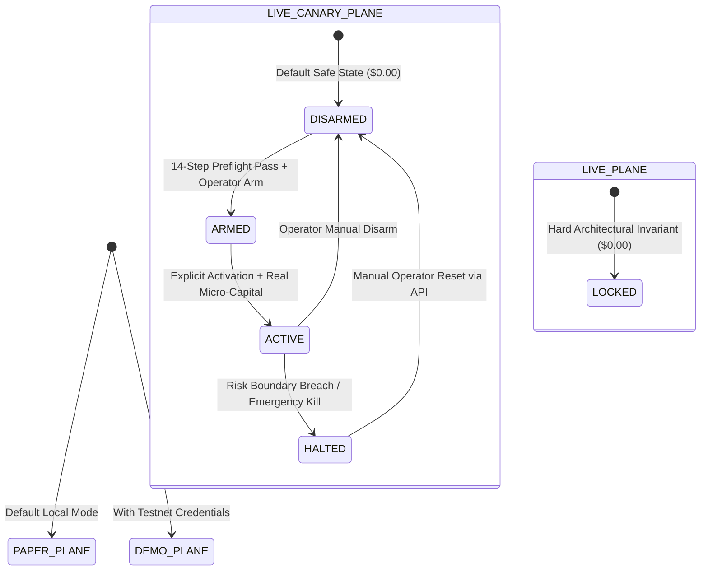

# Four Operating Planes Specification

**Document Version:** 1.0.0  
**Status:** Audited Baseline & Locally Operational  
**Classification:** Operational Security & Architecture  

---

## 1. Operating Plane Architecture

The platform architecture enforces absolute separation of concerns across four operating planes:

```
┌────────────────────────────────────────────────────────────────────────┐
│                        FOUR OPERATING PLANES                           │
├─────────────────┬─────────────────┬───────────────────┬────────────────┤
│     PAPER       │      DEMO       │    LIVE-CANARY    │      LIVE      │
├─────────────────┼─────────────────┼───────────────────┼────────────────┤
│ Virtual Capital │ Testnet Faucet  │ Real Micro-Cap    │ Unrestricted   │
│ Sim Matching    │ Testnet Gateway │ Production Gateway│ Hard Locked    │
│ Active Testing  │ Mock / Testnet  │ DISARMED ($0.00)  │ LOCKED ($0.00) │
└─────────────────┴─────────────────┴───────────────────┴────────────────┘
```

---

## 2. Invariant Comparison Matrix

| Property | `PAPER` | `DEMO` | `LIVE-CANARY` | `LIVE` |
| :--- | :--- | :--- | :--- | :--- |
| **Capital Allocation** | Virtual ($100,000 ledger) | Testnet faucet tokens | Real broker capital (capped) | Real unrestricted capital |
| **Current Capital** | Virtual | Virtual | **$0.00** | **$0.00** |
| **Broker Gateway** | Local matching simulator | Testnet API | Production REST / WSS | Production Gateway |
| **Endpoint (Binance)** | Internal loopback | `testnet.binancefuture.com`| `fapi.binance.com` | Hard rejected |
| **Credentials** | None required | Testnet API keys | Production non-custodial | Permanent reject |
| **Withdrawal Capability**| N/A | Prohibited | **FATAL REJECTION** | Prohibited |
| **Risk Firewall** | Simulated constraints | Simulated constraints | Real-money strict enforcement | Hard reject |
| **State Machine** | `ACTIVE` | `ACTIVE` | `DISARMED` $\to$ `ARMED` $\to$ `ACTIVE` | `LOCKED` (403 Forbidden) |
| **Pre-Flight Required** | None | Contract validation | **14-Step Broker Audit** | N/A |
| **Emergency Halt** | Local pause | Cancel testnet orders | **Instant Failsafe Tripping**| N/A |
| **State Persistence** | SQLite WAL | SQLite WAL | SQLite WAL + Broker Sync | N/A |

---

## 3. Plane Specifications

### 3.1 PAPER Plane
- **Purpose:** Continuous forward paper simulation driven by real-time public market data feeds.
- **Execution:** Microstructure simulator modeling bid/ask spread crossing, maker/taker fee tiers, and slippage.
- **Risk Evaluation:** All 22 pre-trade Risk Firewall rules are active in simulation mode.
- **Persistence:** All order intents, simulated fills, and position states persist to `research/paper_trading.db`.

### 3.2 DEMO Plane
- **Purpose:** Validates exchange-specific order formatting, signers, rate limiters, and error handling against exchange testnets or deterministic mock environments.
- **Adapters:** Binance Futures Testnet, Bybit V5 Linear Testnet, CCXT Sandbox.
- **Reconciliation:** Active state reconciliation compares internal ledger against broker responses.
- **Status:** Contract-verified mock adapter verified; external network broker testnet requires environment API keys.

### 3.3 LIVE-CANARY Plane
- **Purpose:** Controlled micro-capital live production verification on real exchange infrastructure.
- **Current State:** **`DISARMED`** ($0.00 live capital allocated).
- **Two-Phase Arming:**
  1. Operator triggers 14-step broker pre-flight verification via `POST /api/canary/verify`.
  2. If all 14 steps pass, operator arms canary via `POST /api/canary/arm`.
  3. Operator issues explicit second confirmation via `POST /api/canary/activate` to route real orders.
- **Safety Ceilings:**
  - Capital limit: `CANARY_CAPITAL_LIMIT_USD` (Default: `$0.00`).
  - Max position size: `CANARY_MAX_POSITION_SIZE` (Default: `$50.00`).
  - Max leverage: `CANARY_MAX_LEVERAGE` (Ceiling: $1.5\text{x}$).
  - Max daily loss: `CANARY_MAX_DAILY_LOSS` (Ceiling: $2.0\%$).
  - Max total drawdown: `CANARY_MAX_TOTAL_DRAWDOWN` (Ceiling: $5.0\%$).

### 3.4 LIVE Plane
- **Purpose:** Unrestricted live trading.
- **Current State:** **`PERMANENTLY LOCKED`** ($0.00 capital).
- **Enforcement:** Hard-locked fail-closed in `PlatformSettings` and `BaseExchangeAdapter`. Any attempt to register an account or route an order with `mode="LIVE"` is rejected with HTTP `403 Forbidden` (`LIVE_MODE_LOCKED`).

---

## 4. Lifecycle Transitions


