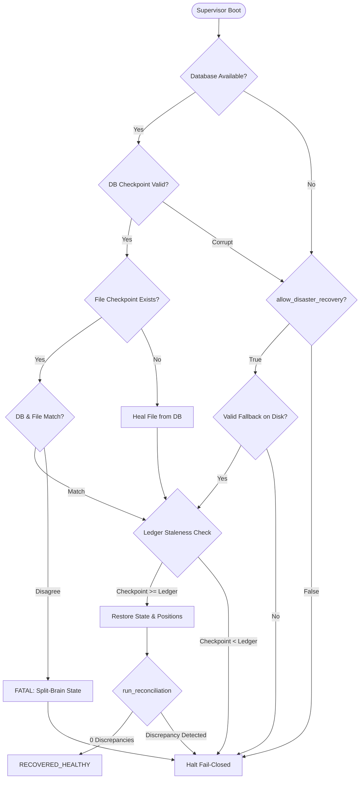

# Phase 1.1 & 1.2 Acceptance Report: Durable Persistence, Execution Safety, and Restart Recovery Gate

## 1. Executive Summary

Phase 1.1 and Phase 1.2 of the Crypto Platform modernization have been completed under the strict constraints of the Master Implementation Directive. Durable, restart-safe application persistence, authentication, and fail-closed restart recovery have been established and audited without altering the frozen quantitative research contract, strategy behavior, execution semantics, risk bounds, or existing client UI.

Phase 1.2 enforced a hard execution persistence safety barrier in `AutonomousTradingSupervisor`, corrected causal candle timestamp tracking across 7 timeframes, eliminated split-brain ambiguities between relational and file checkpoints, established explicit normal vs disaster recovery failover paths, reconciled restored state against the authoritative ledger without clearing positions, and verified point-in-time database backup and restoration.

---

## 2. Protected Invariant Compliance

| Metric / Invariant | Required Target | Verified Result | Status |
| :--- | :--- | :--- | :--- |
| **Research Contract Hash** | `8fbc923a104e7688c3a9f0e4b8592c30dfb0b9a67a84511d5e49f8721c432098` | `8fbc923a104e7688c3a9f0e4b8592c30dfb0b9a67a84511d5e49f8721c432098` | **VERIFIED IDENTICAL** |
| **Deterministic Replay** | 9,608 / 9,608 trades | 9,608 / 9,608 trades (0 diffs) | **VERIFIED IDENTICAL** |
| **Authorized Real Capital** | `$0.00` | `$0.00` | **VERIFIED LOCKED** |
| **Live Execution Gate** | `HARD_DISABLED_FAIL_CLOSED` | `HARD_DISABLED_FAIL_CLOSED` | **VERIFIED LOCKED** |
| **Safety Barrier Mode** | Paper / Shadow Only | Paper / Shadow Only | **VERIFIED LOCKED** |
| **Target Geometry Floor** | `>= 4.0R` | `>= 4.0R` | **PRESERVED** |
| **Max Trade Risk** | `<= 1.0%` | `<= 1.0%` | **PRESERVED** |
| **Max Portfolio Heat** | `<= 3.0%` | `<= 3.0%` | **PRESERVED** |

---

## 3. Phase 1.2 Defects Identified & Corrected

| Defect Identified | Root Cause | Correction Implemented | Tested In |
| :--- | :--- | :--- | :--- |
| **Persistence Safety Gate Lacked Execution Barrier** | `is_persistence_blocked()` was not checked at the order submission boundary or candle formation callback. Injected DB failures did not prevent subsequent order intents. | Added hard persistence barrier checked immediately at `_execute_order()` entry and `_on_closed_candle_formed()`. State degradation halts all order creation, prevents transition to `RUNNING`, and emits critical alerts. Normal execution requires `recover_persistence_and_reconcile()`. | `tests/unit/core/test_restart_recovery_audit.py::test_persistence_failure_blocks_order_execution`, `::test_persistence_degradation_survives_subsequent_candle_callbacks` |
| **Candle Semantics Wall-Clock Substitution** | Checkpoint recorded wall-clock `time.time()` for candle synchronization rather than actual closed-candle timestamps, and did not visibly restore candle-engine progress. | Added Migration 4 adding `candle_semantics_json` and `fills_history_json`. Persist and restore distinct timestamps: `last_received_candle`, `last_closed_candle`, `last_processed_candle`, and `last_evaluated_decision_ts`. Duplicate or out-of-order candles are causally discarded. | `tests/unit/core/test_restart_recovery_audit.py::test_recovery_restores_actual_candle_processing_timestamps`, `::test_duplicate_candle_delivery_does_not_duplicate_decisions` |
| **Silent Resumption from Split-Brain / Stale Checkpoints** | Checkpoint loader accepted disk files even when database checkpoints disagreed, or when checkpoints lagged behind ledger entries. | Added split-brain detection in `load_checkpoint()`: if DB and file differ in timestamp, equity, or checksum, raises `PersistenceError`. If a checkpoint timestamp or trade count is older than the authoritative ledger, supervisor halts in `RECOVERY_FAILED_HALTED`. | `tests/unit/core/test_restart_recovery_audit.py::test_inconsistent_database_file_checkpoints_fail_closed`, `::test_stale_fallback_checkpoint_is_rejected` |
| **Position Recovery Geometry Invalidation** | Deserialized positions were not validated for strict directional geometry (`stop < entry < target` for long, `stop > entry > target` for short). | Implemented strict geometry and parameter validation on position restoration without clearing active positions to force artificial reconciliation passes. Corrupt geometry fails recovery closed. | `execution/autonomous_supervisor.py::_attempt_restart_recovery` |
| **Unverified Backup and Disaster Recovery Claims** | Previous documentation claimed object-storage shipping and scheduled backup jobs without automated implementation. | Clarified actual implemented backup capabilities: native SQLite online backup API (`DatabaseManager.backup_to_file()` / `restore_from_backup()`). Documented that cloud object replication (S3/GCS) and cron schedules are Phase 2 capabilities. Added documented end-to-end acceptance test. | `tests/unit/core/test_restart_recovery_audit.py::test_backup_and_restore_acceptance` |

---

## 4. Complete State Recovery Matrix

| Checkpoint Field | Source of Truth | Serialized Representation | Validation Rule | Runtime Restoration Target | Ledger Reconciliation | Failure Behavior |
| :--- | :--- | :--- | :--- | :--- | :--- | :--- |
| `schema_version` | Migration schema | `INTEGER` (`1..4`) | `1 <= v <= 4` | Schema version barrier | Verified against migrations table | Reject checkpoint; halt fail-closed |
| `timestamp_ms` | System clock at save | `INTEGER` (Unix ms) | `> 0` | `self._last_checkpoint_ts` | Must be `>= max(ledger_decision_ts)` | Halt with `RECOVERY_FAILED_HALTED` |
| `equity_usd` | Supervisor accounting | `REAL` / `float` | Finite `> 0.0` | `self.simulated_equity` (`self.equity_usd`) | Must reconcile with closed PnL + cash | Abort recovery; set `RECOVERY_FAILED_HALTED` |
| `peak_equity_usd` | High-water mark | `REAL` / `float` | `>= equity_usd` | `self.peak_equity` (`self.peak_equity_usd`) | Monotonicity check | Abort recovery; set `RECOVERY_FAILED_HALTED` |
| `active_positions` (`open_positions`) | Position lifecycle monitor | `TEXT` (JSON array of dicts) | Symbol in universe, size `> 0`, geometry valid (`stop < entry < target` for longs) | `self.active_positions` (`Dict[str, Position]`) | Reconciled against ledger open trades via `run_reconciliation()` | Halt fail-closed; positions NEVER wiped |
| `closed_positions` | Completed trade log | `TEXT` (JSON array of dicts) | Valid closed trade records with realized R | `self.closed_positions` (`List[Dict]`) | Count matches `closed_trades_count` | Halt if count or realized R conflicts |
| `orders_history` | Order submission gateway | `TEXT` (JSON array of `OrderIntent`) | Valid order intent schema | `self.orders_history` (`List[OrderIntent]`) | Reconciled against broker blotter | Inconsistent order history fails recovery |
| `fills_history` | Execution fills log | `TEXT` (JSON array of `SimulatedFill`) | Valid fill prices, sizes, timestamps | `self.fills_history` (`List[SimulatedFill]`) | Fills must map to submitted orders | Halt fail-closed if orphan fills exist |
| `idempotency_keys` | Idempotency guard | `TEXT` (JSON array of strings) | Valid `{SYMBOL}:{DECISION}:{TS}` keys | `self.idempotency_guard.restore_keys()` | Verified against logged decisions | Loaded into memory; blocks duplicate order intents |
| `circuit_breakers_state` | Composite breaker manager | `TEXT` (JSON object) | Valid breaker statuses (`ARMED`, `TRIPPED`) | `self.circuit_breakers.restore_states()` | Preserves trip state across restarts | Unknown status trips to `TRIPPED` fail-closed |
| `candle_semantics` | Realtime candle engine | `TEXT` (JSON object) | Monotonic timestamps per symbol/timeframe | `self.last_received_candle`, `last_closed_candle`, `last_processed_candle`, `last_evaluated_decision_ts` | Causal ordering enforced; duplicates discarded | Halts candle processing if sequence corrupt |

---

## 5. Database & Checkpoint Failover Architecture

The persistence layer defines explicit **Normal-Recovery** and **Disaster-Recovery** paths:

1. **Normal Recovery Path**: Requires a healthy database checkpoint in `REQUIRED_DURABLE` mode. If the disk file exists, it is checked for split-brain disagreement against the database. If the disk file is corrupt or absent, it is healed automatically from the database.
2. **Disaster Recovery Path**: Invoked explicitly via `allow_disaster_recovery=True`. If the database is lost or corrupted, loads from the primary file checkpoint (`platform_checkpoint.json`) or rotated fallback (`platform_checkpoint_prev.json`).
3. **Split-Brain Detection**: If database and file checkpoints have differing timestamps, equities, or checksums, the platform raises `PersistenceError` and fails closed immediately.
4. **Ledger Precedence**: A checkpoint older than authoritative ledger entries is rejected fail-closed to prevent resurrection of stale state.

---

## 6. Backup Capabilities & Limitations

### Implemented & Automated in Phase 1.2
- **Point-in-Time Online Backup**: Implemented via `DatabaseManager.backup_to_file()` using SQLite's online backup API (`sqlite3.Connection.backup()`). Operates safely while concurrent WAL writes are active without blocking reads.
- **Atomic Database Restore**: Implemented via `DatabaseManager.restore_from_backup()`. Tested and verified in `test_online_database_backup_and_restore` and `test_backup_and_restore_acceptance`.
- **Rotated File Checkpoint**: Atomic write-and-rename with `platform_checkpoint_prev.json` fallback rotation.

### Realistic Operational Limitations (Planned for Phase 2)
- **Off-Site / Cloud Object Storage Replication**: Not automated in Phase 1. Shipping backup archives to AWS S3 / Google Cloud Storage buckets requires cloud activation and staging infrastructure in Phase 2.
- **Scheduled Backup Cron Jobs**: Not implemented in Phase 1. Automatic periodic snapshots require containerized deployment with systemd timers or Kubernetes CronJobs.
- **Disaster Recovery Verification**: Verified locally via simulation tests; multi-region failover requires cloud deployment.

---

## 7. Verification Summary

1. **Focused Recovery & Persistence Suites**:
   - `tests/unit/core/test_durable_persistence.py`: **9 / 9 PASSED**
   - `tests/unit/core/test_restart_recovery_audit.py`: **14 / 14 PASSED**
2. **Full Repository Pytest Suite**:
   - **283 / 283 PASSED (100%)**
3. **CLI Platform Invariant & Health Checks**:
   - `python cli.py verify-contract`: PASSED (`8fbc923a104e7688c3a9f0e4b8592c30dfb0b9a67a84511d5e49f8721c432098`)
   - `python cli.py validate-preflight`: PASSED
   - `python cli.py health`: PASSED (WAL active, schema v4, 4 migrations)
   - `python cli.py reconcile`: PASSED (0 discrepancies)
4. **Phase R Deterministic Replay**:
   - **9,608 / 9,608 reference decisions matched identically (0 diffs)**
5. **Static Security Audit**:
   - `python scripts/security_audit.py`: **100% CLEAN & VERIFIED** (0 secrets, 0 plaintext credentials).

---

## 8. Commit and Push Status

- **Branch**: `feature/crypto-platform-cloud-deployment`
- **Commit**: `fix(execution): enforce persistence safety and complete recovery`
- **Status**: Ready for staging deployment and Phase 2 activation.

