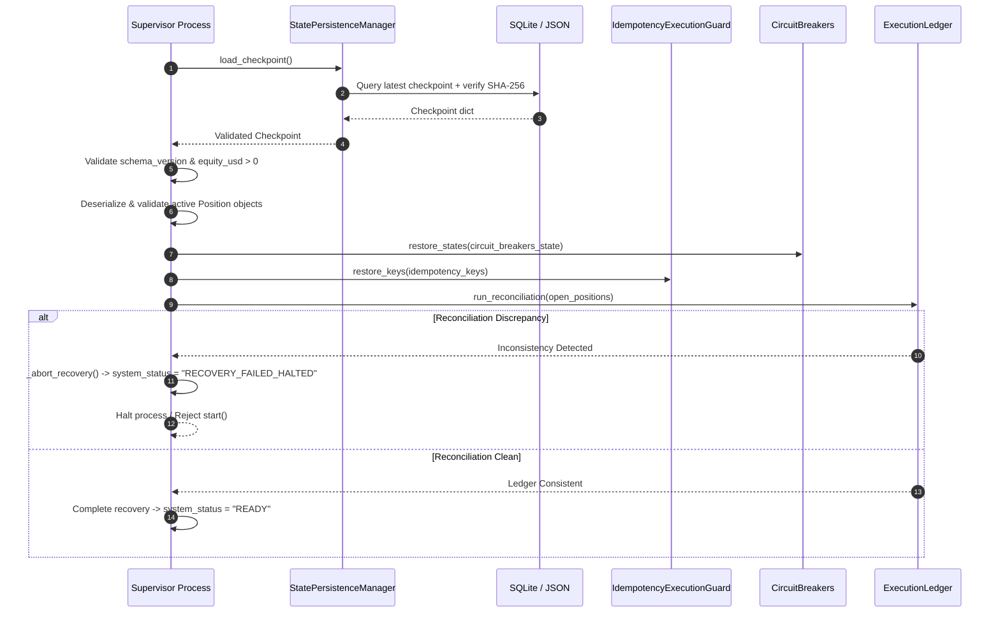

# Recovery and Backup Procedures

## 1. Overview and Recovery Architecture

Crypto Platform implements deterministic, fail-closed state recovery across process restarts and crashes:
1. **Primary Relational Checkpoint Ledger**: Persisted transactionally in the SQLite `application_checkpoints` table with schema versioning, payload integrity checksums (SHA-256), and O(1) timestamp indexing.
2. **Atomic Disk File Fallback / Shadow**: Stored with atomic file replacement (`os.replace`) and prior-version backup preservation (`platform_checkpoint_prev.json`).
3. **Fail-Closed Reconciliation Barrier**: All recovered state must pass strict validation and ledger reconciliation before the platform supervisor accepts new candles or executes trading decisions. If recovery fails, the platform halts in `RECOVERY_FAILED_HALTED`.

---

## 2. Complete State Recovery Matrix

Before the platform supervisor processes any incoming candle or issues any new order decisions, every recoverable field from the latest checkpoint is validated and restored according to the matrix below:

| Saved Field | Restoration Target | Validation Rule | Reconciliation Requirement | Failure Behavior |
| :--- | :--- | :--- | :--- | :--- |
| `schema_version` | Validation barrier | Must match supported versions (`>= 1`, current `2`). | Schema compatibility check. | Reject checkpoint; fail recovery; halt supervisor. |
| `equity_usd` | `self.simulated_equity_usd` | Must be a positive finite float (`> 0.0`). Cannot be null or negative. | Reconciled against ledger cash balance + open position mark-to-market. | If `<= 0` or invalid, abort recovery; set `system_status = "RECOVERY_FAILED_HALTED"`. |
| `peak_equity_usd` | `self.peak_equity_usd` | Float `>= equity_usd` (or reset to `equity_usd` if smaller). | Monotonic peak tracking check. | Abort recovery if non-numeric or negative. |
| `active_positions` | `self.open_positions` (`Dict[str, Position]`) | Every position symbol must be in allowed trading universe. Quantity `> 0`. Stop price and target price must be valid positive floats. Geometry must be valid (`stop < entry < target` for long). | Reconciled against authoritative execution ledger (`run_reconciliation()`). Quantity, symbol, and entry price must exactly match ledger. Never invent missing positions. | Any schema violation, unknown symbol, inverted geometry, or ledger discrepancy triggers `_abort_recovery()`. System halts in `RECOVERY_FAILED_HALTED`. |
| `closed_positions` | `self.closed_positions` (`List[Position]`) | List of serialized `Position` dictionaries. | Historical audit log preservation. | Log warning if corrupted; do not halt live trading if active positions are clean. |
| `pending_order_intents` / `orders_history` | `self.pending_intents` / `self.recent_orders` | Valid order dictionaries with unique `decision_id` and timestamps. | Reconciled against open broker orders and ledger state. | Discrepancies cancel unverified pending orders fail-closed. |
| `candle_sync_timestamps` | `self.last_candle_timestamp` (`Dict[str, int]`) | Valid Unix timestamps (`ms`). Monotonically non-decreasing compared to stream. | Candle stream alignment. Discard duplicate past candles. | Clamped to valid range or stream restarts from checkpoint timestamp. |
| `circuit_breakers_state` | `self.circuit_breakers.restore_states(...)` | State must be recognized breaker status (`"OPEN"`, `"HALF_OPEN"`, `"CLOSED"`). | Preserves active risk trips across restarts. | Unrecognized state triggers fail-closed trip to `"OPEN"` (halt trading). |
| `idempotency_keys` | `self.idempotency_guard.restore_keys(...)` | List of non-empty string keys formatted as `{SYMBOL}:{DECISION_ID}:{TIMESTAMP_MS}`. | Re-evaluated candles must not duplicate previously executed orders. | Deduplicated and loaded into in-memory hash set. |
| `metrics` (`win_rate`, `net_r`, etc.) | `self.performance_metrics` | Valid dictionary with numeric values. | Telemetry and reporting tracking. | Reset to default if corrupted; does not block execution if positions match. |

---

## 3. Fail-Closed Recovery Sequence



---

## 4. Duplicate Order & Decision Prevention on Restart

### The Phantom Re-Entry Hazard
On process crash and restart, an autonomous trading supervisor might re-evaluate historical candles and attempt to re-submit orders for already-executed signals.

### Mitigation via Restored Idempotency Keys
1. Every order intent generates a unique idempotency key:
   `{SYMBOL}:{DECISION_ID}:{TIMESTAMP_MS}`
2. Executed keys are maintained in `IdempotencyExecutionGuard` and persisted in each periodic checkpoint (`idempotency_keys`).
3. Upon restart recovery, `AutonomousTradingSupervisor._attempt_restart_recovery()` loads all recorded idempotency keys into the active guard:
   ```python
   recovered_keys = checkpoint.get("idempotency_keys", [])
   if recovered_keys:
       self.idempotency_guard.restore_keys(recovered_keys)
   ```
4. If a replayed or re-evaluated candle attempts to submit the same order intent, `DuplicateOrderIntentError` is triggered, and the order is suppressed.

---

## 5. Backup & Restore Procedures

### Database Backup
Because SQLite WAL mode keeps transactions in write-ahead logs (`.db-wal`), creating a safe backup requires the standard SQLite online backup API:

#### 1. Python Native API (Zero Reader Locking)
```python
from core.persistence.database import DatabaseManager

db = DatabaseManager("data/crypto_platform.db")
db.backup_to_file("data/backups/crypto_platform_backup_20261009.db")
```

#### 2. SQLite CLI Online Backup
```bash
sqlite3 data/crypto_platform.db ".backup data/backups/crypto_platform_backup_$(date +%Y%m%d_%H%M%S).db"
```

### State Checkpoint Backup
The directory `research/results/state/` contains:
- `platform_checkpoint.json`: Current validated operational state.
- `platform_checkpoint_prev.json`: Previous validated operational state.

```bash
cp research/results/state/platform_checkpoint.json data/backups/
```

### Database Restore Procedure
1. Stop the platform supervisor:
   ```bash
   # Terminate supervisor process gracefully
   ```
2. Restore database from backup:
   ```python
   # Via Python API:
   db.restore_from_backup("data/backups/crypto_platform_backup_20261009.db")
   ```
   Or via file copy:
   ```bash
   cp data/backups/crypto_platform_backup_20261009.db data/crypto_platform.db
   rm -f data/crypto_platform.db-wal data/crypto_platform.db-shm
   ```
3. Verify migrations:
   ```bash
   python cli.py db-status
   ```
4. Restart supervisor:
   ```bash
   python cli.py start --mode PAPER
   ```

