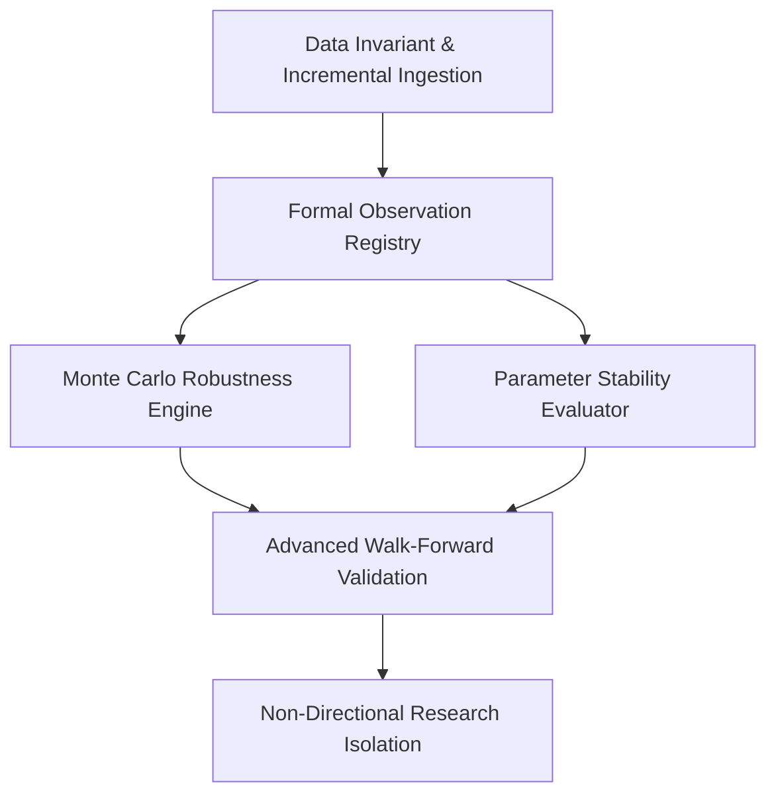

# Institutional Capability Upgrade Roadmap

## 1. Context & Architecture Anchor
> [!IMPORTANT]
> The **Canonical Market Model** ([`MarketStructure`](file:///c:/Users/nares/Workspace/crypto-platform/market_model/contracts.py), [`KeyZones`](file:///c:/Users/nares/Workspace/crypto-platform/market_model/contracts.py), [`MarketPhase`](file:///c:/Users/nares/Workspace/crypto-platform/market_model/contracts.py)) remains permanently frozen, descriptive, and strategy-agnostic.
>
> All external indicators, quantitative metrics, volatility filters, and regime classifiers are registered as **Observations** in the [`market_model/observations/`](file:///c:/Users/nares/Workspace/crypto-platform/market_model/observations/) registry.

---

## 2. Priority Upgrade Sequence

### Phase 1: Formal Observation Registry (Immediate)
- Build `market_model/observations/` providing standardized, typed extraction of:
  - **Structure Observations**: External trend, internal trend, swing hierarchy, BOS, CHoCH, protected/weak swings, trend strength.
  - **Key Zone Observations**: Order blocks, FVGs, imbalance, supply/demand, liquidity sweeps, premium/discount dealing ranges, Fibonacci retracements.
  - **Phase Observations**: Pullback detection, continuation detection, expansion velocity.
  - **Technical & Macro Observations**: EMA alignment, ATR, ADX trend strength, volume expansion, VWAP, funding rates, open interest, BTC risk regime.

### Phase 2: Monte Carlo Robustness & Risk Stress Testing
- Implement `validation/robustness/monte_carlo.py`:
  - **Trade Shuffle Permutations (1,000 runs)**: Assesses sequence risk and calculates 95% worst-case max drawdown in R.
  - **Trade Dropout Simulation (10% to 30% dropout)**: Assesses whether the strategy's expectancy is dependent on a few lucky outlier trades.
  - **Slippage Jitter Testing**: Perturbs slippage by +50% to +100% to evaluate friction resilience.

### Phase 3: Parameter Stability & Plateau Detection
- Implement `validation/robustness/parameter_stability.py`:
  - Quantifies neighborhood stability (Plateau Stability Index - PSI).
  - Flags isolated parameter peaks as curve-fitting artifacts.

### Phase 4: Scaffolding for Non-Directional Research Families
- Create isolated research domains:
  - `research/arbitrage/`: Spot-perpetual basis and funding rate harvesting.
  - `research/hedging/`: BTC beta hedging and cross-asset correlation hedging.
  - `research/market_neutral/`: Cointegrated pairs and statistical arbitrage.
  - `research/ml/`: Chronological leakage-safe supervised learning for candidate ranking.
