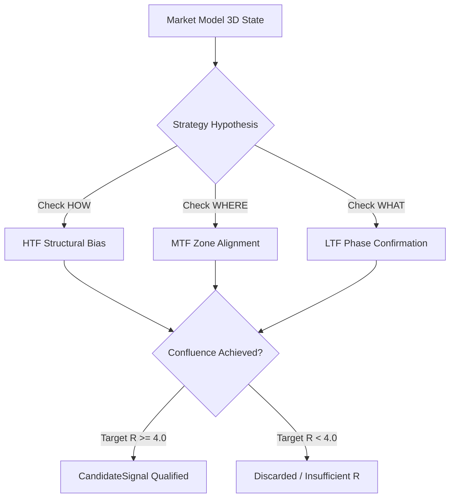

# Strategy Subsystem & Taxonomy Architecture

The `strategy/` package houses all strategy hypotheses, adaptive market-state engines, and rule families. All strategy implementations are **strictly decoupled** from the Market Model ($HOW, WHERE, WHAT$) and adhere to institutional causal rules.

---

## Directory Organization

```
strategy/
├── __init__.py                 # Unified package export (Hypotheses & Adaptive engines)
├── base.py                     # Abstract Base Classes (StrategyHypothesis, CandidateSignal)
├── baseline_v1.py              # Canonical Multi-Timeframe Baseline Hypothesis V1
├── trend_breakout.py           # Trend Breakout Hypothesis (Dealing range boundaries)
├── mean_reversion.py           # Mean Reversion Hypothesis (Premium/Discount -> Equilibrium)
├── momentum_ignition.py        # Momentum Ignition Hypothesis (Compression squeeze expansion)
├── adaptive/                   # Causal Adaptive Market-State Engines
│   ├── __init__.py
│   ├── adaptive_causal_engine.py   # State-conditioned expectancy engine
│   └── adaptive_engine_v1.py       # Regime-adaptive decision rule engine
└── families/                   # 10 Institutional Systematic Strategy Families
    ├── __init__.py
    ├── base_family.py          # Abstract family evaluator
    ├── f01_structure_phase.py              # Structure + Phase (Baseline)
    ├── f02_structure_zone_phase.py         # Structure + Zone + Phase (Confluence)
    ├── f03_structure_ema_phase.py          # Structure + EMA + Phase (Trend filter)
    ├── f04_structure_liquidity_phase.py    # Structure + Liquidity Sweeps
    ├── f05_structure_ob_phase.py           # Structure + Order Block mitigation
    ├── f06_structure_fvg_phase.py          # Structure + Fair Value Gap fill
    ├── f07_structure_sd_phase.py           # Structure + Supply/Demand retests
    ├── f08_structure_trendline_phase.py    # Structure + Dynamic Liquidity lines
    ├── f09_structure_fibonacci_phase.py    # Structure + OTE (61.8% - 78.6%) retracements
    └── f10_structure_momentum_phase.py     # Structure + Momentum Ignition bursts
```

---

## The 3-Dimensional Confluence Invariant

Every strategy hypothesis must strictly evaluate signals against the **three canonical dimensions**:

1. **Market Structure / Trend ($HOW$)**: External trend direction (Bullish, Bearish, Sideways) and Internal order flow (Higher Highs, Lower Lows, CHOCH, BOS).
2. **Key Zones & Levels ($WHERE$)**: Institutional Points of Interest (Order Blocks, FVGs, Liquidity Sweeps, Dealing Ranges, S/D Zones).
3. **Phase ($WHAT$)**: Current cycle state (Expansion, Retracement/Pullback, Reversal, Consolidation).



---

## Execution Integration

Signals produced by `strategy/` are proposals only. They are gated through `execution/risk/portfolio_risk_governor.py` and processed via `execution/shadow/shadow_trader.py` with zero lookahead bias and immutable cryptographic auditing.
